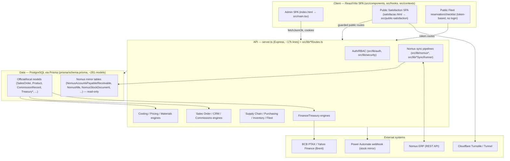
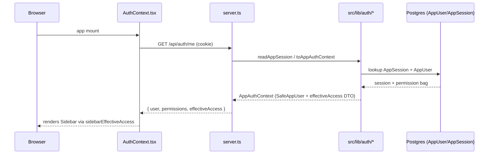
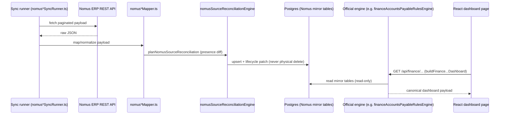
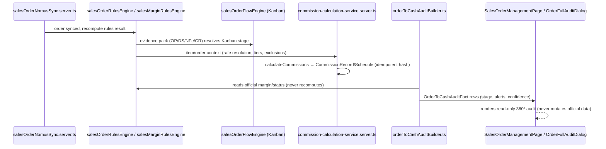
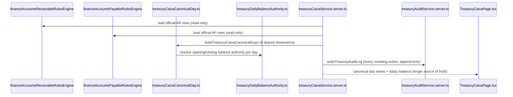

# Codebase Map

> Auto-generated by Cartographer. Last mapped: 2026-09-03T17:11:15Z

## System Overview

IndusCost is a single-process, monolithic Express + Vite/React application (Brazilian industrial ERP: costing, pricing, sales, finance/treasury, supply chain, fleet, HR, commissions) backed by one large PostgreSQL schema via Prisma, continuously synchronized from an external ERP ("Nomus"). Almost everything funnels through a small number of "official engine" boundaries — costing, margin, cash-flow, commissions, permissions — that other code must call rather than reimplement.



## Directory Structure

```
IndusCost/
├── server.ts                 Monolithic Express entry point (~17,000 lines): route wiring,
│                              auth-guard construction, ~93 register*Routes(app, deps) calls
├── vite.config.ts             Dual Vite entries (admin SPA + public satisfaction SPA)
├── index.html / satisfacao.html   SPA entry points
├── AGENTS.md / .cursor/rules/*.mdc   Operator/AI-agent guardrails (prod safety, DB bootstrap gotchas)
├── prisma/
│   ├── schema.prisma          Single ~10,900-line schema, ~281 models / ~208 enums
│   ├── migrations/            Hundreds of timestamped, hand-authored, additive migrations
│   └── seed.ts                Minimal dev seed (not comprehensive)
├── scripts/                   Hundreds of CLI tools: Nomus sync, audits, backfills, repairs
├── tmp-audits/                 Throwaway, read-only incident-investigation CLI scripts (not maintained)
├── infra/satisfaction-homolog/ Nginx/systemd artifacts for the public survey deployment
├── src/
│   ├── main.tsx / App.tsx      Admin SPA bootstrap + root route table (~1240 lines)
│   ├── public-satisfaction/    Fully isolated public survey mini-app (separate Vite entry)
│   ├── contexts/AuthContext.tsx  Session/permission context (polls for permission-version bumps)
│   ├── hooks/                  usePermissions, useAuthorizedTabs, admin step-up, etc.
│   ├── types/                  Domain type mirrors of Prisma enums (fleet, purchasing, projects, ...)
│   ├── components/             ~25 top-level feature folders (see Module Guide) + shared UI kit
│   │   ├── ui/                 MetricCard/SummaryKpiCard/SystemTotalizerCard, Overlay* dialog kit
│   │   ├── layout/              App shell: Sidebar, AppHeaderBar, Layout
│   │   ├── security/            PermissionGate/ProtectedTab (UI-only gates, not a security boundary)
│   │   ├── print/                PrintDocumentShell/Header/Section/Table + many *-print.css files
│   │   ├── tour/ + tours/        Generic GuidedTour engine + per-module step arrays
│   │   ├── finance/               Largest UI tree: bi/, billing/, cash-flow/, cost-centers/, treasury/,
│   │   │                          executive-report/, portfolio-reconciliation/, sales-orders/, shared/
│   │   ├── commercial/            Output Documents, Sales Order Flow Kanban, Price Table, Satisfaction, Sold Products
│   │   ├── commissions/           Dashboard/audit/apuração/forecast/rules/payments/persons/releases
│   │   ├── sales/                 Sales Order management/detail/margin/reports UI
│   │   ├── product/               Product/BOM/Nomus-maintenance engineering workspace
│   │   ├── projects/               Project (quotation/costing) UI: tabs, modals, reports
│   │   ├── purchasing (bucket)/    PurchaseModule, PurchaseOrderModule, quotation award/comparison
│   │   ├── fleet/                  Vehicle fleet admin UI + public reservation/checklist surfaces
│   │   ├── inventory/               Estoque/Almoxarifado UI + Stock Collector tablet sub-app
│   │   ├── materials/               Material Market Intelligence + Raw Material Planning UI
│   │   ├── crm/                     Customer Intelligence 360°, portfolio cockpit
│   │   ├── goals/                   OKR/Goals cockpit, wizards
│   │   ├── employee/                HR dashboard, org chart, employee profile ("ficha")
│   │   ├── admin/                    Access Profiles / Permission Matrix / Tree editors
│   │   ├── pricing/                  Published price grid, cost-table publish panels
│   │   ├── contextual/                Per-domain "Indicadores" dashboards + material-demand intelligence
│   │   ├── proposal/, customers/, dashboard/, audit/, settings/   feature-scoped UI
│   │   └── __loose__/                 ~15 large standalone route-level modules (Settings/Simulation/
│   │                                    Reports/Tax/Product/Projects/Proposal/Purchase*, guards, version watcher)
│   └── lib/                     Backend/domain logic layer (Prisma-adjacent), ~30 sub-domains
│       ├── treasury/             Central de Tesouraria (contracts/domain/adapters/mappers/repositories/
│       │                          services/controllers/queries/ofx/jobs) — the most layered sub-tree
│       ├── finance/               Effective-schedule (FIN-xx), Order-to-Cash audit, Portfolio
│       │                          Reconciliation/Maturity, Fiscal (T0x), One Page dashboard
│       ├── commissions/           Rules/calc/release/payment/materialization/receipt-closing engines
│       ├── sales/                 Sales Order Flow (Kanban), KAN-LINK evidence graph, funnel, reports
│       ├── sales-orders/          Sales Order Detail (executive view) + Tributos (TRIB-xx) tax sub-area
│       ├── purchasing/            SC→Cotação→PO→Recebimento workflows, supplier performance, indicators
│       ├── inventory/              Movement ledger, balances, count sessions, Stock Collector auth
│       ├── nomus/                  Source-presence/lifecycle reconciliation engine (SYNC-xx)
│       ├── output-documents/       Documentos de Saída read-only audit + canonical resolver (DS-xx)
│       ├── security/                Permission contract, effectiveAccess resolver, admin permission UI state
│       ├── auth/                    Password/session/rate-limit/step-up subsystem
│       ├── goals/                   OKR rule engine (whitelisted SQL), versioning
│       ├── satisfaction/            Customer satisfaction survey backend (public + admin)
│       ├── diagnostics/             "ChatGPT diagnostic bundle" generator (read-only ZIP export)
│       ├── audit/                   Cost-to-Cash Trace engine, Nomus sales-order orphan audit
│       ├── commercial/              CRM access-scope, canonical SalesOrder where-builder, seller/owner identity
│       ├── suppliers/               Supplier service-termination (distrato) calculator/export
│       ├── supply-chain/            Official-engine read/write boundary guard for the SC parallel domain
│       ├── purchasing, projects*, pricing/, materialMarket*, materialStock*, materialDemand*   costing/
│       │                          pricing/materials domain (mostly flat "__loose__" files, see Module Guide)
│       └── __loose__ (flat files)  ~110 groups worth of flat domain modules covering Finance AP/AR,
│                                    Cash Flow, Cost Centers, DRE, Executive Report, Sales Order rules/
│                                    margin engines, Nomus BOM/product/proposal/production-order sync,
│                                    Projects, Proposals, Pricing, Fleet, CRM, People Profile, Permission
│                                    Catalog, Product/Production Cost engine, Commercial/Commissions helpers
├── docs/                        ~110+ markdown design/audit/runbook docs, organized by domain
│   (finance/, treasury/, security/, commercial/, sales/, supply-chain/, nomus/, audits/, generated/,
│    people/, hr/, architecture/, performance/, navigation/, fleet/, integrations/)
└── docs/generated/               Auto-generated audit/report artifacts from scripts/ (not hand-written)
```

## Module Guide

### Server Entry Point (`server.ts`)

**Purpose**: Single monolithic Express app (~17,150 lines) bootstrapping the HTTP server, auth guards, and ~93 `register*Routes(app, deps)` calls, plus hundreds of inline route handlers. Serves the Vite-built SPA and the separate public satisfaction bundle.
**Entry point**: `server.ts` → `startServer()`.
**Key files**: `server.ts` (all logic lives inside one `async function startServer()` closure).
**Exports**: No named exports; its "interface" is the routes it registers.
**Dependencies**: Nearly all of `src/lib/**`, Prisma client, Express, Vite dev middleware, multer.
**Dependents**: Client SPA (via REST), all `src/lib/*Routes.ts` modules it wires in.
**Gotchas**: Bootstrap-admin recovery is dead code (`isBootstrapAdminRequest` hardcoded `false`); the public Satisfação survey is double-guarded (host middleware + path allowlist) to prevent leaking the admin SPA.

---

### Auth / Session (`src/lib/auth/*`, `src/contexts/AuthContext.tsx`)

**Purpose**: Human-credential subsystem — password hashing (scrypt), session tokens, brute-force throttling, forced/temporary password lifecycle, admin step-up elevation, security audit logging.
**Entry point**: `src/lib/auth/appAuth.server.ts`, `passwordLifecycleRoutes.ts`; client side `src/contexts/AuthContext.tsx`.
**Key files**: `appAuth.shared.ts` (browser-safe contract), `appAuth.server.ts` (crypto), `passwordPolicy.ts`, `passwordLifecycle.server.ts`, `passwordChangeRequiredGuard.ts`, `authRateLimit.ts`, `adminElevation.server.ts`.
**Exports**: `hashPassword`/`verifyPassword`, `createOpaqueSessionToken`, `toSafeAppUser`/`toAppAuthContext`, `changeOwnPassword`, `adminResetPassword`, `createPasswordChangeRequiredGuard`.
**Dependencies**: `@prisma/client` (AppUser/AppSession), Node crypto, `permissionCatalog.ts`/`permissionsVersion.ts`.
**Dependents**: `server.ts` auth guards; nearly every `*Routes.ts` file.
**Gotchas**: Rate limiting keys on identity, never IP (`trust proxy` disabled); password policy has no composition rules or expiry (deliberate); admin-reset temp password is returned exactly once, never persisted.

---

### Permissions / RBAC (`src/lib/security/*`, `src/lib/permissionCatalog.ts`, `src/lib/accessProfiles*`)

**Purpose**: A large, in-progress migration ("PERM-25..40") from a legacy flat permission-string bag (`AppUser.permissions[]`, OR-combined) to a canonical, typed resource/action contract with one authoritative resolver `resolveEffectiveAccess`. Ships alongside Access Profiles (snapshot-based role bundles).
**Entry point**: `src/lib/security/requireResource.ts` (backend guard), `src/lib/security/effectiveAccess/resolveEffectiveAccess.ts` (resolver), `src/lib/accessProfilesRoutes.ts`.
**Key files**: `permissionContract/resources.ts` (canonical catalog), `effectiveAccess/resolveEffectiveAccess.ts`, `effectiveAccessDto/*`, `accessComparison/*` (dry-run diff), `permissionAudit/*` (AST scanner), `permissionBackfill/*`, `permissionDualWrite/*`, `userPermissionAdminService.ts`, `permissionMatrixUi/`, `permissionsTreeUi/`, `accessProfilesService.ts`.
**Exports**: `resolveCanonicalEffectiveAccess`, `requireResource`, `PERMISSION_CONTRACT_RESOURCES`, `runPermissionBackfill`, `saveUserPermissionOverrides`, `buildAccessProfileMatrixModel`.
**Dependencies**: `appAuth.js`, `permissionResourceSeedData.js`, `navigationGroups.js`, `modulePermissions.js`.
**Dependents**: Every module's `*Permissions.ts`/`*Routes.ts` files; `src/hooks/usePermissions.ts`, `src/components/security/*`, `src/lib/sidebarEffectiveAccess.ts`.
**Gotchas**: The legacy bag remains the **actual runtime authority** in most places despite `resolveEffectiveAccess` being fully implemented (shadow-only pending cutover). `requireResource` bypasses auth entirely under `NODE_ENV=test` unless a strict env flag is set. Access Profiles are a point-in-time **snapshot** — editing a profile never cascades to already-linked users without an explicit "apply" action. SUPER_ADMIN is always allowed and cannot be locked out (anti-lockout guard on the last active SUPER_ADMIN).

---

### Finance — Accounts Payable / Receivable (`src/lib/financeAccountsPayable*.ts`, `financeAccountsReceivable*.ts`)

**Purpose**: Dashboard aggregation, "official rules engine" for canonical metrics, filtered/paginated title grids, CSV export, data-quality alerts, and cost-center classification, all reading from locally-synced `NomusAccountsPayable`/`NomusAccountsReceivable` mirror tables.
**Entry point**: `financeAccountsPayableRoutes.ts` / `financeAccountsReceivableRoutes.ts`.
**Key files**: `financeAccountsPayableDashboard.ts`/`financeAccountsReceivableDashboard.ts`, `financeAccountsPayableRulesEngine.ts`/`financeAccountsReceivableRulesEngine.ts` (canonical), `*RulesAdapter.ts`, `financeAccountsPayableTitles.ts`, `financeAccountsPayableCostCenterAllocation.ts` (~1700 lines), `financeAccountsReceivableDeduplication.ts`.
**Exports**: `buildFinanceAccountsPayableDashboard`/`buildFinanceAccountsReceivableDashboard`, `buildOfficialAccountsPayableDashboard`, `classifyFinanceApTitle`/`classifyFinanceArTitle`.
**Dependencies**: `financeInternalGroupExclusions.js`, `financeHorizonAggregation.js`, `financeCivilDate.js`, `financeAccountsPayableCostCenterIntegration.js`.
**Dependents**: Cash Flow, DRE, Executive Report, Treasury Caixa engines, Portfolio Reconciliation, `src/components/finance/*Page.tsx`.
**Gotchas**: AP and AR "open/settled" logic is **not symmetric** despite parallel naming; AP's `scheduleDate` is informational-only (only `dueDate` drives operational due date). Several `*_VIEW_PERMISSIONS` constants are `@deprecated` but still exported/used.

---

### Finance — Cash Flow (`src/lib/financeCashFlow*.ts`)

**Purpose**: Managerial cash-flow dashboard built exclusively from the official AR/AP engines (never recomputes them) — executive/YTD summaries, CFO diagnostics, forecasting/scenarios, Daily Radar drill-down, calendar reconciliation, and a large reconciliation-map "oracle" documenting every number's source.
**Entry point**: `financeCashFlowRoutes.ts` (`/api/finance/cash-flow/*`).
**Key files**: `financeCashFlowDashboard.ts`, `financeCashFlowLedger.ts` (movement-resolution core), `financeCashFlowRulesAdapter.ts`, `financeCashFlowForecast.ts`, `financeCashFlowCfoDiagnostics.ts`, `financeCashFlowDailyRadar.ts`, `financeCashFlowReconciliationMap.ts`.
**Exports**: `buildFinanceCashFlowDashboard`, `buildCashFlowForecastWithScenarios`, `buildFinanceCashFlowDailyRadar`, `financeCashFlowMetricsAreFinite` (test guard).
**Dependencies**: `financeAccountsReceivableDashboard.js`, `financeAccountsPayableDashboard.js`, `financeHorizonBuckets.js`.
**Dependents**: `src/components/finance/cash-flow/*`, Executive Report, Treasury Caixa (reuses the same AR/AP engines).
**Gotchas**: The "planned" view always allocates by `dueDate` regardless of filter; "realized" allocates by `dueDate` too (not `settlementDate`) — documented, easy-to-miss divergences tracked as risks R1–R7 in the reconciliation map.

---

### Finance — Cost Centers & DRE (`src/lib/financeCostCenter*.ts`, `financeDre*.ts`)

**Purpose**: Cost-center CRUD, classification/reclassification rule engines, allocation dashboards, and the DRE Gerencial Mensal (management income statement) — pure math, cost-center role classification, CMV-from-NFe, tax estimation, snapshot/caching layer.
**Entry point**: `financeCostCentersRoutes.ts`, `financeDreRoutes.ts` (implied via `financeDreService.server.ts`).
**Key files**: `financeCostCenterDashboard.ts`, `financeCostCenterClassificationRules.ts`, `financeDreMath.ts` (pure), `financeDreReportBuilder.ts`, `financeDreService.server.ts` (live), `financeDreSnapshot.server.ts` (cached), `financeDreCostCenterRoles.ts`.
**Exports**: `buildCostCenterDetailAllocationRow`, `buildFinanceDreReport`, `resolveFinanceDreReportWithSnapshot`, `classifyDreCostCenterRole`.
**Dependencies**: `financeAccountsPayableRulesAdapter.js`, `financeCashFlowDashboard`, `financeBillingNfeDashboard`, `productionCostTables.server`.
**Dependents**: `src/components/finance/FinanceCostCentersPage.tsx`, `FinanceManagerialDrePage.tsx`.
**Gotchas**: IRPJ/CSLL estimates are month-independent (not cumulative reapportionment); Cash Bridge (Lucro × Caixa) is explicitly "v1 parcial" with hardcoded nulls; snapshot claims expire after 10 minutes.

---

### Finance — Billing, Executive Report, Portfolio Reconciliation (`src/lib/financeBilling*.ts`, `financeExecutiveReport*.ts`, `src/lib/finance/portfolioMaturity*`, `orderToCashAudit*`)

**Purpose**: Billing (NF-e) dashboard; the read-only "Relatório Presidencial" board report that composes AR/AP/cash-flow/billing/sales/cost-center data without any parallel calculation; and the Order-to-Cash / Portfolio Reconciliation analytics layer classifying every sales order's cash "maturity" from `OrderToCashAuditFact` rows.
**Entry point**: `financeExecutiveReportRoutes.ts`, `financePortfolioReconciliationRoutes.ts`.
**Key files**: `financeExecutiveReport.ts`, `financeExecutiveReportTypes.ts` (`FINANCE_EXECUTIVE_REPORT_OFFICIAL_SOURCES` registry), `financeExecutiveReportPresidentialAudit.ts`; `src/lib/finance/orderToCashAuditApi.ts` (1288 lines), `portfolioMaturityClassification.ts`, `portfolioMaturityAnalytics.ts` (1904 lines), `portfolioMaturityIntelligenceApi.ts`.
**Exports**: `buildFinanceExecutiveReport`, `classifyPortfolioOrder`, `buildPortfolioMaturityAnalytics`, `buildOrderToCashAuditListPayload`.
**Dependencies**: All official AR/AP/cash-flow/sales-order engines; never recalculates.
**Dependents**: `src/components/finance/executive-report/*`, `src/components/finance/portfolio-reconciliation/*`.
**Gotchas**: Snapshot mode is accepted by types but not implemented; margin/commission KPIs are deliberately absent from the Executive Report to avoid parallel calculation. Portfolio Reconciliation is explicitly a parallel, non-authoritative analytics layer — never touches official CR/cash/commission data.

---

### Finance — Effective Schedule / Order Full Audit / Fiscal (`src/lib/finance/effectiveSchedule*`, `orderFullAudit*`, `fiscalSettlement*`, `fiscalTaxIntelligence*`)

**Purpose**: Reconciles a sales order's contractual payment plan (FIN-05 engine) with real evidence (NF-e, AR titles, stock/output documents) for three consumers (Cash Flow, AR Títulos, Auditoria 360º); `orderFullAuditService.ts` (~277KB) is the largest single orchestration file in the repo, composing NFe/stock/receivables/production/commission data into one 360° audit payload. Fiscal Settlement (T0x) tracks tax apuration periods, payment guides, and managerial tax allocation.
**Entry point**: `orderFullAuditService.ts` → `getOrderFullAudit`; `fiscalSettlementRoutes.ts`.
**Key files**: `effectiveScheduleAuditProjection.ts` (FIN-09), `cashFlowOrderProjectionLoader.server.ts` (FASE 2C "light" projection), `financeAccountsReceivableEffectiveTitles.ts` (FIN-08), `orderAuditItemProjection.ts`/`orderAuditReceivableProjection.ts` (pure, shared with the light loader), `fiscalTaxIntelligenceService.server.ts`, `nfeStatus.ts` (canonical NF-e status).
**Exports**: `getOrderFullAudit`, `loadCashFlowOrderProjections`, `buildFinanceArEffectiveTitles`, `resolveFinanceEffectiveSettlementDate`, `normalizeNfeStatus`.
**Dependencies**: `salesOrderEffectiveFinancialSchedule.ts`, `financeAccountsReceivableDashboard.ts`, `output-documents/*`.
**Dependents**: Cash Flow, AR Títulos, Sales Order Detail (`sales-orders/salesOrderDetailService.server.ts`), Order Full Audit UI.
**Gotchas**: `INDUSCOST_CASH_FLOW_LIGHT_PROJECTION` env flag accepts only literal `"1"`. `orderFullAuditService.ts` is too large to read in one pass — navigate by grep. Fiscal allocations are "managerial only," never official NF tax payment.

---

### Treasury / Central de Tesouraria (`src/lib/treasury/**`, `src/components/finance/treasury/**`)

**Purpose**: Full cash-management module — bank accounts, balances, daily closing, bank (OFX) reconciliation, payables/receivables operational overlay (promises, disputes, collections), manual ledger, internal transfers, cash-flow projection/scenarios, exception detection, and the "Caixa" canonical single-source-of-truth day engine. Strictly layered: `contracts → domain (pure) → adapters → mappers → repositories (Prisma) → services → controllers`.
**Entry point**: `src/lib/treasury/treasuryRoutes.ts` (~100 routes); UI shell `src/components/finance/treasury/TreasuryModule.tsx`.
**Key files**: `domain/treasuryCaixaCanonicalDay.ts` (canonical daily buckets), `domain/treasuryDailyBalanceAuthority.ts`, `domain/treasuryCaixaRules.ts` (~1650 lines), `domain/treasuryProjectionEngine.ts`, `domain/treasuryExceptionEngine.ts`, `domain/treasuryFinancialIdentityRules.ts` (anti-double-count precedence table), `services/treasuryCaixaService.server.ts`, `services/treasuryOfficialTodayBalance.server.ts`, `services/treasuryConsolidatedAccountUniverse.server.ts`, `ofx/treasuryOfxParser.ts`, `treasuryMoney.ts` (BigInt-cents), `treasuryPermissions.ts`, `treasuryFeatureFlags.ts` (fail-closed).
**Exports**: `buildTreasuryCaixaCanonicalDays`, `resolveTreasuryDailyBalanceAuthority`, `createTreasuryCaixaService`, `runTreasuryProjectionEngine`, `registerTreasuryRoutes`.
**Dependencies**: Official Finance AR/AP rules engines as read-only sources of truth (`financeAccountsReceivableRulesEngine.js`, etc.).
**Dependents**: `src/components/finance/treasury/*` (~40 pages/panels), `src/components/finance/portfolio-reconciliation/*` (Cash Support).
**Gotchas**: Never a second title-mirroring database; internal transfers never alter consolidated cash math directly; AP "paid" day is always anchored to `dueDate` (never `paymentDate`); genesis civil date `2026-01-01` is hardcoded for running balance. See `project_treasury_balance_authority.md` and `project_treasury_caixa_timeline.md` in user memory for prior fixes in this area.

---

### Sales Order — Nomus Sync & Rules Engines (`src/lib/salesOrderNomus*.ts`, `salesOrderRulesEngine.ts`, `salesOrderOperationalEngine.server.ts`, `salesMarginRulesEngine.ts`)

**Purpose**: Parses/normalizes raw Nomus sales-order payloads, syncs orders/items into the local DB idempotently, and provides the "official rules engines" (operational/financial/logistic metrics) consumed by dashboards, PDFs, and audits.
**Entry point**: `salesOrderOperationalEngine.server.ts` (OP-02 canonical engine), `salesOrderRulesEngine.ts`.
**Key files**: `salesOrderNomusRaw.ts`, `salesOrderNomusSync.server.ts`, `salesOrderRulesEngine.ts`, `salesOrderResultEngine.server.ts` (Aba Resultado), `salesMarginRulesEngine.ts` (Margem de Venda), `salesOrderCommercialMargin.server.ts` (price-tier margin), `salesOrderLogisticStatus.ts` (BI-parity DAX reproduction).
**Exports**: `runSalesOrderOperationalEngine`, `buildSalesOrderRulesResult`, `buildSalesMarginRulesResult`, `calculateSalesOrderItemMargin`.
**Dependencies**: `scripts/nomusNumberParser.js`, `productionCostTables.server`, `averageSalesTaxEngine`, `commercialAccess`.
**Dependents**: `src/components/sales/*`, Finance Sales Orders dashboard, Commissions, Sales Order Flow.
**Gotchas**: `SalesOrderItem.unitCost` is a Nomus **sale price**, not production cost, despite the name — misuse is a recurring class of bug documented in multiple places. Commercial margin (price-tier) and managerial/sales margin (tax-adjusted) are deliberately separate and must not be conflated.

---

### Sales Order Flow — Kanban Engine (`src/lib/sales/salesOrderFlow*.ts`, `src/components/commercial/SalesOrderFlow*.tsx`)

**Purpose**: OP-46..78 series building a pure state-machine Kanban engine tracking each sales order/item through production→output-document→NF-e→shipment, backed by the "KAN-LINK" canonical evidence-linkage graph (OP/DS/NF-e), plus manual overlay actions, integrity audits, and an Industrial Result report.
**Entry point**: `src/lib/sales/salesOrderFlowEngine.ts` (pure), `salesOrderFlowRecompute.server.ts` (transactional persist), `salesOrderFlowRoutes.ts`.
**Key files**: `salesOrderFlowCatalog.ts` (stage vocabulary), `salesOrderFlowEvidence.server.ts`, `salesOrderOperationalEvidenceGraph.ts` (KAN-LINK-02..07), `salesOrderItemFlowEngine.ts` (OP-50), `salesOrderOutputDocumentLinkResolver.ts`, `salesOrderProductionOrderLinkResolver.ts`, `salesOrderFlowManagement.ts` (manual overlay, `FORBIDDEN_BODY_KEYS` blocklist), `salesOrderFlowRebuild.server.ts` (checkpoint/lock files on disk).
**Exports**: `resolveSalesOrderFlow`, `recomputeSalesOrderFlow`, `buildSalesOrderOperationalEvidenceGraphFromPack`.
**Dependencies**: `finance/*` (fulfillment classifier, AR effective titles), `commissions/commission-money.shared`.
**Dependents**: `src/components/commercial/SalesOrderFlowModule.tsx`, `SalesOrderFlowKanbanBoard.tsx`.
**Gotchas**: Evidence links never inferred via customer/value/date proximity — only official IDs; audit tool self-scans its own source to forbid writes. Feature flag only gates UI/route/menu exposure — backend recompute always runs.

---

### Commissions (`src/lib/commissions/**`, `src/components/commissions/**`)

**Purpose**: Calculates, releases, pays, and audits sales commissions on orders/NF-e/AR settlements. Two parallel systems coexist: a legacy materialized engine (`CommissionRecord`/`CommissionPaymentSchedule`, LEGACY_READ_ONLY) and a newer receipt-based ledger (`CommissionMonthlyClosing`/`CommissionReceiptLedgerLine`) selected via a resolver.
**Entry point**: `commission-calculation-service.server.ts` (`calculateCommissions`); `commissionReceiptEngine.ts` (receipt-based preview); routes registered per feature.
**Key files**: `commission-rule-engine.ts`, `commission-rate-resolver.server.ts`, `commission-commercial-tier.ts`, `commission-release-service.ts`, `commissionOrderMaterializer.server.ts`, `commissionMaterializationOrchestrator.server.ts`, `commissionReceiptEngine.ts`/`.server.ts`, `commissionReceiptClosingApi.ts`, `commissionSellerIdentity.ts`, `commissionReprocess.server.ts`, `commissionScheduleVigency.ts`.
**Exports**: `calculateCommissions`, `materializeCommissionForSalesOrder`, `loadCommissionReceiptPreview`, `resolveCommissionSellerIdentity`, `previewCommissionReprocess`/`applyCommissionReprocess`.
**Dependencies**: `productionCostTables.server.js` (cost lookups), `salesOrderMarginMath.js`, `crmSellerIdentityConsolidation.js`.
**Dependents**: `src/components/commissions/*` (22 pages), CRM dashboards, Finance reconciliation.
**Gotchas**: Competence is strictly the receipt **date**, never `settlementDate`; paid/closed commissions are never auto-mutated (hard invariant enforced in `commissionReprocess.server.ts`); a hardcoded historical fallback attributes pre-2026-02 unmapped-seller orders to a specific person.

---

### CRM / Customer Intelligence (`src/lib/crm*.ts`, `src/lib/customerIntelligence*.ts`, `src/lib/commercial/*`, `src/components/crm/**`)

**Purpose**: Seller/management dashboards ("official orders" reconciliation), seller identity consolidation, customer list/search, and the large Customer Intelligence 360° per-customer report (commercial history, financials, CRM activity, scoring, opportunities, narrative). `src/lib/commercial/*` provides the canonical CRM access-scope ("carteira") and SalesOrder where-builder used everywhere in CRM.
**Entry point**: `customerIntelligenceRoutes.ts` → `buildCustomerIntelligenceReport`; `crmSellerDashboardService.ts`.
**Key files**: `crmCustomersList.ts` (1022 lines), `crmSellerDashboardService.ts` (1141 lines), `customerIntelligence.ts` (assembler over ~15 sub-builders), `customerIntelligenceScoring.ts`, `commercial/commercialAccessScopeService.ts`, `commercial/crmCanonicalSalesOrderScope.server.ts`, `commercial/orderSellerIdentityResolver.ts`.
**Exports**: `fetchCrmCustomersList`, `buildCrmSellerDashboardResponse`, `buildCustomerIntelligenceReport`, `resolveCrmCommercialAccessScope`, `crmCanonicalSalesOrderWhere`.
**Dependencies**: `salesOrderRulesAdapter.js`, `financeInternalGroupExclusions.js`.
**Dependents**: `src/components/crm/*`, dashboards.
**Gotchas**: "Responsável Comercial" (portfolio owner) is a distinct axis from "Vendedor do Pedido" (order's Nomus seller) — repeatedly stressed as a do-not-conflate rule. `customerCommercialProposalLegacy.ts` is `@deprecated` in favor of the SalesOrder-based view.

---

### Costing / Production Cost / Pricing Engine (`src/lib/productCostAnalysisEngine.server.ts`, `productionCostTables.server.ts`, `costRollup.ts`, `src/lib/pricing/*`, `priceTablePublication.ts`)

**Purpose**: The official industrial cost engine (`getProductCostAnalysis`) and its versioned, immutable "production cost table" publication workflow that freezes engineering CIU (custo industrial unitário) into official cost records; the commercial price-table generation formula built on top.
**Entry point**: `productCostAnalysisEngine.server.ts` → `createProductCostAnalysisEngine`; `productionCostPublication.server.ts`.
**Key files**: `productOfficialFinalCost.ts` (canonical CIU extractor), `productionCostVersioning.ts` (DRAFT/PUBLISHED/SUPERSEDED/ARCHIVED), `costRollup.ts`, `costAnalysisPartial.ts`, `componentStandardProcessCost.ts`, `materialCostEngineResolver.ts`, `priceTablePublication.ts` (pure `PV = (cost+freight)/(1-tax-comm-other-margin)` formula), `src/lib/pricing/commercialPublishedPrices.server.ts`.
**Exports**: `resolveOfficialProductFinalCostFromAnalysis`, `publishProductionCostVersionFromDraft`, `calculatePriceTableItemFromFrozenCost`.
**Dependencies**: `financeCivilDate.js`, `nomusEffectiveBomCostImpact.js`.
**Dependents**: Sales Order margin engines, Commissions (commercial-tier resolution), Projects, Pricing UI.
**Gotchas**: Published versions are immutable — corrections always require a new DRAFT revision; `productCostDisplay.ts` forbids returning "R$ 0,00" as a false "not loaded" fallback (zero must be a real loaded state).

---

### Nomus ERP Integration — Sync & Reconciliation (`src/lib/nomus*.ts`, `src/lib/nomus/**`)

**Purpose**: The broad family of pipelines syncing Sales Orders, Proposals, Products, AR/AP, NF-e, Production Orders, and Stock Documents from the external Nomus ERP into local Prisma mirror tables, plus the `src/lib/nomus/` "source reconciliation" engine that infers record presence/absence (never physical deletes) with strict fail-closed gating.
**Entry point**: Per-domain `nomus*SyncRunner.ts` files; `nomusSourceReconciliationEngine.ts` (`planNomusSourceReconciliation`).
**Key files**: `nomusRestClient.ts` (shared HTTP client), `nomusSalesOrdersClient.ts`, `nomusProductionOrdersBackfill.server.ts`/`Incremental.server.ts`, `nomusNfesSyncRunner.ts`, `nomusStockDocumentsSyncRunner.ts`, `nomus/nomusSourceReconciliationEngine.ts`, `nomus/nomusCanonicalSyncContract.ts`, `nomus/nomusSourcePresencePolicy.ts`.
**Exports**: `planNomusSourceReconciliation`, `runNomus*HistoricalReconcile`, per-entity sync runners.
**Dependencies**: `@prisma/client`, Node `crypto`/`fs` (file-based locks), external Nomus REST endpoints.
**Dependents**: Essentially every Nomus-sourced domain (Finance AR/AP, Sales Orders, Commissions, Materials).
**Gotchas**: Absence can only be confirmed under `FULL_RECONCILIATION`/`TARGETED_LOOKUP` strategies, never `RECENT_WINDOW`; `assertNoPhysicalDeletes` hard-throws on any DELETE-like action; lock file paths default to `/tmp/induscost-nomus-*` (POSIX-only, notable on Windows dev).

---

### Nomus BOM Governance / Engineering Equalization (`src/lib/nomusBom*.ts`, `nomusEngineering*.ts`, `nomusMasterData*.ts`, `src/components/product/Nomus*.tsx`)

**Purpose**: Reconciles Nomus's BOM/product/material master data with IndusCost's own records, classifying differences and generating human-reviewable or auto-applied plans (governance, controlled apply, dashboards, revalidation).
**Entry point**: `nomusBomComparison.ts` → `nomusBomClassification.ts` → `nomusBomApplyPlan.ts` → `nomusBomControlledApply.ts` → `nomusBomAutoApplyAfterSync.ts` → `nomusAutoApplyBomDashboard.ts`.
**Key files**: `nomusEffectivePricingBom.ts`, `nomusBomReviewDecision.ts`, `nomusEngineeringReconciliation.ts`, `nomusEngineeringEqualizationActionPlan.ts`, `nomusMasterDataEqualize.ts`/`Import.ts`, `nomusComponentRegistryCleanup.ts`.
**Exports**: `buildBomComparisonForParentCode`, `applyEffectiveBomToProductBom`, `buildNomusEngineeringEqualizationActionPlan`.
**Dependencies**: `costRollup`, `productChangeHistory`, `nomusCatalogEntityResolve.ts`.
**Dependents**: `src/components/product/NomusEngineeringStatusBoard.tsx` (1318 lines), `NomusEngineeringOperationsCockpitPanel.tsx`.
**Gotchas**: `computeEffectiveLineQuantity` intentionally ignores `qtdePerdaNormal` (loss %) by policy, not bug. "Apply" operations always require a deterministic `planHash` + exact Portuguese confirmation phrase inside a transaction, writing `EngineeringSyncRun`/`EngineeringChangeLog` audit rows.

---

### Materials — Market Intelligence, Demand, Stock (`src/lib/materialMarket*.ts`, `materialDemand*.ts`, `materialStock*.ts`, `src/components/materials/**`)

**Purpose**: Supplier quote governance, PTAX/FX-adjusted pricing, price-history/what-if simulation, savings opportunity, market-situation classification; raw-material demand planning from BOM+sales orders; and manual stock-count ("conferência") workflows.
**Entry point**: `materialMarketQuote.ts`, `materialDemandPlannedRealized.ts`, `materialStockConference*.ts`.
**Key files**: `materialMarketAlertEngine.ts`, `materialMarketQuoteGovernance.ts`, `materialMarketSimulation.ts`, `materialProductFinancialImpact.server.ts`, `rawMaterialPlanning.shared.ts`/`.server.ts`, `materialStockLevelRules.ts`, `materialCostVersioning.ts`.
**Exports**: `evaluateMaterialMarketAlerts`, `buildMaterialMarketSimulationResponse`, `buildRawMaterialPlanningPayload`, `resolveMaterialStockStatus`.
**Dependencies**: `salesOrderRawMaterialEstimation.js`, `productCostAnalysisEngine.server.js`, `nomus/nomusSourcePresencePolicy.js`.
**Dependents**: `src/components/materials/*`, `src/components/contextual/ProductMaterialDemandDashboard.tsx`.
**Gotchas**: Quote reliability still accepts legacy `LOW/MEDIUM/HIGH` alongside canonical PT levels; stock quantity has two sources of truth (`InventoryBalance` vs legacy `Material.quantity`) depending on Inventory linkage.

---

### Inventory / Almoxarifado + Stock Collector (`src/lib/inventory/**`, `src/components/inventory/**`)

**Purpose**: Immutable movement ledger + balance projection/repository for the warehouse module, plus a tablet-based Stock Collector sub-app enabling device-authenticated (no human login) blind counting and material withdrawal via Tailscale peer identity.
**Entry point**: `inventoryService.server.ts` (`createInventoryMovement`), `collector/collectorRoutes.server.ts`.
**Key files**: `inventoryRepository.server.ts` (sole authorized balance writer, `FOR UPDATE` locking), `inventoryMovementRules.ts`, `inventoryCountApplicationService.server.ts` (CAS + idempotency), `collector/collectorDeviceAuth.server.ts` (fail-closed Tailscale chain), `collector/collectorAutonomousSession.server.ts`.
**Exports**: `createInventoryMovement`, `recordInventoryCount`, `registerInventoryCollectorRoutes`, `requireInventoryCollectorDevice`.
**Dependencies**: `@prisma/client`, Node `http`/`crypto` (Tailscale LocalAPI).
**Dependents**: `src/components/inventory/*`, Collector sub-app (`/collector` standalone routes).
**Gotchas**: Ledger corrections are always a new `REVERSAL` movement, never update/delete; Collector trusts only `socket.remoteAddress`, never `X-Forwarded-For`, unless an opt-in single-hop local-proxy header rule applies.

---

### Fleet (`src/lib/fleet*.ts`, `src/components/fleet/**`)

**Purpose**: Full vehicle-fleet management — vehicle/driver CRUD, internal + public self-service reservations, checkout/checkin, maintenance, fines/costs, financial dashboards, CSV import, public vehicle-condition checklists (QR-token based), integrity diagnostics.
**Entry point**: `fleetRoutes.ts` (aggregator).
**Key files**: `fleetService.ts`, `fleetValidation.ts`, `fleetPermissionResolve.ts`, `fleetPublicReservationService.ts` (1354 lines, largest), `fleetIntegrityDiagnostic.ts` (925 lines), `fleetVehicleStatusOps.ts`.
**Exports**: `registerFleetRoutes`, `FleetBusinessError`, `canFleet`/`canViewFleetFinancial`, `buildFleetListResponse`.
**Dependencies**: `@prisma/client`, `appAuth.js`.
**Dependents**: `src/components/fleet/*` (17 tabs + public pages).
**Gotchas**: Public reservation/checklist flows use opaque tokens, not auth sessions. A hardcoded PT confirmation phrase gates the destructive "delete all fleet reservations" super-admin operation. `FLEET_LEGACY_PERMISSIONS` and `FLEET_GRANULAR_PERMISSIONS` coexist mid-migration.

---

### Purchasing / Supply Chain (`src/lib/purchasing/**`, `src/lib/supply-chain/**`)

**Purpose**: Full purchase-request → quotation → negotiation → award → PO → receiving pipeline, modeled as pure state machines per stage, plus supplier performance evaluation and read-only supply-chain indicators. `src/lib/supply-chain/*` enforces a hard read/write boundary so this newer "Supply Chain" parallel domain never mutates the official costing/pricing engines.
**Entry point**: `purchaseRequestRoutes.ts`, `purchaseOrderRoutes.ts`, `supplyChainIndicatorsRoutes.ts`.
**Key files**: `purchaseRequestWorkflow.ts`/`purchaseQuotationWorkflow.ts`/`purchaseOrderWorkflow.ts`/`purchaseReceiptWorkflow.ts` (state machines), `negotiationSavingsEngine.ts`, `quotationAwardEngine.ts` (blocks auto-pick-by-price), `realizedSavingsEngine.ts`, `supplierPerformance.ts`, `officialEngineBoundary.ts`/`officialEngineWriteGuard.ts` (runtime Proxy + static scanner).
**Exports**: `computeNegotiationSavings`, `validateAwardPackage`, `OFFICIAL_ENGINE_PROTECTED_PRISMA_MODELS`, `getSupplyChainFeatureFlags`.
**Dependencies**: `operationsAccess.js`, `officialDataProviders.server.ts` (read-only BOM/product access).
**Dependents**: `src/components/__loose__/PurchaseModule.tsx`, `PurchaseOrderModule.tsx`, `PurchaseQuotationAwardPanel.tsx`, `SupplierPerformanceTab.tsx`.
**Gotchas**: Winner selection always requires a human-authored justification (≥10 chars) — no auto-pick-lowest-price. All 5 Supply Chain feature-flag envs default OFF (fail-closed).

---

### Projects / Simulation / Proposals (`src/lib/projects*.ts`, `src/lib/proposal*.ts`, `src/components/projects/**`)

**Purpose**: "Projetos" is a pre-sale quotation/costing workspace mixing official product/material data with simulated/manual items — mold amortization, guided-cost flow, pricing, client/executive reports. Proposals get their own commercial-margin engine (price-tier based, independent of Sales Orders) with a freeze/snapshot philosophy.
**Entry point**: `projectsRoutes.ts`, `proposalCommercialMargin.server.ts`.
**Key files**: `projectsCostAmortization.ts` (705 lines), `projectsPricing.ts` (775 lines), `projectsService.ts`, `projectsClientReport.ts`/`ClientReportPptx.ts`, `proposalCommercialMargin.ts`/`.server.ts`, `proposalCommercialMarginSnapshot.ts` (schema-versioned freeze).
**Exports**: `buildProjectCostAmortizationSummary`, `buildProjectClientReport`, `calculateProposalItemCommercialMargin`, `stampProposalItemsWithCommercialMarginsForWrite`.
**Dependencies**: `pricingCalculations.js`, `commercialMarginCore.js`, `financeCivilDate.js`.
**Dependents**: `src/components/projects/*`, `src/components/__loose__/ProjectsModule.tsx`, `ProposalModule.tsx`.
**Gotchas**: `PROJECTS_BLOCK_IN_PROJECT_PRODUCT_CREATION` is hardcoded `true` — in-project product/BOM creation is permanently disabled by policy, users are redirected to Simulations. Client-facing reports have an explicit `assertProjectClientReportPayloadIsSafe` guard against leaking internal costs/margins.

---

### HR / People (`src/lib/employee*.ts`, `src/lib/peopleProfile*.ts`, `src/lib/hrOrgStructure.ts`, `src/components/employee/**`)

**Purpose**: Employee registration, HR admin/personal data, EPI tracking, system/user linking, org-chart, dashboards, and the "Ficha Funcional" (People Profile) subsystem — career, compensation, benefits, documents, with fine-grained hierarchical authorization (SELF/DIRECT_REPORTS/DESCENDANTS/ALL).
**Entry point**: `peopleProfileRoutes.ts`, `employeesDashboardRoutes.ts`, `hrOrgStructureRoutes.ts`.
**Key files**: `employeeRegistration.ts`, `peopleProfile.server.ts`, `peopleProfileCapabilities.ts`, `peopleProfileAccess.ts`, `peopleProfileHierarchy.server.ts`.
**Exports**: `loadPeopleProfileSummary`, `buildPeopleProfileCapabilities`, `canAccessEmployeeRecord`, `buildHrOrgChart`.
**Dependencies**: `employeesAccess.js`, Prisma.
**Dependents**: `src/components/employee/*` (dashboard, org chart, profile tabs).
**Gotchas**: `employees.view` never grants compensation **values**, only events — a security-sensitive distinction. Cycle-detection in manager hierarchy has a duplicated "source of truth" (JS version tested; DB uses a recursive CTE) that must stay behaviorally in sync.

---

### Commercial / Output Documents / Kanban UI (`src/components/commercial/**`)

**Purpose**: Read-only Commercial Price Table lookup, Output Documents (Documentos de Saída) list/detail, the Sales Order Flow Kanban UI, Sold Products/Customer-mix reporting, and the Customer Satisfaction survey admin shell.
**Entry point**: `CommercialPriceTableModule.tsx`, `OutputDocumentsModule.tsx`, `SalesOrderFlowModule.tsx`.
**Key files**: `OutputDocumentDetailOverlay.tsx`, `SalesOrderFlowKanbanBoard.tsx`, `SalesOrderFlowDetailDrawer.tsx`, `satisfaction/SatisfactionModule.tsx`.
**Dependencies**: `outputDocumentsClient/Ui`, `salesOrderFlowClient/Ui/Analytics`, `satisfactionApi.ts`.
**Dependents**: Router (`App.tsx`).
**Gotchas**: `SalesOrderFlowKanbanExportButtons.tsx` fetches a hardcoded `limit: 10000` to approximate "export all." Satisfaction's API doc requires the client to never compute averages itself — all numbers precomputed backend-side.

---

### Output Documents — Domain Engine (`src/lib/output-documents/**`)

**Purpose**: Read-only audit/resolver toolkit over `NomusStockDocument` staging tables, reconciling Documents against NF-e, Sales Orders, AR, and Order-to-Cash facts, using strict evidence classification (persisted/derived/inferred/conflicting/unresolved), never mutating Nomus stage data.
**Entry point**: `nomusOutputDocumentResolver.ts` (`resolveOutputDocument`).
**Key files**: `outputDocumentAllocationProjection.ts`, `outputDocumentFinancialStatusResolver.ts`, `auditOutputDocumentsReadOnlyGuard.ts` (static scanner).
**Exports**: `resolveOutputDocument`, `projectOutputDocumentAllocation`, `resolveOutputDocumentFinancialStatus`.
**Dependencies**: `commissions/commission-money.shared.js`, `sales/salesOrderOutputDocumentLinkResolver.js`.
**Dependents**: `src/lib/finance/*` (light Cash Flow loader), `src/components/commercial/OutputDocumentsModule.tsx`.
**Gotchas**: Financial evidence resolution uses `max`, not `sum`, to avoid double-counting Document + CR value from the same NF.

---

### Satisfaction Survey (`src/lib/satisfaction/**`, `src/public-satisfaction/**`)

**Purpose**: Standalone customer NPS-like survey feature — campaign management, invitation/token issuance, a public unauthenticated response surface (separate Vite bundle, `satisfacao.html`), Google Forms historical import, and analytics.
**Entry point**: `satisfactionRoutes.ts` (admin), `satisfactionPublicRoutes.ts` (public, 4 endpoints).
**Key files**: `satisfactionContracts.ts` (pure core), `satisfactionCampaignService.server.ts`, `satisfactionPublicService.server.ts`, `satisfactionPublicSurface.ts` (host-based allowlist guard), `satisfactionTurnstile.server.ts`, `satisfactionAnalytics.server.ts` (SQL-only aggregation).
**Exports**: `createSatisfactionCampaignService`, `registerSatisfactionPublicRoutes`, `validateAnswers`.
**Dependencies**: `commercial/commercialAccessScopeService.js`, `commissions/commissionSellerIdentity.server.js`.
**Dependents**: `src/components/commercial/satisfaction/*`, `src/public-satisfaction/main.tsx`.
**Gotchas**: Two "delete campaign" concepts — soft delete (real HTTP action) vs. physical delete (test/internal only, virgin DRAFT only). Rating scale (1–5) is historically frozen; changing it breaks series comparability.

---

### Goals / OKR (`src/lib/goals/**`, `src/components/goals/**`)

**Purpose**: Business-goal (OKR) tracking with weighted Key Results measured manually or via a curated, whitelist-only SQL rule engine over Nomus/IndusCost data, including calculated "customer moment" variables and versioned/audited KR configuration.
**Entry point**: `goalRoutes.ts`, `goalService.server.ts` (~2100 lines).
**Key files**: `goalContracts.ts`, `goalMetadata.ts` (whitelist dictionary), `goalRuleEngine.server.ts` (parametrized SQL only, never `$queryRawUnsafe`), `goalConceptCompiler.server.ts`.
**Exports**: `createGoalService`, `executeGoalRule`, `GOAL_RECIPES`.
**Dependencies**: `financeBillingNfeDashboard.js`, `salesOrdersListSummary.js`.
**Dependents**: `src/components/goals/*`.
**Gotchas**: "History is NEVER filtered by the goal's date window" is a hard invariant for customer-moment classification — flagged as "trap #1." Comparison targets freeze a computed baseline at creation time (must not become a live recompute).

---

### Diagnostics / Audit Trail (`src/lib/diagnostics/**`, `src/lib/audit/**`)

**Purpose**: `diagnostics/` builds a sanitized ZIP "diagnostic bundle" (per business scope) meant to be pasted into ChatGPT for root-cause analysis, reusing existing audit/trace services and enforcing secret redaction. `audit/` implements the Cost-to-Cash Trace engine (Product Cost → Published Price → Sales Order → Commission) plus a Nomus sales-order orphan audit.
**Entry point**: `diagnosticBundleRoutes.server.ts`; `src/lib/audit/costToCashTrace.server.ts`.
**Key files**: `sanitizeDiagnosticPayload.server.ts`, `commissionDiagnostic.server.ts`, `costToCashDiagnostic.server.ts`, `costToCashTraceRoutes.ts`, `nomusSalesOrderOrphanAudit.ts`.
**Exports**: `buildAndWriteDiagnosticBundle`, `buildCostToCashTrace`, `compareLocalAndNomusSalesOrders`.
**Dependencies**: `productCostTraceAudit.server.js`, `commissions/commissionTraceAudit.server.js`, `pricing/publishedPriceSourceTrace.server.js`.
**Dependents**: `src/components/audit/CostToCashTracePage.tsx`.
**Gotchas**: `writeDiagnosticBundleToDirectory` refuses any `outputDir` outside `tmp/`. `SALES_ORDER` scope is declared but not fully implemented in the API route builder (only the CLI has a stub).

---

### Admin / Settings Shell (`src/components/__loose__/SettingsModule.tsx`, `src/lib/adminSettingsAccess.ts`, `src/components/admin/**`)

**Purpose**: Admin hub — global cost params, payroll, Nomus sync monitoring, price-table publish workflow, users/permissions editor, system diagnostics, all tabbed behind one very large route component; plus reusable RBAC matrix/tree editor components used across Access Profiles and per-user permission editing.
**Entry point**: `SettingsModule.tsx` (3225 lines).
**Key files**: `src/components/admin/PermissionMatrix.tsx`, `PermissionsTree.tsx`, `AccessProfilesModule.tsx`, `AdminUsersModule.tsx`.
**Dependencies**: `src/lib/security/permissionMatrixUi`, `userPermissionsAdminClient.ts`.
**Dependents**: Router.
**Gotchas**: `SettingsModule.tsx` hardcodes special-case UUIDs for a pilot price-table version — a leftover hotfix. `UserPermissionTree.tsx` is explicitly marked legacy/reference-only.

---

### App Shell / Navigation (`src/App.tsx`, `src/components/layout/**`, `src/lib/sidebarEffectiveAccess.ts`, `src/lib/navigationGroups.ts`)

**Purpose**: Root route table (~1240 lines, still statically imports nearly every module — the single biggest remaining bundle-size opportunity per the perf audits), sidebar/header shell, and the RBAC→sidebar visibility projection.
**Entry point**: `App.tsx`; `Layout.tsx` → `Sidebar.tsx`/`AppHeaderBar.tsx`.
**Key files**: `sidebarEffectiveAccess.ts` (contract-key map per module), `navigationGroups.ts` (23 modules → 6 accordion groups, UI-only grouping).
**Exports**: `App`, `Layout`, `Sidebar`, `buildSidebarNavigationFromEffectiveAccess`.
**Dependencies**: `resourceNavigationAccess.js`, `modulePermissions.js`.
**Dependents**: Every routed page.
**Gotchas**: `sidebarEffectiveAccess.ts` documents two real production bugs where a new module was silently hidden because `SIDEBAR_MODULE_CONTRACT_KEYS` wasn't updated — a recurring footgun when adding modules.

---

### Shared UI Kit / Print Infra (`src/components/ui/**`, `src/components/print/**`, `src/components/tour/**`)

**Purpose**: Cross-cutting design-system primitives — `MetricCard`/`SummaryKpiCard`/`SystemTotalizerCard` KPI-card family, the `Overlay*` portal-based dialog/drawer kit, print-document shells, and a generic guided-tour engine.
**Key files**: `MetricCard.tsx`, `overlay/Overlay.tsx`, `PrintDocumentShell.tsx`, `GuidedTour.tsx`.
**Exports**: `MetricCard`, `Overlay`/`OverlayHeader`/`OverlayTabs`/`OverlayTable`, `PrintDocumentShell`, `GuidedTour`.
**Dependents**: Nearly every feature module.
**Gotchas**: A visual audit (`docs/audits/kpi-summary-cards-visual-audit.md`) found **four** coexisting KPI-card visual systems; migration onto `MetricCard` is recommended but not fully executed.

---

### Prisma Schema & Migrations (`prisma/schema.prisma`, `prisma/migrations/**`, `prisma/seed.ts`)

**Purpose**: The single source of truth for the relational data model — ~281 models / ~208 enums across manufacturing costing, HR/payroll, materials, sales/CRM, purchasing, Nomus mirrors, fiscal/tax, fleet, inventory, commissions, order-to-cash auditing, treasury, goals, satisfaction.
**Entry point**: `prisma/schema.prisma`.
**Exports**: The generated `@prisma/client` API consumed throughout the backend.
**Dependents**: Every `.server.ts` file in the repo.
**Gotchas**: Several explicitly named `*_backup_*_20260413` tables are one-off data-migration snapshots left in the schema — candidates for cleanup, not live domain models. `seed.ts` only covers a tiny slice of the schema and is unsuitable as a comprehensive fixture generator. A fresh-DB `prisma migrate deploy` fails (the earliest migration assumes pre-existing tables) — use `prisma db push` instead (see `AGENTS.md`).

---

### Documentation Tree (`docs/**`)

**Purpose**: ~110+ hand-written markdown design docs, audits, and runbooks, organized by domain (`finance/`, `treasury/`, `security/`, `commercial/`, `sales/`, `supply-chain/`, `nomus/`, `people/`, `hr/`, `architecture/`, `performance/`, `navigation/`, `fleet/`, `integrations/`), plus `docs/generated/` (auto-generated audit artifacts from `scripts/`) and `docs/audits/`. Consistently documents which function/engine is the "official source" for a given number, and tracks numbered ticket series (FIN-xx, T0x, SYNC-xx, OP-xx, PERM-xx, KAN-LINK-xx, TRIB-xx, DS-xx) end-to-end from proposal through implementation to QA.
**Dependents**: Human engineers and AI agents; several docs are read by tests (string/regex assertions) to keep UI/doc text in sync.
**Gotchas**: Docs are frequently point-in-time snapshots pinned to a commit hash — treat as historical record, not always-current truth. Several docs explicitly disclaim that DB-backed validation was **not run** in the authoring environment.

## Data Flow

### 1. Authentication / session bootstrap



### 2. Nomus ERP sync → canonical engine → dashboard read



### 3. Sales Order → margin → commission → Order-to-Cash audit



### 4. Treasury Caixa canonical day (write-with-audit-trail pattern)



## Conventions

- **"Official engine" boundary pattern**: For nearly every financial/costing number there is exactly one authoritative builder function (e.g. `buildFinanceAccountsPayableDashboard`, `getProductCostAnalysis`, `salesOrderRulesEngine`, `treasuryCaixaCanonicalDay`). Downstream code is expected to *compose/format* these outputs, never recompute the underlying math — enforced in places by static source scanners (`auditOutputDocumentsReadOnlyGuard.ts`, `officialEngineWriteGuard.ts`, `salesOrderTaxesAudit.ts`) and by explicit `FINANCE_*_OFFICIAL_SOURCES` registries.
- **Pure-core / `.server.ts` shell / `*Routes.ts` split**: The dominant file-layering convention across almost every `src/lib` sub-domain — a framework-free, Prisma-free `.ts` file (unit-testable, sometimes frontend-safe) holds business rules; a `.server.ts` sibling does Prisma/HTTP I/O and calls into it; a `*Routes.ts` file wires Express handlers with injected auth guards.
- **Fail-closed feature flags**: Treasury, Supply Chain, Satisfaction, and Nomus reconciliation all follow the same pattern — an absent/malformed env flag resolves to OFF/deny, never a guessed default-on.
- **Frozen/versioned snapshot pattern**: Production cost tables, commercial price tables, Proposal commercial-margin, and Project structure snapshots are all "resolve live once, then freeze into an immutable JSON/versioned row" — corrections require a new version, never an in-place edit.
- **Read-only Nomus mirror tables, never mutated by app logic**: `Nomus*` Prisma models are written only by sync pipelines; all other code treats them as read-only source-of-truth data.
- **Permission gating via `permissionCatalog`/`permissionContract` + per-feature `*Permissions.ts`**: Every feature module has its own `canView*`/`canManage*` predicate file, usually with a legacy-bag fallback (`dtoOrLegacy` pattern) during the ongoing PERM-25..40 migration.
- **UI-only permission gates vs backend enforcement**: `PermissionGate`/`ProtectedTab`/`UnauthorizedAccessGate` are explicitly documented as UX-only — the backend `requireResource`/`requireAppAuth` guards are the real security boundary.
- **`Overlay*`/`MetricCard` design-system components**: Reused across nearly all feature areas for drawers/modals and KPI cards, though a documented audit found 4 competing KPI-card visual systems still coexisting.
- **Docs-as-audit-trail, Portuguese documentation convention**: Business rules and bug-fix rationale are heavily documented inline (Portuguese JSDoc headers) and in numbered `docs/` ticket series, often cross-referencing real production defect IDs (PD 0xxxx).
- **Ticket-numbered doc series**: FIN-xx (effective schedule), T0x (fiscal/tax), SYNC-xx (Nomus reconciliation), OP-xx (Sales Order Flow), PERM-xx (permissions), KAN-LINK-xx (evidence graph), TRIB-xx (documentary taxes), DS-xx (output documents), each with a companion implementation/validation doc.
- **Confirm-phrase gating for destructive/bulk actions**: Bulk classification, mass reclassification, fleet-reservation purge, Nomus registry cleanup, and commission reprocessing all require the caller to type an exact Portuguese confirmation string before the mutation proceeds.
- **Draft/applied filter state**: Nearly every dashboard page splits `draftFilters` (local UI state) from `appliedFilters` (triggers fetch), so heavy queries only fire on explicit "Aplicar"/"Pesquisar."

## Gotchas

1. `server.ts` is ~17,150 lines — a monolithic closure; the whole app boots inside one `startServer()` function with no DI container, only closures over `prisma`/`app`/auth guards.
2. `App.tsx` still statically imports nearly every route module — code-splitting there is the biggest remaining bundle-size win per the perf audits, not yet done.
3. The legacy permission bag (`AppUser.permissions[]`) remains the **actual runtime authority** in most of the app even though the canonical `resolveEffectiveAccess` resolver is fully built — several modules (Treasury, Invested Capital Recovery) were once silently hidden from the sidebar because a new module's contract-key mapping wasn't added.
4. `SalesOrderItem.unitCost` is a Nomus **sale price** snapshot, not a production cost, despite the name — a recurring source of margin-calculation bugs across multiple modules.
5. Fresh-DB `prisma migrate deploy` fails (earliest migration assumes pre-existing tables) — use `prisma db push` for a clean bootstrap (`AGENTS.md`).
6. `prisma/schema.prisma` contains several explicitly named `*_backup_*_20260413` tables — one-off data-migration snapshots, not live domain models.
7. AP and AR "open/settled" logic in Finance is **not symmetric** despite parallel file naming — read both before assuming behavior mirrors.
8. Cash Flow's "realized" figures are allocated by `dueDate`, not `settlementDate`/`paymentDate`, contrary to what the field names suggest — documented as risk R2/R3 in `financeCashFlowReconciliationMap.ts`.
9. Treasury's AP "paid" day is always anchored to `dueDate`, never the actual payment date — Nomus rarely records real payment dates; only the separate bank (OFX) adapter supplies real bank dates.
10. Commissions run **two parallel systems** at once (legacy materialized vs. new receipt-based ledger) selected via `commissionReportSource.ts` (`--source=auto|receipt|legacy`); paid/closed commissions are hard-protected from any auto-recalculation.
11. `orderFullAuditService.ts` (~277KB) is the single largest file in the repo and the de-facto integration point for the entire Order-to-Cash domain — navigate by grep, not full reads.
12. Nomus sync lock files default to `/tmp/induscost-nomus-*` — POSIX paths, notable friction on Windows dev machines.
13. The Nomus source-reconciliation engine can only confirm record **absence** under `FULL_RECONCILIATION`/`TARGETED_LOOKUP` strategies; `RECENT_WINDOW` (the common case) can never do so, and `assertNoPhysicalDeletes` hard-throws on any DELETE-like action anywhere in the plan.
14. `PROJECTS_BLOCK_IN_PROJECT_PRODUCT_CREATION` is a hardcoded `true` — creating new products/BOM inside a Project is a permanent, deliberate deprecation, not a bug; users are redirected to Simulations.
15. Supply Chain's official-engine write boundary is enforced three ways at once (declarative model list + runtime Proxy guard + static source scanner) — treat any bypass attempt as a serious regression, not a shortcut.
16. Commercial Price Table publication does **not** populate `ProductPricing` — that's a separate model (frozen premises vs. published price); conflating them is a known UX/product ambiguity, not a bug to silently "fix."
17. Cost-to-Cash / Diagnostics tooling strictly separates "PUBLISHED" (frozen, authoritative) from "DIAGNOSTIC" (live recompute for comparison) — several comments warn these must never be conflated when investigating discrepancies.
18. The public Satisfação survey is served from a distinct Vite entry (`satisfacao.html`) and is double-guarded (Nginx host allowlist + Node "Public Host Guard" middleware) specifically to prevent the internal admin SPA from leaking on the public hostname.
19. Fleet's public reservation/checklist surfaces and the Inventory Stock Collector both use **unsigned, server-revalidated tokens** (no HMAC) by design — the server always re-checks IDs against the DB rather than trusting the token payload.
20. The Inventory Collector trusts only `socket.remoteAddress` for device identity by default; the opt-in local-reverse-proxy header path only activates under a strict single-hop-loopback condition — any ambiguity denies.
21. `financeInternalGroupExclusions.ts` fixed a real historical bug where a naive `tradeName.contains` inside a negated OR clause hit SQL three-valued-logic `UNKNOWN`, silently dropping 127 legitimate orders — a cautionary example for anyone writing exclusion filters elsewhere.
22. `nomusDateTime.ts` documents a real production incident from parsing Brazilian dates with `new Date(string)` — never revert to that pattern for Nomus date fields.
23. Documentation under `docs/` is frequently a point-in-time, commit-pinned snapshot; several docs explicitly state DB-backed validation was **not** run in the authoring (CI/agent) environment and needs re-verification on a machine with real `.env`/DB access.
24. Many `*_VIEW_PERMISSIONS`/`*_PERMISSIONS` constants across Finance, Fleet, and Supply Chain modules are marked `@deprecated` in favor of `requireResource`-based checks but are still actively imported — the migration to the canonical permission system is incomplete and inconsistent module-to-module.
25. `tmp-audits/` and `scratch/` at the repo root contain real, unmaintained, incident-driven diagnostic scripts (tied to specific production order codes) — several explicitly warn agents not to run them against production automatically.

## Navigation Guide

**To add a new API endpoint**: Create (or extend) a `<domain>Routes.ts` file exporting `register<Domain>Routes(app, deps)`, following the existing DI pattern (`{ requireAppAuth, requireResource, getCurrentAppUser, ...serviceFns }`); wire it into `server.ts` next to the other `register*Routes` calls in the large call sequence, choosing a resource key from the relevant `*Access.ts`/`*ModulesAccess.ts` constants file.

**To add a new component**: Place it under the matching `src/components/<domain>/` folder; reuse `src/components/ui/MetricCard*`/`Overlay*` for KPI cards and drawers, and delegate all business logic to a paired `src/lib/<domain>*.ts` module rather than inlining calculations in JSX.

**To modify Finance/Treasury logic**: Identify the "official engine" owning the number first (check `FINANCE_EXECUTIVE_REPORT_OFFICIAL_SOURCES` or the relevant `*RulesEngine.ts`/canonical day builder) and change it there — never recompute the same figure in a dashboard/report file. For Treasury specifically, respect the `contracts → domain → adapters → services → controllers` layering under `src/lib/treasury/`.

**To modify Sales Order logic**: Distinguish which engine you're touching — `salesOrderRulesEngine`/`salesMarginRulesEngine` (official metrics), `salesOrderFlowEngine` (Kanban/operational evidence), or `orderToCashAuditBuilder` (read-only O2C analytics) — and never let one recompute another's output.

**To add a new permission**: Add the resource/action to `src/lib/security/permissionContract/resources.ts` (canonical contract) *and* the legacy `permissionCatalog.ts`/PT seed if backward compatibility with existing Access Profiles matters; wire a `canView*`/`canManage*` predicate in the relevant module's `*Permissions.ts`, and gate the route with `requireResource`.

**To touch Nomus sync**: Locate the entity-specific pipeline under `src/lib/nomus*SyncRunner.ts` / `src/lib/nomus/nomus<Entity>SourceReconciliation.ts`; never invent a second reconciliation engine — extend `nomusSourceReconciliationEngine.ts`'s presence model if a new entity type is needed, and respect the fail-closed per-entity kill switches in `nomusSourceReconciliationFlags.ts`.

**To change costing/pricing math**: Start at `productCostAnalysisEngine.server.ts` (industrial cost) or `priceTablePublication.ts` (commercial price formula) — both are treated as immutable-once-published; add a new DRAFT version rather than mutating a PUBLISHED one.

**To work on Commissions**: Determine which of the two coexisting engines (legacy materialized vs. receipt-based ledger) the change targets via `commissionReportSource.ts`'s source resolution; never mutate a `PAID`/`CLOSED` record — all such flows are hard-blocked by `commissionProtectionState.ts`/`commissionReprocess.server.ts`.

**To debug a specific order/customer/material**: Check `tmp-audits/` for an existing incident-driven script first (many are keyed by order code), or use the `src/lib/diagnostics/` ChatGPT bundle generator (`POST /api/diagnostics/chatgpt-bundle`) for a sanitized, shareable evidence package.
