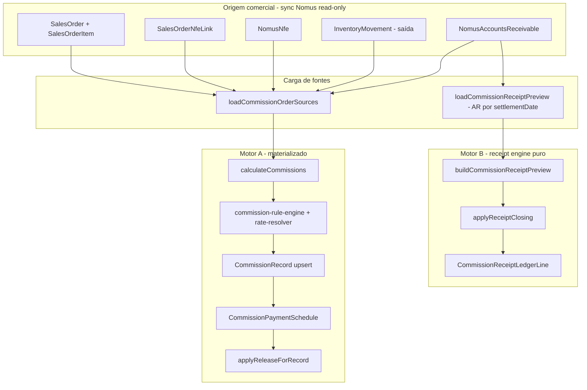
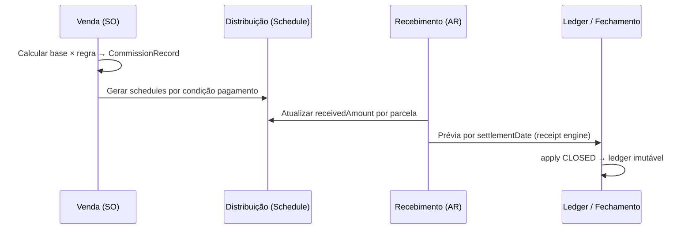

# Auditoria — Materialização de Comissões

**Projeto:** IndusCost / My Industry  
**Data:** 2026-07-06  
**Fase:** Auditoria e plano — **sem implementação**  
**Escopo:** Documentar estado atual antes da nova arquitetura de materialização.

---

## Regra conceitual alvo (negócio)

| Etapa | Significado |
|-------|-------------|
| **Venda** | Calcula a comissão (base comercial × regra vigente). |
| **Condição de pagamento** | Distribui a comissão nas parcelas previstas. |
| **Recebimento** | Libera a comissão proporcional ao valor recebido no CR. |
| **Fechamento** | Congela a comissão do período (imutável para pagamento). |

**Restrições desta etapa:** não criar tabela, não alterar regra, não alterar sync Nomus, não apagar código — apenas documentar.

---

## 1. Estado atual

### 1.1 Resumo executivo

O módulo de comissões **já está implementado** com motor central, persistência Prisma, telas simplificadas e scripts de auditoria. Existem **dois caminhos paralelos** para “comissão a pagar”:

1. **Legado (materializado):** `CommissionRecord` + `CommissionPaymentSchedule` com `commissionReleasedAmount`, atualizado pelo recálculo (`calculateCommissions` → `applyReleaseForRecord`).
2. **Novo (receipt-based):** motor puro `commissionReceiptEngine` + fechamento em `CommissionMonthlyClosing` / `CommissionReceiptLedgerLine`, sem depender do schedule materializado para o total oficial.

A UI ativa (`COMMISSIONS_SIMPLIFIED_UI = true`) expõe quatro seções: **Fechamento do mês** (receipt closing), **Previsão**, **Auditoria Visual** e **Exceções por cliente**. Dezenas de telas e endpoints legados permanecem no código, mas rotas redirecionam para `/commissions`.

### 1.2 Alinhamento com a regra conceitual alvo

| Etapa alvo | Situação hoje | Observação |
|------------|---------------|------------|
| Venda calcula | **Parcial** | Cálculo ocorre no **pedido** (forecast) e é **reconfirmado na NF-e** (`OUTPUT_DOCUMENT`). A NF é o marco operacional de confirmação (`confirmedAt`). |
| Condição distribui | **Parcial** | `CommissionPaymentSchedule` com fonte `SALES_ORDER_INSTALLMENT` (previsão do `nomusRawResponse`) ou `ACCOUNTS_RECEIVABLE` (parcelas reais do CR). Rateio proporcional em `allocateProportional`. |
| Recebimento libera | **Duplicado** | (a) `commission-release-service` atualiza `commissionReleasedAmount` no schedule; (b) `commissionReceiptEngine` recalcula liberação por `settlementDate` na prévia/fechamento. |
| Fechamento congela | **Em evolução** | `CommissionMonthlyClosing` + `CommissionReceiptLedgerLine` com status `CLOSED`; reprocessamento gera supersessão. Legado PAYABLE via visual audit ainda existe com aviso de depreciação. |

### 1.3 Documentação relacionada já existente

| Documento | Conteúdo |
|-----------|----------|
| `docs/commissions-audit-current-state.md` | Inventário técnico (2026-07-03). |
| `docs/commission-receipt-engine-plan.md` | Plano do motor por recebimento e ledger. |
| `docs/commission-monthly-closing-design.md` | Design do fechamento mensal. |
| `docs/commission-customer-exclusion-design.md` | Exclusões de cliente. |
| `docs/commission-summary.md` | Campos de resumo KPI. |
| `docs/commissions/commission-module-blueprint.md` | Blueprint do módulo. |

---

## 2. Modelos existentes (Prisma)

### 2.1 Tabelas do domínio comissão (16 modelos)

> **Nota:** não existe modelo `CommissionSchedule`. O equivalente é **`CommissionPaymentSchedule`**.

| Modelo | Tabela | Papel |
|--------|--------|-------|
| `CommissionPerson` | `CommissionPerson` | Vendedor/representante canônico (`nomusPersonId`, `type`, `active`). |
| `CommissionPersonAlias` | `CommissionPersonAlias` | Alias `rawSellerId` + `source` → pessoa canônica (partial unique ACTIVE). |
| `CommissionRule` | `CommissionRule` | Regra: `ratePercent`, `baseType`, `releaseRule`, `calculationType`, vigência. |
| `CommissionRuleCondition` | `CommissionRuleCondition` | Escopo: cliente, vendedor, produto, empresa, faixas. |
| `CommissionCalculationRun` | `CommissionCalculationRun` | Job de recálculo (`mode`, período, contadores). |
| `CommissionRecord` | `CommissionRecord` | Linha materializada: pedido/NF/item × pessoa × valor. |
| `CommissionPaymentSchedule` | `CommissionPaymentSchedule` | Parcela: `commissionExpectedAmount`, `commissionReleasedAmount`, `nomusReceivableId`. |
| `CommissionPaymentBatch` | `CommissionPaymentBatch` | Lote de pagamento manual por período + pessoa. |
| `CommissionPaymentBatchItem` | `CommissionPaymentBatchItem` | Item do lote (record + schedule opcional). |
| `CommissionAuditIssue` | `CommissionAuditIssue` | Issues polimórficos (vínculos, divergências). |
| `CommissionSettings` | `CommissionSettings` | Config JSON operacional (singleton). |
| `CommissionCustomerException` | `CommissionCustomerException` | Exceção auditável por cliente/produto (legado UI). |
| `CommissionCustomerExclusionRule` | `CommissionCustomerExclusionRule` | Exclusão com vigência (`effectiveFrom`/`effectiveTo`, `status`). |
| `CommissionMonthlyClosing` | `CommissionMonthlyClosing` | Cabeçalho do fechamento mensal (`RECEIPT_BASED`). |
| `CommissionReceiptLedgerLine` | `CommissionReceiptLedgerLine` | Linha congelada por recebimento (base, % , liberado). |

### 2.2 Enums relevantes

| Enum | Valores principais |
|------|-------------------|
| `CommissionRuleBaseType` | `SALES_ORDER_ITEM_NET`, `OUTPUT_DOCUMENT_ITEM_NET`, `RECEIVABLE_AMOUNT` |
| `CommissionReleaseRule` | `SALES_ORDER_CREATED`, `OUTPUT_DOCUMENT_CREATED`, `FIRST_RECEIVABLE_PAID`, `EACH_RECEIVABLE_PAID` |
| `CommissionPaymentScheduleSource` | `SALES_ORDER_INSTALLMENT`, `ACCOUNTS_RECEIVABLE` |
| `CommissionRecordOriginStage` | `SALES_ORDER`, `OUTPUT_DOCUMENT` |
| `CommissionRecordStatus` | `FORECAST_FROM_ORDER` → `CONFIRMED_BY_OUTPUT_DOCUMENT` → `PARTIALLY_RELEASED`/`RELEASED` → `PAID_*` |
| `CommissionMonthlyClosingStatus` | `DRAFT`, `PREVIEWED`, `CLOSED`, `CANCELLED`, `REPROCESSED` |
| `CommissionReceiptLedgerLineStatus` | `COMMISSIONABLE`, `CUSTOMER_EXCLUDED`, `NO_SALES_LINK`, `NO_SELLER`, `NO_RULE`, … |

### 2.3 Tabelas comerciais / Nomus usadas pela comissão (sem FK Prisma)

| Modelo | Uso na comissão |
|--------|-----------------|
| `SalesOrder` | Origem do pedido; `issueDate`, `externalSellerId`, `paymentTerms`, `nomusRawResponse`. |
| `SalesOrderItem` | Base por item (`totalNetValue`, produto, `notes` com `[nomus-line:id]`). |
| `SalesOrderNfeLink` | Vínculo pedido ↔ NF-e Nomus (`nfeExternalId`, `dataProcessamento`). |
| `NomusNfe` | NF-e autorizada; `dataProcessamento` → `confirmedAt`; `valorLiquido`. |
| `InventoryMovement` | Documento de saída (tipos `MANUAL_EXIT`, etc.) — validação de cadeia. |
| `NomusAccountsReceivable` | CR Nomus; **`settlementDate`** (baixa), `dueDate`, `amountReceived`, `sourceInvoiceId`. |

### 2.4 Migrations notáveis

| Migration | Conteúdo |
|-----------|----------|
| `20260701120000_commissions_module_base` | Base do módulo (records, schedules, rules, batches). |
| `20260706140000_commission_person_alias` | `CommissionPersonAlias`. |
| `20260707120000_commission_customer_exclusion_rules` | Exclusões de cliente. |
| `20260708120000_commission_receipt_ledger` | `CommissionMonthlyClosing` + `CommissionReceiptLedgerLine`. |

---

## 3. Fluxo atual

### 3.1 Diagrama geral

### 3.2 Onde o sistema busca Pedido de Venda, NF-e e Contas a Receber

| Dado | Arquivo principal | Query / critério |
|------|-------------------|------------------|
| **Pedido de Venda** | `commission-source-resolver.server.ts` → `loadCommissionOrderSources` | `salesOrder.findMany` por `issueDate` no período; select com `items`, `nfeLinks`, `Customer`, `nomusRawResponse`. |
| **Pedido por NF** | `loadCommissionOrderSourcesByNfeExternalIds` | Pedidos com `nfeLinks.some(nfeExternalId in …)` — usado pelo receipt engine. |
| **NF-e** | `buildCommissionOrderSourceBundlesFromOrders` | `nomusNfe.findMany` por `externalId`; fallback em `SalesOrderNfeLink.rawPayload`. |
| **Doc. saída** | idem | `inventoryMovement.findMany` por `nfeId` / `nfeNumber`. |
| **Contas a Receber (motor A)** | idem | `nomusAccountsReceivable.findMany` por `sourceInvoiceId in nfeExternalIds`. |
| **Contas a Receber (motor B)** | `commissionReceiptEngine.server.ts` → `loadCommissionReceiptPreview` | `nomusAccountsReceivable.findMany` por **`settlementDate`** no mês, `amountReceived > 0`. |

Helpers de mapeamento puro: `commission-source-resolver.ts` (`mapSalesOrderItemToSource`, `mapReceivableSource`, `assembleOrderSourceBundle`, `extractForecastInstallmentsFromNomusRaw`).

### 3.3 Onde a comissão é calculada hoje

| Camada | Arquivo | Função | Quando roda |
|--------|---------|--------|-------------|
| **Motor principal (grava)** | `commission-calculation-service.server.ts` | `calculateCommissions` | API `POST /api/commissions/recalculate`, auditoria `rerunCommissionAudit`, script `recalculate-commissions.ts`. |
| **Processamento por item** | idem | `processBeneficiaryForItem` | Por pedido × item × beneficiário (SELLER/REPRESENTATIVE). |
| **Seleção de regra** | `commission-rule-engine.ts` | `selectBestMatchingRule` | Match por condições + vigência. |
| **Percentual** | `commission-rate-resolver.server.ts` | `resolveCommissionRateForItem` | Fixo ou faixa comercial (`COMMERCIAL_PRICE_TIER`). |
| **Exclusão cliente** | `commissionCustomerExclusionApply.ts` | `applyCustomerExclusionToCommission` | Zera ou bloqueia persistência. |
| **Preview (não grava)** | `commission-preview-calculation.server.ts` | `previewCommissionCalculation` | Script `recalculate-commissions.ts --preview`. |
| **Receipt engine (não grava)** | `commissionReceiptEngine.ts` | `buildCommissionReceiptPreview` | Prévia/fechamento por `settlementDate`; recalcula base × % por linha de recebimento. |

**Marcos de cálculo no motor A:**

1. **Forecast (pedido, sem NF autorizada):** `originStage=SALES_ORDER`, schedules `SALES_ORDER_INSTALLMENT` via `buildForecastSchedules`.
2. **Confirmado (NF autorizada):** `originStage=OUTPUT_DOCUMENT`, `confirmedAt = nfe.dataProcessamento`, schedules `ACCOUNTS_RECEIVABLE` ou forecast se sem CR.
3. **Supersessão:** forecasts `FORECAST_FROM_ORDER`/`WAITING_NFE` → `SUPERSEDED_BY_OUTPUT_DOCUMENT` quando NF confirma.

### 3.4 Onde a comissão é liberada por recebimento hoje

| Caminho | Arquivo | Mecanismo |
|---------|---------|-----------|
| **Materializado (schedule)** | `commission-release-service.ts` | `computeScheduleReleaseTarget` — proporcional `receivedAmount / receivableAmount` para `EACH_RECEIVABLE_PAID`; `FIRST_RECEIVABLE_PAID`; liberação imediata para `SALES_ORDER_CREATED` / `OUTPUT_DOCUMENT_CREATED`. |
| **Aplicação no banco** | `commission-calculation-service.server.ts` | `applyReleaseForRecord` após upsert quando há receivables; atualiza `commissionReleasedAmount` e `releasedAmount` do record. |
| **Leitura PAYABLE legado** | `commissionVisualAudit.server.ts` | Modo `PAYABLE`: filtra por `settlementDate`, lê `commissionReleasedAmount` dos schedules. |
| **Receipt engine** | `commissionReceiptEngine.ts` | Calcula `releasedCommissionAmount` por linha de AR recebido no período (independente do schedule materializado). |
| **Fechamento oficial** | `commissionReceiptClosing.server.ts` | Persiste ledger; `CommissionMonthlyClosing.status = CLOSED`. |
| **Resolução de relatório** | `commissionReportSource.server.ts` | `resolveMonthlyPayableReport`: `auto` = ledger fechado > prévia receipt > legado com aviso. |

### 3.5 APIs e telas ativas

| Rota UI | Componente | API principal |
|---------|------------|---------------|
| `/commissions` | `CommissionsReceiptClosingPage` | `/api/commissions/receipt-closing/*`, `/api/commissions/monthly-closing` |
| `/commissions/previsao` | `CommissionsReceivableForecastPage` | `/api/commissions/receivable-forecast` |
| `/commissions/auditoria` | `CommissionsVisualAuditPage` | `/api/commissions/visual-audit` |
| `/commissions/exclusoes-cliente` | `CommissionsCustomerExclusionsPage` | `/api/commissions/customer-exclusions` |

Registro de rotas: `src/lib/commissionsRoutes.ts` (~40 endpoints, incluindo recalculate, payments, rules, legacy AR views).

---

## 4. Problemas encontrados

### 4.1 Dois motores para “comissão a pagar”

- **Motor A** materializa em `CommissionPaymentSchedule.commissionReleasedAmount` durante recálculo.
- **Motor B** recalcula na prévia/fechamento a partir de AR + pedido + regras, gravando em `CommissionReceiptLedgerLine`.

Sem fechamento `CLOSED`, telas e scripts podem divergir (ex.: junho/2026 — esperado R$ 11.285,75 vs liberado R$ 7.505,02 no legado).

### 4.2 Eixos temporais distintos

| Visão | Eixo | Risco |
|-------|------|-------|
| Apuração / Confirmadas | `confirmedAt` / `calculatedAt` | Mostra comissão **gerada**, não pagável. |
| Previsão | `dueDate` | Mostra comissão **prevista**, não recebida. |
| PAYABLE / Fechamento | `settlementDate` | Comissão **oficial a pagar**. |

Usar apuração ou dashboard legado para pagamento mensal gera decisão financeira errada.

### 4.3 Regras de liberação que conflitam com “recebimento libera”

`CommissionReleaseRule` inclui `SALES_ORDER_CREATED` e `OUTPUT_DOCUMENT_CREATED`, que liberam comissão **sem recebimento** quando `receivableAsDefinitiveReleaseSource` está desligado nas settings. Isso contradiz a regra conceitual alvo.

### 4.4 Cálculo na NF vs “venda calcula”

Hoje o valor **definitivo** materializado nasce na **NF-e** (`OUTPUT_DOCUMENT`), não no pedido. O pedido gera apenas forecast substituível. A regra alvo sugere cálculo na venda com distribuição posterior — exige separar **valor calculado** de **marco de confirmação documental**.

### 4.5 Condição de pagamento frágil

- Forecast usa parcelas extraídas de `nomusRawResponse` (`extractForecastInstallmentsFromNomusRaw`).
- Quando CR existe, rateio usa `amountReceivable` real.
- Se CR ainda não sincronizado no recálculo, schedule fica em forecast e liberação não reflete recebimentos posteriores até novo `calculateCommissions`.

### 4.6 Identidade de vendedor

Múltiplos `rawSellerId` Nomus → um `CommissionPerson` via `CommissionPersonAlias`. Divergências de consolidação afetam fechamento e comparação com planilha Nomus (scripts `audit-commission-seller-identity.ts`).

### 4.7 UI simplificada vs código legado

`COMMISSIONS_SIMPLIFIED_UI` desativa rotas, mas **servidores e scripts legados permanecem ativos** (`commissionApuracao`, `commissionReleases`, `commissionArViews`, dashboard, payments UI). Risco de manutenção e confusão operacional.

### 4.8 Nomus como referência, não como fonte de pagamento

Comparações (`reconcile-commission-nomus-june-2026.ts`) mostram gap estrutural vs export manual Nomus (escopo vendedor, tabela, timing). IndusCost deve ser fonte oficial após fechamento, não espelho Nomus.

---

## 5. Proposta de arquitetura nova (materialização)

> **Não implementar nesta etapa.** Plano para alinhar ao modelo de quatro etapas.

### 5.1 Princípios

1. **Uma fonte oficial por etapa** — cada etapa produz artefato imutável ou versionado.
2. **Receipt ledger como verdade de pagamento** — fechamento `CLOSED` é contrato financeiro.
3. **Motor único de cálculo, múltiplas projeções** — evitar recalcular % em três lugares.
4. **Recebimento como único gatilho de liberação** — deprecar `SALES_ORDER_CREATED` / `OUTPUT_DOCUMENT_CREATED` para pagamento.

### 5.2 Mapeamento conceitual → artefatos

| Etapa | Artefato proposto | Reaproveitar |
|-------|-------------------|--------------|
| Venda calcula | `CommissionRecord` com `originStage=SALES_ORDER` como **valor calculado definitivo** (não só forecast) | `CommissionRecord`, `commission-rule-engine`, exclusões |
| Condição distribui | `CommissionPaymentSchedule` sempre derivado da condição de pagamento (pedido ou CR) | `allocateProportional`, `buildForecastSchedules`, `buildReceivableSchedules` |
| Recebimento libera | Linhas em `CommissionReceiptLedgerLine` (pré-fechamento) + atualização opcional de `commissionReleasedAmount` | `commissionReceiptEngine`, `commission-release-service` (só `EACH_RECEIVABLE_PAID`) |
| Fechamento congela | `CommissionMonthlyClosing` `CLOSED` + hash `calculationHash` | `commissionReceiptClosing.server.ts`, `commissionReportSource` |

### 5.3 Fluxo alvo (conceitual)

### 5.4 O que unificar

| Hoje (duplicado) | Alvo |
|------------------|------|
| `applyReleaseForRecord` + receipt engine | Receipt engine como cálculo; schedule como espelho opcional para auditoria |
| Visual audit PAYABLE + monthly payable legado | `resolveMonthlyPayableReport` só `receipt` / `auto` em produção |
| Apuração por `confirmedAt` | Renomear/clarificar como “comissão gerada”, nunca “a pagar” |

### 5.5 O que não mudar nesta fase

- Sync Nomus (`NomusAccountsReceivable`, `SalesOrder` sync).
- Schema Prisma existente (evolução futura via migration explícita).
- Regras de negócio cadastradas (`CommissionRule`, exclusões).

---

## 6. Código legado candidato a inativação

> **Candidato** = não combina com a nova lógica ou foi substituído; **não apagar** até migração completa.

### 6.1 Telas (UI desativada, código preservado)

| Arquivo | Motivo |
|---------|--------|
| `CommissionsDashboardPage.tsx` | KPIs por `confirmedAt`; não é PAYABLE. |
| `CommissionsApuracaoPage.tsx` | Apuração ≠ fechamento por recebimento. |
| `CommissionsReleasesPage.tsx` | Liberação via schedule materializado (visão intermediária). |
| `CommissionsConfirmedPage.tsx` | Confirmadas por NF, não por recebimento. |
| `CommissionsForecastPage.tsx` | Substituída por `CommissionsReceivableForecastPage`. |
| `CommissionsArPages.tsx` / `CommissionsArViewPage.tsx` | Views AR legadas (payable/generated/future/overdue). |
| `CommissionsPaymentsPage.tsx` | Lotes manuais — revisar após ledger oficial. |
| `CommissionsMonthlyClosingPage.tsx` | **Órfã** (não roteada); substituída por `CommissionsReceiptClosingPage`. |
| `CommissionsRulesPage.tsx`, `CommissionsPersonsPage.tsx`, etc. | Desativadas na UI simplificada; APIs ainda existem. |

### 6.2 Serviços / leituras legadas

| Arquivo | Motivo |
|---------|--------|
| `commissionApuracao.server.ts` | Eixo `confirmedAt`; não usar para pagamento. |
| `commissionReleases.server.ts` | Lista liberação do schedule, não ledger fechado. |
| `commissionArViews.server.ts` | Views payable/generated/future/overdue duplicam visual audit. |
| `commissionConfirmed.server.ts` | Confirmadas ≠ pagáveis. |
| `commissionDashboard.server.ts` | Dashboard agregado legado. |
| `listPayableVisualAuditRows` (modo legado em `commissionVisualAudit.server.ts`) | Marcado `LEGACY_PAYABLE_DEPRECATION_NOTICE` em `commissionReportSource.ts`. |

### 6.3 Scripts majoritariamente legados ou de reconciliação pontual

| Script | Status |
|--------|--------|
| `audit-commission-apuracao.ts` | Legado — eixo confirmação. |
| `audit-commission-apuracao-nomus-comparison.ts` | Reconciliação pontual Nomus. |
| `export-commission-june-comparison.ts` | Relatório pontual jun/2026. |
| `reconcile-commission-nomus-june-2026.ts` | Reconciliação pontual. |
| `compare-commission-with-nomus-export.ts` | Comparação manual Nomus. |
| `reconcile-commission-release-amounts.ts` | Diagnóstico schedule vs AR. |
| `preview-commission-interpolated-rates.ts` | Experimento taxas interpoladas. |

### 6.4 Scripts a manter / evoluir

| Script | Papel |
|--------|-------|
| `recalculate-commissions.ts` | Recálculo materializado (até unificação). |
| `validate-commission-receipt-closing.ts` | Validação read-only do novo motor. |
| `apply-commission-receipt-closing.ts` | Fechamento CLI. |
| `preview-commission-receipt.ts` | Prévia receipt engine. |
| `audit-commission-monthly-payable.ts` | Auditoria PAYABLE oficial (`--source=auto\|receipt\|legacy`). |
| `reconcile-ar-vs-commission.ts` | AR × comissão. |
| `audit-commission-links.ts` | Cadeia pedido → NF → AR. |
| `audit-commission-seller-identity.ts` | Consolidação vendedor. |
| `audit-commission-customer-exclusion.ts` | Exclusões. |
| `apply-commission-customer-exclusion-reprocess.ts` | Reprocesso após exclusão. |

---

## 7. Riscos

| # | Risco | Impacto | Mitigação proposta |
|---|-------|---------|-------------------|
| 1 | Pagamento baseado em visão legada (apuração/releases) | Alto — valor errado | Exigir `CommissionMonthlyClosing CLOSED` ou `source=receipt`; bloquear export sem meta `RECEIPT_CLOSED`. |
| 2 | Recálculo sobrescreve registros pagos | Alto — perda histórica | Manter `paidCommissionBlockAutoChange` + testes `commission-payment-service`. |
| 3 | Divergência schedule vs receipt engine | Médio — auditoria confusa | Tratar ledger como oficial; schedule como projeção até deprecação. |
| 4 | CR atrasado no sync Nomus | Médio — liberação atrasada | Jobs de reprocessamento (`receipt-closing/reprocess`); issues `RECEIVED_WITHOUT_RELEASE`. |
| 5 | Regras `OUTPUT_DOCUMENT_CREATED` liberando sem recebimento | Alto — pagamento antecipado | Migrar regras para `EACH_RECEIVABLE_PAID`; flag `receivableAsDefinitiveReleaseSource=true`. |
| 6 | Identidade de vendedor | Médio — rateio por pessoa errada | Expandir `CommissionPersonAlias`; auditoria obrigatória pré-fechamento. |
| 7 | Duplicação de manutenção (2 motores) | Médio — custo engenharia | Roadmap de unificação na seção 5; não criar terceiro motor. |
| 8 | Telas legadas reativadas por engano | Baixo | Manter `COMMISSIONS_SIMPLIFIED_UI` até cutover documentado. |

---

## Anexo A — Serviços existentes (`src/lib/commissions/`)

| Serviço | Responsabilidade |
|---------|------------------|
| `commission-calculation-service.server.ts` | Motor principal: calcular, upsert record/schedule, liberar. |
| `commission-release-service.ts` | Lógica pura de liberação por regra. |
| `commission-source-resolver.server.ts` | Carga SO + NF + AR + doc saída. |
| `commission-source-resolver.ts` | Mapeamento puro bundles. |
| `commission-rule-engine.ts` | Match de regras. |
| `commission-rate-resolver.server.ts` | % fixo ou tier comercial. |
| `commissionReceiptEngine.ts` / `.server.ts` | Prévia por recebimento. |
| `commissionReceiptClosing.ts` / `.server.ts` | Fechamento e ledger. |
| `commissionReportSource.ts` / `.server.ts` | Fonte oficial de relatórios. |
| `commissionVisualAudit.ts` / `.server.ts` | Auditoria visual (GENERATED/FORECAST/PAYABLE). |
| `commissionMonthlyPayable.ts` / `.server.ts` | Agregação mensal a pagar. |
| `commissionReceivableForecast.server.ts` | Previsão por vencimento. |
| `commissionCustomerExclusionRules.server.ts` | CRUD exclusões. |
| `commissionCustomerExclusionApply.ts` | Aplicação de exclusão no cálculo. |
| `commissionSellerIdentity.server.ts` | Resolução vendedor canônico. |
| `commissionPayments.server.ts` | Lotes de pagamento. |
| `commission-payment-service.server.ts` | Marcar pago / batch workflow. |
| `commissionAudit.server.ts` | Issues + rerun audit. |
| `commissionRules.server.ts` | CRUD regras. |
| `commissionPersons.server.ts` | CRUD pessoas. |
| `commissionSettings.server.ts` | Settings JSON. |
| `commissionApuracao.server.ts` | Apuração (legado leitura). |
| `commissionReleases.server.ts` | Lista liberações (legado). |
| `commissionArViews.server.ts` | Views AR legadas. |
| `commissionConfirmed.server.ts` | Confirmadas (legado). |
| `commissionForecast.server.ts` | Forecast pedido (legado). |
| `commissionDashboard.server.ts` | Dashboard (legado). |
| `reconcileArVsCommission.ts` / `.server.ts` | Conciliação AR. |
| `commissionNomusReconciliation.ts` | Helpers reconciliação Nomus. |
| `commissionReceiptClosingValidation.server.ts` | Validação read-only fechamento. |

---

## Anexo B — Arquivos analisados

### Prisma e migrations
- `prisma/schema.prisma` (modelos `Commission*` + `SalesOrder*` + `Nomus*`)
- `prisma/migrations/20260701120000_commissions_module_base/`
- `prisma/migrations/20260706140000_commission_person_alias/`
- `prisma/migrations/20260707120000_commission_customer_exclusion_rules/`
- `prisma/migrations/20260708120000_commission_receipt_ledger/`

### Motor e domínio
- `src/lib/commissions/commission-calculation-service.server.ts`
- `src/lib/commissions/commission-release-service.ts`
- `src/lib/commissions/commission-source-resolver.server.ts`
- `src/lib/commissions/commission-source-resolver.ts`
- `src/lib/commissions/commissionReceiptEngine.ts`
- `src/lib/commissions/commissionReceiptEngine.server.ts`
- `src/lib/commissions/commissionReceiptClosing.ts`
- `src/lib/commissions/commissionReceiptClosing.server.ts`
- `src/lib/commissions/commissionReportSource.ts`
- `src/lib/commissions/commissionReportSource.server.ts`
- `src/lib/commissions/commissionVisualAudit.server.ts`
- `src/lib/commissions/commissionMonthlyPayable.server.ts`
- `src/lib/commissions/commission-preview-calculation.server.ts`
- `src/lib/commissions/commission-rule-engine.ts`
- `src/lib/commissions/commissionCustomerExclusionApply.ts`
- `src/lib/commissions/commissionSellerIdentity.server.ts`
- `src/lib/commissionsRoutes.ts`
- `src/lib/commissionsNavigation.ts`

### UI ativa
- `src/components/CommissionsModule.tsx`
- `src/components/commissions/pages/CommissionsReceiptClosingPage.tsx`
- `src/components/commissions/pages/CommissionsReceivableForecastPage.tsx`
- `src/components/commissions/pages/CommissionsVisualAuditPage.tsx`
- `src/components/commissions/pages/CommissionsCustomerExclusionsPage.tsx`

### Documentação prévia
- `docs/commissions-audit-current-state.md`
- `docs/commission-receipt-engine-plan.md`
- `docs/commission-monthly-closing-design.md`
- `docs/commission-customer-exclusion-design.md`

### Scripts (`scripts/*commission*`)
- `recalculate-commissions.ts`, `validate-commission-receipt-closing.ts`, `apply-commission-receipt-closing.ts`, `preview-commission-receipt.ts`
- `audit-commission-monthly-payable.ts`, `reconcile-ar-vs-commission.ts`, `audit-commission-links.ts`, `audit-commission-missing-links.ts`
- `audit-commission-visual-summary.ts`, `audit-commission-seller-identity.ts`, `audit-commission-customer-exclusion.ts`
- `audit-commission-financial-release.ts`, `audit-commission-receivables-timeline.ts`, `audit-commission-rules-coverage.ts`
- `audit-commission-readiness.ts`, `audit-commission-june-readiness.ts`, `audit-commission-apuracao.ts`
- `reconcile-commission-release-amounts.ts`, `reconcile-commission-nomus-june-2026.ts`
- `compare-commission-with-nomus-export.ts`, `export-commission-june-comparison.ts`
- `preview-commission-interpolated-rates.ts`, `preview-commission-customer-exclusion-impact.ts`
- `apply-commission-customer-exclusion-reprocess.ts`, `backfill-commission-persons.ts`, `dedupe-commission-persons.ts`
- `commission-script-utils.ts`, `commission-audit-args.ts`

---

## Anexo C — Reaproveitável vs legado

| Reaproveitável | Legado / candidato a inativação |
|----------------|--------------------------------|
| `CommissionRecord` como linha de cálculo | Forecast como único artefato de “venda calcula” |
| `CommissionPaymentSchedule` como distribuição | Liberação via schedule sem receipt ledger |
| `CommissionRule` + condições + exclusões | `CommissionCustomerException` (UI antiga) |
| `CommissionPerson` + `CommissionPersonAlias` | Dashboard / apuração / releases UI |
| `commissionReceiptEngine` + ledger + fechamento | `commissionApuracao`, `commissionArViews` |
| `commissionReportSource` (fonte oficial) | Visual audit PAYABLE como fonte primária |
| `commission-release-service` (`EACH_RECEIVABLE_PAID`) | Regras `SALES_ORDER_CREATED` / `OUTPUT_DOCUMENT_CREATED` para pagamento |
| Scripts de auditoria e validação | Scripts pontuais jun/2026 e comparação Nomus manual |

---

## Anexo D — Pontos de conflito com a nova lógica

1. **Cálculo na NF**, não na venda — `originStage=OUTPUT_DOCUMENT` é o registro definitivo hoje.
2. **Liberação sem recebimento** — regras `SALES_ORDER_CREATED` / `OUTPUT_DOCUMENT_CREATED`.
3. **Dois totais PAYABLE** — schedule materializado vs receipt ledger.
4. **Recálculo por `issueDate`** — receipt engine filtra por `settlementDate` (meses diferentes).
5. **Apuração vs fechamento** — mesmos records, filtros temporais opostos.
6. **Pagamento manual em batch** — `CommissionPaymentBatch` não referencia ledger fechado.
7. **UI simplificada vs APIs legadas** — endpoints de rules/persons/releases ainda registrados.

---

*Documento gerado na etapa de auditoria pré-implementação. Nenhuma tabela, regra ou sync foi alterado.*
