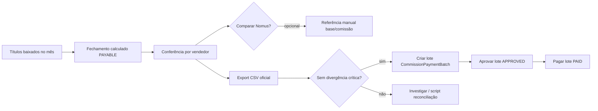

# Design — Fechamento mensal de comissão

**Projeto:** IndusCost / My Industry  
**Data:** 2026-07-03  
**Escopo:** Fluxo operacional de fechamento mensal — auditoria + implementação calculada (sem migration nesta etapa).

---

## 1. Resposta ao checklist YAGNI

| # | Pergunta | Resposta |
|---|----------|----------|
| 1 | Precisa existir agora? | **Sim** — usuário precisa calcular, conferir, comparar Nomus e exportar antes de pagar. |
| 2 | Já existe entidade de pagamento/fechamento? | **Pagamento sim** (`CommissionPaymentBatch`). **Fechamento mensal dedicado: não.** |
| 3 | Já existe CommissionPayment? | **Sim** — via `CommissionPaymentBatch` + `CommissionPaymentBatchItem`. |
| 4 | Já existe auditoria? | **Sim** — `CommissionAuditIssue`, auditoria visual, scripts CLI. |
| 5 | Operar com export sem persistir? | **Sim** — abordagem adotada nesta etapa. |
| 6 | Precisa migration? | **Não nesta etapa** — fechamento é calculado; aprovação usa lote existente. |
| 7 | Se precisar migration, documentar antes | Ver seção 6 — proposta futura documentada. |
| 8 | Altera comissão calculada? | **Não** — somente leitura/agregação PAYABLE. |
| 9 | Impacta pagamento real? | **Não** — lote de pagamento continua fluxo separado. |
| 10 | Build/testes | Rodar `npm run test:commissions`. |

---

## 2. Auditoria de entidades existentes

### Existe

| Entidade | Função | Status |
|----------|--------|--------|
| `CommissionRecord` | Comissão por item/NF | Ativo |
| `CommissionPaymentSchedule` | Parcela CR + liberação | Ativo |
| `CommissionPaymentBatch` | Lote de pagamento por vendedor/período | DRAFT → APPROVED → PAID |
| `CommissionPaymentBatchItem` | Itens do lote | Ativo |
| `CommissionAuditIssue` | Issues de auditoria | Ativo |
| `CommissionCalculationRun` | Histórico de recálculo | Ativo |

### Não existe

| Entidade buscada | Resultado |
|------------------|-----------|
| `CommissionClosing` | **Não** |
| `CommissionSettlement` | **Não** |
| `CommissionBatch` (fechamento) | **Não** — existe batch de **pagamento**, não de fechamento |
| Status de aprovação do **mês** | **Não** — aprovação está no lote de pagamento |

---

## 3. O que já foi implementado (base suficiente)

A tela **Fechamento do mês** (`/commissions`) já entrega:

1. **Calcular comissão a pagar** — `settlementDate` no mês → `commissionReleasedAmount`
2. **Conferir por vendedor** — agrupamentos + tabela por vendedor com status
3. **Comparar com Nomus** — referência manual opcional (base/comissão CLI ou filtros UI)
4. **Exportar** — CSV resumo, detalhe, completo e **oficial** (com status de workflow)
5. **Status derivado** — calculado / revisado / divergente / aprovado / pago (sem gravar fechamento)

### Arquivos principais

| Camada | Arquivo |
|--------|---------|
| UI | `CommissionsMonthlyClosingPage.tsx` |
| API | `GET /api/commissions/monthly-closing`, `.../export` |
| Agregação | `commissionMonthlyPayable.ts` |
| Workflow | `commissionMonthlyClosingWorkflow.ts` |
| Reconciliação Nomus | `scripts/reconcile-commission-nomus-june-2026.ts` |

---

## 4. Fluxo operacional (atual)



### Status de fechamento (derivado, não persistido)

| Status | Significado |
|--------|-------------|
| **Calculado** | Dados agregados do mês; sem lote ou sem revisão |
| **Revisado** | Existe lote DRAFT no período (alguém iniciou pagamento) |
| **Divergente** | Alertas de linha, warnings ou diferença Nomus crítica |
| **Aprovado** | Lote `CommissionPaymentBatch` APPROVED no período |
| **Pago** | Lote PAID no período |

### Regras de validação (aprovação)

- **Não persistimos** “aprovar fechamento” nesta etapa.
- Se no futuro existir entidade de fechamento: **não permitir aprovar com divergência crítica sem justificativa** (`validateClosingApproval` já implementada em lógica pura).
- Histórico de comissão **não é sobrescrito** — fechamento é visão read-only sobre schedules liberados.

---

## 5. Critério de cálculo oficial

| Campo | Uso |
|-------|-----|
| `NomusAccountsReceivable.settlementDate` | Recorte do mês |
| `CommissionPaymentSchedule.commissionReleasedAmount` | Comissão a pagar |
| Base rateada | `allocatedBaseAmount` por schedule (dedup CR) |

**Não usar** `confirmedAt` ou `dueDate` para fechamento “a pagar”.

---

## 6. Proposta futura — migration (requer confirmação)

> **Não implementada.** Só criar após aprovação explícita do usuário.

### `CommissionMonthlyClosing` (hipotético)

```prisma
model CommissionMonthlyClosing {
  id                 String   @id @default(uuid())
  year               Int
  month              Int
  commissionPersonId String?  // null = fechamento global
  status             CommissionMonthlyClosingStatus // DRAFT | REVIEWED | APPROVED | LOCKED
  indusBase          Decimal
  indusCommission    Decimal
  nomusBase          Decimal?
  nomusCommission    Decimal?
  justification      String?
  approvedBy         String?
  approvedAt         DateTime?
  createdAt          DateTime @default(now())
  @@unique([year, month, commissionPersonId])
}
```

**Benefícios:** trilha de aprovação do mês, bloqueio pós-fechamento, justificativa persistida.  
**Riscos:** duplicar estado já coberto parcialmente por `CommissionPaymentBatch`; exige UI de aprovação e permissões.

**Recomendação YAGNI:** operar com export oficial + lote de pagamento até o processo madurar.

---

## 7. Export oficial

Formato `official` no export inclui:

- Metadados: mês, status geral, flag `persistencia_aprovacao=nao`
- Por vendedor: valores + status + lote vinculado + pode_aprovar + motivo_bloqueio
- Detalhe de títulos (mesmo CSV detalhe existente)

---

## 8. Scripts de auditoria relacionados

```bash
# Fechamento genérico
npx tsx scripts/audit-commission-monthly-payable.ts --year=2026 --month=6 --detail

# Reconciliação Nomus (jun/2026 Gislene)
npx tsx scripts/reconcile-commission-nomus-june-2026.ts \
  --seller="GISLENE LIMA" --year=2026 --month=6 \
  --nomus-base=808107.32 --nomus-commission=20926.56
```

---

## 9. Decisão desta etapa

| Item | Decisão |
|------|---------|
| Migration | **Não** |
| Aprovação persistida do mês | **Não** — usar `CommissionPaymentBatch` |
| Cálculo + export + status derivado | **Sim — implementado** |
| Integração leitura lote pagamento | **Sim — status Aprovado/Pago** |
