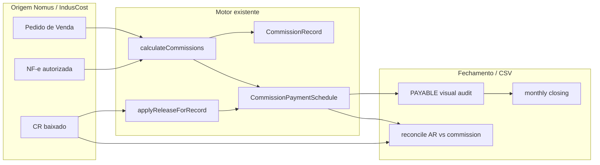
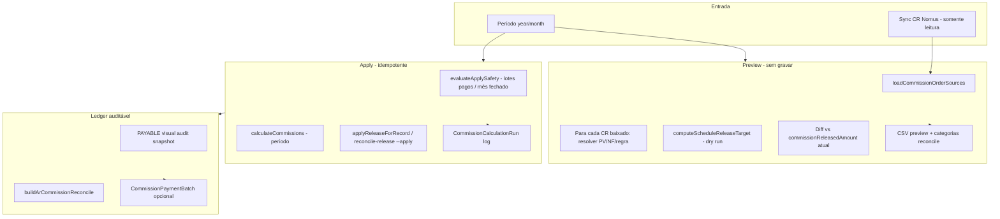

# Plano técnico — Motor de comissão por recebimento

**Projeto:** IndusCost / My Industry  
**Data:** 2026-07-06  
**Fase:** Auditoria e plano — **sem implementação do novo motor nesta etapa**  
**Decisão de negócio:** *Comissão nasce na venda, mas só vira pagável quando o título é recebido.*

---

## Sumário executivo

O IndusCost **já possui** um motor de comissão com `CommissionRecord`, `CommissionPaymentSchedule`, liberação proporcional ao recebimento (`commissionReleasedAmount`) e fechamento mensal PAYABLE por `settlementDate`. O problema de junho/2026 não é ausência de estrutura, e sim **divergência entre visões** (esperado × liberado × Nomus) causada por lacunas de vínculo, schedules ausentes, liberação desatualizada e recortes temporais distintos.

**Recomendação:** não criar um segundo motor paralelo. Evoluir o fluxo existente para um **ledger auditável por recebimento** reutilizando `commission-calculation-service`, `commission-release-service`, `commissionVisualAudit` (PAYABLE) e `reconcileArVsCommission`.

### Divergência observada (junho/2026)

| Métrica | Valor referência |
|---------|-------------------|
| Comissão **esperada** no sistema (PAYABLE, `commissionExpected`) | R$ 11.285,75 |
| Comissão **liberada** no sistema (`commissionReleased`) | R$ 7.505,02 |
| **Diferença líquida** (esperado − liberado) | **R$ 3.780,73** |
| Nomus (referência manual vendedor, base) | R$ 808.107,32 |
| Nomus (referência manual vendedor, comissão) | R$ 20.926,56 |

A diferença interna (R$ 3.780,73) explica títulos parcialmente liberados, sem schedule ou com regras de liberação não satisfeitas. A diferença vs Nomus é adicional (escopo de vendedor, percentual/tabela, timing de sync).

---

## 1. Estado atual

### 1.1 Conceitos operacionais já implementados

| Conceito | Onde vive | Campo / filtro |
|----------|-----------|----------------|
| Comissão **gerada** | `CommissionRecord` | `confirmedAt` (NF/documento) |
| Comissão **prevista** | Schedules em aberto | `dueDate`, título sem baixa |
| Comissão **esperada** por parcela | `CommissionPaymentSchedule` | `commissionExpectedAmount` |
| Comissão **liberada** (pagável) | `CommissionPaymentSchedule` | `commissionReleasedAmount` |
| Comissão **a pagar no mês** | Auditoria visual PAYABLE | `NomusAccountsReceivable.settlementDate` no período |
| Comissão **paga** | Lotes manuais | `CommissionPaymentBatch`, `paidAmount` |

### 1.2 Motor único existente

O cálculo **não** está espalhado em relatórios: há um motor central em:

- `src/lib/commissions/commission-calculation-service.server.ts` — `calculateCommissions`, `upsertCommissionRecord`, `buildReceivableSchedules`, `applyReleaseForRecord`
- `src/lib/commissions/commission-release-service.ts` — `computeScheduleReleaseTarget`, `recomputeCommissionRecordRelease`
- `src/lib/commissions/commission-rule-engine.ts` — seleção de regra vigente
- `src/lib/commissions/commission-rate-resolver.server.ts` — percentual (fixo ou faixa comercial)
- `src/lib/commissions/commissionCustomerExclusionApply.ts` — exclusão de cliente

**Base comercial:** `SALES_ORDER_ITEM_NET`, `OUTPUT_DOCUMENT_ITEM_NET` ou `RECEIVABLE_AMOUNT` conforme `CommissionRule.baseType` — **nunca** `SalesOrderItem.unitCost` industrial.

### 1.3 Visões de leitura (não são motores)

| Visão | Arquivo | Eixo temporal | Total principal |
|-------|---------|---------------|-----------------|
| Auditoria visual GENERATED | `commissionVisualAudit.ts` | `confirmedAt` | `commissionExpectedTotal` |
| Previsão FORECAST | idem | `dueDate` | comissão prevista em aberto |
| **Fechamento PAYABLE** | idem | **`settlementDate`** | **`commissionReleasedTotal`** |
| Apuração | `commissionApuracao.ts` | `confirmedAt` (default) | organiza records, não recalcula |
| Conciliação AR | `reconcileArVsCommission.ts` | `settlementDate` | esperado vs liberado por título |

**Risco atual:** Apuração e PAYABLE usam eixos diferentes; fechamento oficial deve ser sempre PAYABLE.

### 1.4 Documentação e scripts de auditoria já existentes

- `docs/commissions-audit-current-state.md` — inventário do módulo
- `docs/commission-summary.md` — campos de resumo
- `docs/commission-june-2026-reconciliation.md` — reconciliação Nomus
- `scripts/reconcile-ar-vs-commission.ts` — AR × comissão PAYABLE
- `scripts/audit-commission-monthly-payable.ts` — fechamento mensal oficial
- `scripts/reconcile-commission-nomus-june-2026.ts` — comparação Nomus parametrizada
- `scripts/audit-commission-seller-identity.ts` — consolidação de vendedor

---

## 2. Modelos e tabelas existentes (Prisma)

### 2.1 Comissão — 14 modelos, 17 enums

> **Nota:** não existe `CommissionSchedule`. O equivalente é **`CommissionPaymentSchedule`**.

| Modelo | Papel |
|--------|-------|
| `CommissionPerson` | Vendedor/representante canônico (`nomusPersonId`, `name`, `type`) |
| `CommissionPersonAlias` | Mapeamento `rawSellerId` + `source` → canônico (partial unique ACTIVE) |
| `CommissionRule` | Regra: `ratePercent`, `baseType`, `releaseRule`, `calculationType`, vigência |
| `CommissionRuleCondition` | Escopo: cliente, vendedor, produto, empresa, valores |
| `CommissionCalculationRun` | Job de recálculo (modo, período, contadores) |
| `CommissionRecord` | Linha de comissão (pedido/NF/item, base, % , status lifecycle) |
| `CommissionPaymentSchedule` | Parcela/CR: `commissionExpectedAmount`, **`commissionReleasedAmount`**, `nomusReceivableId` |
| `CommissionPaymentBatch` | Lote de pagamento por período + pessoa |
| `CommissionPaymentBatchItem` | Item do lote (record + schedule opcional) |
| `CommissionAuditIssue` | Issues polimórficos (vínculos, divergências) |
| `CommissionSettings` | Config JSON do módulo |
| `CommissionCustomerException` | Exceção auditável por cliente/produto |
| `CommissionCustomerExclusionRule` | Exclusão com vigência (`effectiveFrom`/`effectiveTo`, `status`) |

**Enums relevantes:**

- `CommissionReleaseRule`: `EACH_RECEIVABLE_PAID`, `FIRST_RECEIVABLE_PAID`, `SALES_ORDER_CREATED`, `OUTPUT_DOCUMENT_CREATED`
- `CommissionPaymentScheduleSource`: `SALES_ORDER_INSTALLMENT`, `ACCOUNTS_RECEIVABLE`
- `CommissionRecordStatus`: `FORECAST_FROM_ORDER` → `CONFIRMED_BY_OUTPUT_DOCUMENT` → `PARTIALLY_RELEASED` / `RELEASED` → `PAID_*`

**Migrations notáveis:** `20260701120000_commissions_module_base`, `20260706140000_commission_person_alias`, `20260707120000_commission_customer_exclusion_rules`.

### 2.2 Contas a Receber Nomus

**Modelo:** `NomusAccountsReceivable` (sync somente leitura, sem FK Prisma)

| Campo | Uso na comissão |
|-------|-----------------|
| `externalId` | Chave de join com `CommissionPaymentSchedule.nomusReceivableId` |
| `settlementDate` | **Baixa** — eixo PAYABLE |
| `dueDate` | Previsão FORECAST |
| `amountReceivable` | Valor nominal do título |
| `amountReceived` | Valor recebido (proporção de liberação) |
| `balanceReceivable` | Saldo em aberto |
| `personId`, `personName` | Cliente |
| `sourceInvoiceId`, `sourceInvoiceNumber` | Vínculo lógico com NF |
| `description`, `comments` | Metadados / parcela em texto |

**Sem relação Prisma** com `NomusNfe`, `SalesOrder` ou `CommissionRecord` — vínculos são **inteiros externos** resolvidos em código.

### 2.3 Vínculos AR → NF → Pedido (app layer)

| Helper / serviço | Arquivo |
|------------------|---------|
| Bundle pedido + NF + CR | `commission-source-resolver.server.ts` → `loadCommissionOrderSources` |
| Mapeamento CR por NF | `commission-source-resolver.ts` → `indexReceivablesByNfeId`, `mapReceivableSource` |
| Pedido ↔ NF normalizado | `SalesOrderNfeLink` (`nfeExternalId`) |
| Auditoria de elos | `scripts/audit-commission-links.ts`, `audit-commission-missing-links.ts` |

---

## 3. Rotas e scripts atuais

### 3.1 API principal (`src/lib/commissionsRoutes.ts` — 52 rotas)

**Cálculo e auditoria:**

| Método | Rota | Função |
|--------|------|--------|
| POST | `/api/commissions/recalculate` | `calculateCommissions` |
| POST | `/api/commissions/audit/rerun` | `rerunCommissionAudit` |
| GET | `/api/commissions/visual-audit` | PAYABLE / GENERATED / FORECAST |
| GET | `/api/commissions/visual-audit/export` | CSV auditoria visual |
| GET | `/api/commissions/monthly-closing` | Fechamento mensal |
| GET | `/api/commissions/monthly-closing/export` | CSV oficial (`full`, `summary`, `detail`, `official`) |
| GET | `/api/commissions/apuracao` | Apuração (eixo `confirmedAt`) |

**Pagamento:** `/api/commissions/payment-batches/*` — aprovar e marcar pago.

### 3.2 Scripts CLI (inventário por função)

| Categoria | Scripts |
|-----------|---------|
| **Recálculo** | `recalculate-commissions.ts` (`--preview` / `--apply`) |
| **Liberação** | `reconcile-commission-release-amounts.ts` |
| **Fechamento** | `audit-commission-monthly-payable.ts`, `audit-commission-visual-summary.ts` |
| **Conciliação** | `reconcile-ar-vs-commission.ts`, `reconcile-commission-nomus-june-2026.ts` |
| **Identidade** | `audit-commission-seller-identity.ts`, `backfill-commission-persons.ts` |
| **Exclusão cliente** | `audit-commission-customer-exclusion.ts`, `apply-commission-customer-exclusion-reprocess.ts` |
| **Vínculos** | `audit-commission-links.ts`, `audit-commission-missing-links.ts` |

**Utilitários:** `scripts/commission-script-utils.ts`, `scripts/commission-audit-args.ts`.

---

## 4. Fluxo atual (resumo)



### 4.1 Geração

1. `loadCommissionOrderSources` carrega pedidos, NF-e, documentos de saída e CR.
2. Para cada item elegível, `selectBestMatchingRule` aplica regra **vigente** na data do contexto.
3. `resolveCommissionRateForItem` resolve % (fixo ou faixa comercial interpolada).
4. `applyCustomerExclusionToCommission` zera comissão com motivo se cliente excluído.
5. `upsertCommissionRecord` persiste com `calculationHash` (idempotência).
6. Schedules: `buildForecastSchedules` (pedido) ou `buildReceivableSchedules` (CR vinculado à NF).

### 4.2 Liberação

1. `applyReleaseForRecord` roda após upsert quando há CR.
2. `computeScheduleReleaseTarget` com `EACH_RECEIVABLE_PAID`:  
   `commissionReleased = min(expected, expected × amountReceived / amountReceivable)`.
3. `commissionReleasedAmount` gravado no schedule; `releasedAmount` agregado no record.

### 4.3 Fechamento mensal e CSV

1. `listCommissionVisualAuditPage` modo **PAYABLE** filtra schedules cujo CR tem `settlementDate` no mês.
2. Cards: `commissionReleasedTotal`, `commissionExpectedTotal`, `commissionPendingTotal`.
3. Export: `exportCommissionMonthlyClosingCsv` / `buildVisualAuditCsv`.
4. Conciliação: `buildArCommissionReconcile` categoriza títulos fora da comissão.

---

## 5. Pontos de divergência prováveis (junho/2026)

### 5.1 Diferença interna: esperado R$ 11.285,75 vs liberado R$ 7.505,02 (−R$ 3.780,73)

| Categoria (`reconcileArVsCommission`) | Hipótese |
|---------------------------------------|----------|
| `COMMISSIONABLE_NOT_FULLY_RELEASED` | Título baixado parcialmente; liberação proporcional < esperado |
| `PARTIAL_RECEIPT` | `amountReceived` < `amountReceivable` no CR Nomus |
| `NO_COMMISSION_RECORD` | CR baixado em junho sem `CommissionRecord` / schedule |
| `NO_SCHEDULE` | Record existe mas sem `CommissionPaymentSchedule` para o `nomusReceivableId` |
| `NO_SELLER` | Pedido/NF sem vendedor → record não gerado |
| `SELLER_AMBIGUOUS` | Vendedor não consolidado; linhas fora do canônico |
| `CUSTOMER_EXCLUDED` | Cliente com exclusão — esperado zero, mas base aparece no AR |
| `ZERO_COMMISSION_RULE` | Regra resultou em comissão zero |

**Causa estrutural:** liberação depende de **recálculo** (`calculateCommissions`) após sync do CR. Se Nomus sincronizou baixa depois do último recálculo, `commissionReleasedAmount` fica defasado até `recalculate` ou `reconcile-commission-release-amounts --apply`.

### 5.2 Diferença vs Nomus (base R$ 808.107,32 / comissão R$ 20.926,56)

| Fator | Detalhe |
|-------|---------|
| Escopo de vendedor | Filtro canônico + aliases; títulos sem ID ou com ID duplicado |
| Percentual | IndusCost usa `COMMERCIAL_PRICE_TIER` interpolado; Nomus pode usar tabela fixa |
| Recorte temporal | IndusCost: `settlementDate` no mês; Nomus manual pode incluir/excluir títulos distintos |
| Base comissionável | Rateio por `allocationPercent` entre itens do mesmo CR |
| Sync | AR Nomus desatualizado vs baixa real |

### 5.3 CSV de fechamento — sintomas relatados

- **Títulos baixados sem comissão:** `NO_COMMISSION_RECORD` ou vendedor ausente / exclusão.
- **Comissão maior que prevista:** bug de liberação, duplicidade de schedule ou cap de `commissionExpectedAmount` incorreto — investigar com `audit-commission-financial-release.ts`.

---

## 6. Serviços a reutilizar (não criar nomes novos)

| Necessidade do motor por recebimento | Serviço existente |
|--------------------------------------|-------------------|
| Snapshot oficial PAYABLE | `listCommissionVisualAuditPage` + `buildVisualAuditRow` |
| Agregação mensal | `aggregateMonthlyPayableFromRows` (`commissionMonthlyPayable.ts`) |
| Conciliação título a título | `buildArCommissionReconcile` (`reconcileArVsCommission.ts`) |
| Preview antes de gravar | `previewCommissionCalculation` (`commission-preview-calculation.server.ts`) |
| Apply / recálculo | `calculateCommissions` |
| Matemática de liberação | `computeScheduleReleaseTarget`, `recomputeCommissionRecordRelease` |
| Fonte pedido/NF/CR | `loadCommissionOrderSources` |
| Exclusão de cliente | `resolveCustomerExclusionForSale` |
| Vendedor canônico | `resolveCommissionSellerIdentity` (`commissionSellerIdentity.ts`) |
| Preview/apply com safety | `evaluateExclusionReprocessSafety` (padrão), `evaluateApplySafety` em preview |
| Idempotência | `buildCommissionCalculationHash`, upsert por hash |
| CSV detalhado | `buildVisualAuditCsv`, `arCommissionDetailToCsvRow` |
| Pagamento pós-fechamento | `createCommissionPaymentBatch`, `markCommissionPaymentBatchPaid` |

**Nome sugerido para o snapshot unificado (se necessário):** reutilizar **`buildArCommissionReconcile`** + **`listCommissionVisualAuditPage` (PAYABLE)** — já cobrem ledger de leitura; não criar `buildProjectCostSnapshot` análogo em comissões sem necessidade.

---

## 7. Arquitetura proposta — motor por recebimento (evolução, não rewrite)

### 7.1 Princípio

> Comissão nasce na venda (`CommissionRecord` + regra vigente), mas só vira pagável quando o título é recebido (`commissionReleasedAmount` após `settlementDate`).

O “novo motor” é uma **camada de orquestração** sobre o existente, com ledger auditável.

### 7.2 Componentes propostos



### 7.3 Fluxo por título baixado (regra simplificada)

Para cada `NomusAccountsReceivable` com `settlementDate` no mês:

1. Localizar NF via `sourceInvoiceId` / `sourceInvoiceNumber`.
2. Localizar pedido via `SalesOrderNfeLink` ou metadados do record.
3. Carregar regra vigente na data da venda/NF (`CommissionRule` + condições).
4. Verificar `CommissionCustomerExclusionRule` na data da venda.
5. Resolver vendedor canônico (`CommissionPerson` + `CommissionPersonAlias`).
6. Calcular `commissionExpectedAmount` na venda (já feito pelo motor).
7. Calcular `commissionReleasedAmount` = f(recebido no mês, proporcional).
8. Registrar no ledger PAYABLE; categorizar divergências.

### 7.4 Preview

- **Entrada:** `year`, `month`, filtros opcionais (`seller`, `customer`).
- **Saída:** JSON + CSV com colunas alinhadas a `reconcile-ar-vs-commission.ts`:
  `receivableId`, `settlementDate`, `amountReceived`, `commissionExpected`, `commissionReleased`, `reasonExcluded`, `canonicalSellerId`, `resolutionStatus`.
- **Implementação:** extrair handler comum de `runArVsCommissionReconcile` + simulação dry-run de `computeScheduleReleaseTarget` para títulos sem schedule.

### 7.5 Apply

- **Pré-condição:** `evaluateApplySafety` — bloquear se lote `PAID` no período ou registro pago.
- **Passos:**
  1. `calculateCommissions` para o período (modo `RELEASE` ou `FULL_RECALC` conforme settings).
  2. Opcional: `reconcile-commission-release-amounts --apply` para backfill de liberação.
  3. Registrar `CommissionCalculationRun` com `summaryJson` do diff.
- **Idempotência:** `calculationHash` + upsert de schedules por `(commissionRecordId, nomusReceivableId, installmentNumber, source)`.

### 7.6 Ledger / fechamento auditável

- **Leitura oficial:** `GET /api/commissions/monthly-closing` modo PAYABLE (já existe).
- **Persistência de fechamento:** hoje derivada de `CommissionPaymentBatch` (`commissionMonthlyClosingWorkflow.ts`). Fase 2 pode introduzir entidade `CommissionMonthlyClosing` (ver `docs/commission-monthly-closing-design.md`) — **fora desta etapa**.
- **CSV detalhado:** unificar export `official` com colunas de reconcile + identidade de vendedor.

### 7.7 Reprocessamento seguro

Reutilizar padrão de `commissionCustomerExclusionReprocess.server.ts`:

- `preview` → diff por título
- `evaluateSafety` → bloqueia mês com lote aprovado/pago
- `apply` → recálculo + liberação
- `--skip-closed-months` para meses com batch `APPROVED`/`PAID`

---

## 8. Plano de implementação em etapas

### Etapa 0 — Baseline (concluída nesta auditoria)

- [x] Inventariar modelos, rotas, scripts
- [x] Documentar divergências junho/2026
- [x] Definir reutilização vs novo motor

### Etapa 1 — Diagnóstico automatizado (próxima)

- Rodar `reconcile-ar-vs-commission.ts --year=2026 --month=6 --json --details` em produção/staging
- Rodar `audit-commission-links.ts` e `audit-commission-missing-links.ts`
- Quantificar cada `breakdownCategory` para os R$ 3.780,73
- **Entregável:** relatório CSV categorizado (sem alterar dados)

### Etapa 2 — Correção de dados (preview/apply)

- `recalculate-commissions.ts --preview` → `--apply` para junho/2026
- `reconcile-commission-release-amounts.ts --preview` → `--apply`
- Validar redução da diferença esperado − liberado
- **Entregável:** `CommissionCalculationRun` com log

### Etapa 3 — API preview/apply por recebimento

- Expor endpoint `POST /api/commissions/receipt-engine/preview` e `/apply` encapsulando fluxo acima
- Reutilizar `previewCommissionCalculation` + `buildArCommissionReconcile`
- **Sem nova tabela** na primeira versão

### Etapa 4 — UI e fechamento

- Tela de fechamento exibe diff esperado × liberado por categoria
- Bloqueio de apply em mês com lote pago
- CSV único “oficial” com colunas de reconcile

### Etapa 5 — Ledger persistido (opcional)

- Migration `CommissionMonthlyClosing` + snapshot imutável do fechamento
- Somente se Etapa 4 não bastar para auditoria

---

## 9. Riscos

| Risco | Mitigação |
|-------|-----------|
| Criar segundo motor divergente | Reutilizar `calculateCommissions` + `commission-release-service` |
| Recálculo sobrescrever registros pagos | `evaluateApplySafety`, `activeCommissionRecordWhere`, guards em exclusion reprocess |
| Sync Nomus atrasado | Job pós-sync: trigger de `RELEASE` recalc; monitorar `syncedAt` |
| Vendedor não consolidado | Obrigar resolução via `CommissionPersonAlias` antes de apply |
| Apuração vs PAYABLE confundidos | Documentar e rotular UI; apuração não é “a pagar” |
| Faixa comercial ≠ Nomus | Conciliação parametrizada (`nomusReference`); não hardcodar referências |
| Performance em recálculo mensal | Período restrito; índices em `nomusReceivableId`, `settlementDate` |
| Duplicidade de schedule | Manter chave upsert existente; testes em `commission-release-service.test.ts` |

---

## 10. Decisões técnicas recomendadas

1. **Eixo oficial de pagamento:** `NomusAccountsReceivable.settlementDate` + `commissionReleasedAmount` (manter).
2. **Não criar `CommissionSchedule`:** usar `CommissionPaymentSchedule`.
3. **Motor único:** evoluir `commission-calculation-service`, não fork.
4. **Preview obrigatório** antes de qualquer apply em produção.
5. **Ledger de leitura:** `reconcileArVsCommission` + PAYABLE visual audit como fonte de CSV.
6. **Exclusão de cliente:** manter `CommissionCustomerExclusionRule`; títulos aparecem com comissão zero e motivo.
7. **Vendedor:** `resolveCommissionSellerIdentity`; conflitos ficam `AMBIGUOUS` sem consolidação automática.
8. **Base:** comercial (`SALES_ORDER_ITEM_NET` / `OUTPUT_DOCUMENT_ITEM_NET` / `RECEIVABLE_AMOUNT`) — nunca custo industrial.
9. **Nomus:** referência manual via parâmetro CLI/API (`nomusReferenceBase`, `nomusReferenceCommission`), não hardcoded.
10. **Testes:** estender `reconcileArVsCommission.test.ts` com cenário R$ 3.780,73; E2E em `commissionE2eValidation.test.ts`.

---

## 11. O que NÃO será alterado (nesta e nas próximas etapas iniciais)

- Sync Nomus / tabelas `NomusAccountsReceivable` (somente leitura)
- Módulo Financeiro / AR interno fora do escopo de comissão
- `SalesOrderItem.unitCost` como base de comissão
- Regras de custo industrial / produção
- Consolidação automática de vendedores sem alias aprovado
- Hardcode de clientes, vendedores ou valores Nomus no código
- Criação de migration nesta etapa de auditoria

---

## 12. Checklist YAGNI (respostas)

| # | Pergunta | Resposta |
|---|----------|----------|
| 1 | Isso realmente precisa existir? | Sim — fechamento mensal exige rastreio título a título |
| 2 | Já existe motor/service/API? | **Sim** — motor + PAYABLE + reconcile |
| 3 | Nomus fornece baixa/valor? | **Sim** — `settlementDate`, `amountReceived` |
| 4 | Banco tem Record/Schedule/Alias/exclusão? | **Sim** |
| 5 | Helper AR → NF → Pedido? | **Sim** — `commission-source-resolver` |
| 6 | Segundo motor sem necessidade? | **Evitar** — orquestrar o existente |
| 7 | Alterar Financeiro/AR/sync? | **Não** |
| 8 | Regra vigente na data correta? | Sim via `commission-rule-engine`; validar em preview |
| 9 | Rastreabilidade? | `CommissionCalculationRun`, `calculationHash`, CSV reconcile |
| 10 | Testes provam título → comissão? | Parcial — reforçar em Etapa 1–3 |

---

## 13. Arquivos analisados (referência)

### Schema e migrations
- `prisma/schema.prisma` (Commission*, NomusAccountsReceivable)
- `prisma/migrations/20260701120000_commissions_module_base/`
- `prisma/migrations/20260706140000_commission_person_alias/`
- `prisma/migrations/20260707120000_commission_customer_exclusion_rules/`
- `prisma/migrations/20260606120000_nomus_accounts_receivable/`

### Motor e liberação
- `src/lib/commissions/commission-calculation-service.server.ts`
- `src/lib/commissions/commission-release-service.ts`
- `src/lib/commissions/commission-source-resolver.server.ts`
- `src/lib/commissions/commission-source-resolver.ts`
- `src/lib/commissions/commission-rule-engine.ts`
- `src/lib/commissions/commission-preview-calculation.server.ts`
- `src/lib/commissions/commissionCustomerExclusionApply.ts`
- `src/lib/commissions/commissionSellerIdentity.ts`

### Fechamento e conciliação
- `src/lib/commissions/commissionVisualAudit.ts`
- `src/lib/commissions/commissionVisualAudit.server.ts`
- `src/lib/commissions/commissionMonthlyPayable.ts`
- `src/lib/commissions/commissionMonthlyPayable.server.ts`
- `src/lib/commissions/commissionMonthlyClosingWorkflow.ts`
- `src/lib/commissions/reconcileArVsCommission.ts`
- `src/lib/commissions/reconcileArVsCommission.server.ts`
- `src/lib/commissions/commissionApuracao.ts`
- `src/lib/commissions/commissionNomusReconciliation.ts`

### API e scripts
- `src/lib/commissionsRoutes.ts`
- `scripts/reconcile-ar-vs-commission.ts`
- `scripts/audit-commission-monthly-payable.ts`
- `scripts/recalculate-commissions.ts`
- `scripts/reconcile-commission-release-amounts.ts`
- `scripts/audit-commission-seller-identity.ts`
- `scripts/audit-commission-links.ts`

### Documentação pré-existente
- `docs/commissions-audit-current-state.md`
- `docs/commission-summary.md`
- `docs/commission-june-2026-reconciliation.md`
- `docs/commission-monthly-closing-design.md`

---

## 14. Comandos de validação (pós-implementação futura)

```bash
# Conciliação AR × comissão PAYABLE
npx tsx scripts/reconcile-ar-vs-commission.ts --year=2026 --month=6 --json --details

# Fechamento mensal oficial
npx tsx scripts/audit-commission-monthly-payable.ts --year=2026 --month=6 --csv

# Preview recálculo (sem gravar)
npx tsx scripts/recalculate-commissions.ts --year=2026 --month=6 --preview

# Testes
npm run test:commissions
```

---

## 15. Modelagem persistida (2026-07-08)

Migration `20260708120000_commission_receipt_ledger`:

- `CommissionMonthlyClosing` — fechamento mensal auditável (`DRAFT` → `PREVIEWED` → `CLOSED`)
- `CommissionReceiptLedgerLine` — linha por título recebido com snapshot de regra/vendedor
- Partial unique: um fechamento `CLOSED` por `(year, month, source)`
- Helpers: `src/lib/commissions/commissionReceiptLedger.ts`

O fechamento calculado em tela (`commissionMonthlyPayable`) permanece consultável; o ledger persistido é camada adicional para auditoria e reprocessamento.

