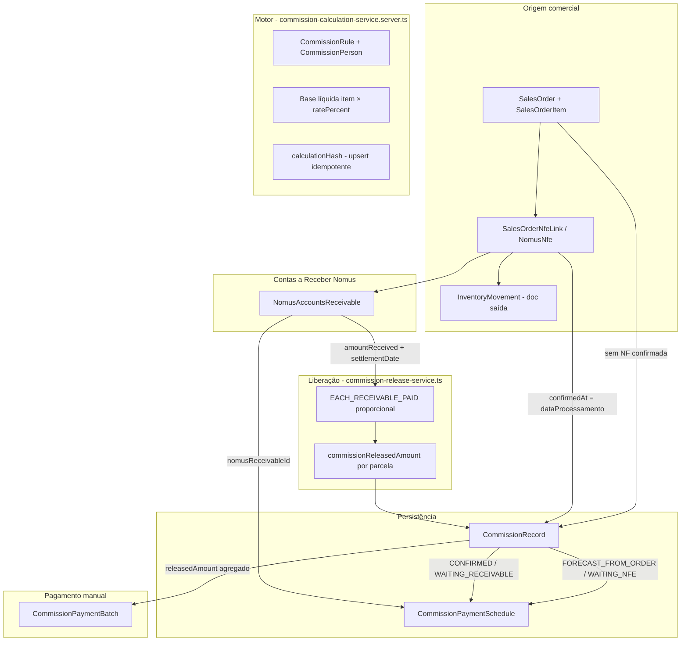

# Auditoria técnica — Módulo de Comissões (estado atual)

**Projeto:** IndusCost / My Industry  
**Data da auditoria:** 2026-07-03  
**Escopo:** Documentação do comportamento **atual** — sem alteração de regras, migrations ou sync Nomus.

---

## 1. Objetivo e regra de negócio oficial

O usuário precisa saber **quanto pagar de comissão em cada mês** (ex.: junho/2026), usando Contas a Receber do Nomus.

| Conceito | Definição operacional | Campo / filtro principal |
|----------|----------------------|---------------------------|
| **Comissão gerada** | Comissão confirmada pela NF / documento de saída no período | `CommissionRecord.confirmedAt` (fallback `calculatedAt`) |
| **Comissão prevista / a liberar** | Parcelas em aberto, ainda não baixadas no CR | `CommissionPaymentSchedule.dueDate`, título **sem** baixa |
| **Comissão a pagar no mês** | Comissão **liberada** por títulos **recebidos/baixados** no mês | `NomusAccountsReceivable.settlementDate` → `CommissionPaymentSchedule.commissionReleasedAmount` |
| **Comissão liberada** | Valor proporcional ao recebimento do título AR | `commissionReleasedAmount` (schedule) / `releasedAmount` (record) |
| **Comissão paga** | Valor efetivamente pago ao comissionado (lote manual) | `CommissionRecord.paidAmount`, `CommissionPaymentBatch` |

**Regra principal (a pagar):** filtrar CR com `settlementDate` no mês; somar `commissionReleasedAmount` das parcelas vinculadas (`nomusReceivableId`).

---

## 2. Checklist YAGNI / reutilização

| # | Pergunta | Resposta |
|---|----------|----------|
| 1 | Isso realmente precisa existir? | Sim — motor + schedules + liberação AR já existem; falta alinhar **todas** as telas/endpoints ao mesmo critério de “a pagar”. |
| 2 | IndusCost já possui motor/service/repository? | **Sim** — `commission-calculation-service.server.ts`, `commission-release-service.ts`, `commissionReleases.server.ts`, `commissionVisualAudit.server.ts`, etc. |
| 3 | Nomus fornece o dado? | **Sim** — `NomusAccountsReceivable`: `settlementDate`, `amountReceived`, `dueDate`, vínculo NF via `sourceInvoiceId`. |
| 4 | Banco já possui a informação? | **Sim** — tabelas Prisma listadas na seção 4. |
| 5 | Biblioteca/helper pronto? | **Sim** — `commission-money`, `commissionQuery`, `commissionVisualAudit.ts`, scripts de auditoria. |
| 6 | Dá para fazer mais simples? | UI já simplificada para **Auditoria Visual**; risco é **duplicidade de visões** (apuração, releases, payable) com critérios distintos. |
| 7 | Estou criando um segundo motor? | **Não** — cálculo único; visões/agregações múltiplas sobre os mesmos dados. |
| 8 | Respeita arquitetura? | **Sim** — server lib + routes + componentes; hooks de recálculo via API/script. |
| 9 | Impacta outro módulo? | Indiretamente: pedidos, NF-e, CR Nomus, financeiro AR (somente leitura para comissão). |
| 10 | Build/testes | Ver seção 12 — executados nesta auditoria. |

---

## 3. Fluxograma do cálculo atual



### Fluxo de status (`CommissionRecord`)

```text
Pedido → FORECAST_FROM_ORDER / WAITING_NFE
    ↓ NF-e + doc. saída (confirmedAt)
CONFIRMED_BY_OUTPUT_DOCUMENT / WAITING_RECEIVABLE
    ↓ recebimento AR (settlementDate)
PARTIALLY_RELEASED / RELEASED
    ↓ lote pagamento (manual)
PAID_PARTIAL / PAID_TOTAL
```

---

## 4. Entidades e tabelas

| Entidade Prisma | Papel na comissão |
|-----------------|-------------------|
| `SalesOrder` | Origem do pedido; `issueDate`, `externalSellerId`, totais |
| `SalesOrderItem` | Base por item (`totalNetValue`, produto) |
| `SalesOrderNfeLink` / `NomusNfe` | NF-e; `dataProcessamento` → `confirmedAt` |
| `NomusAccountsReceivable` | Parcelas CR; **baixa** = `settlementDate`; vencimento = `dueDate` |
| `CommissionPerson` | Vendedor/representante comissionável |
| `CommissionRule` / `CommissionRuleCondition` | Percentual, base, `releaseRule` |
| `CommissionRecord` | Linha calculada (item × pessoa × origem) |
| `CommissionPaymentSchedule` | Rateio por parcela pedido ou AR |
| `CommissionPaymentBatch` / `CommissionPaymentBatchItem` | Pagamento ao comissionado |
| `CommissionAuditIssue` | Divergências / bloqueios |
| `CommissionSettings` | Defaults operacionais |
| `CommissionCalculationRun` | Histórico de recálculo |

### Campos críticos por conceito

| Conceito | Tabela.campo | Origem Nomus / sistema |
|----------|--------------|------------------------|
| Data NF / pedido (gerada) | `CommissionRecord.confirmedAt` | `NomusNfe.dataProcessamento` ou pedido |
| Vencimento (prevista) | `CommissionPaymentSchedule.dueDate` | `NomusAccountsReceivable.dueDate` |
| Baixa / recebimento (a pagar) | `NomusAccountsReceivable.settlementDate` | Sync CR Nomus |
| Valor esperado por parcela | `CommissionPaymentSchedule.commissionExpectedAmount` | Rateio da `commissionAmount` do record |
| Valor liberado por parcela | `CommissionPaymentSchedule.commissionReleasedAmount` | Motor liberação × recebimento AR |
| Comissão total da linha | `CommissionRecord.commissionAmount` | Cálculo regra × base |
| Liberado acumulado linha | `CommissionRecord.releasedAmount` | Soma schedules |
| Pago | `CommissionRecord.paidAmount` | Lotes aprovados |
| Vínculo título | `CommissionPaymentSchedule.nomusReceivableId` | `NomusAccountsReceivable.externalId` |
| NF / pedido | `nomusNfeId`, `nfeNumber`, `orderCode` | Links pedido-NF |

---

## 5. Onde nasce a comissão

**Arquivo:** `src/lib/commissions/commission-calculation-service.server.ts`

1. Carrega pedidos do período (`loadCommissionOrderSources`).
2. Por item + beneficiário: resolve `CommissionPerson`, aplica `selectBestMatchingRule`.
3. **Prevista:** status `FORECAST_FROM_ORDER` / `WAITING_NFE`, schedules `SALES_ORDER_INSTALLMENT`.
4. **Confirmada:** supersede previstas; status `CONFIRMED_BY_OUTPUT_DOCUMENT` / `WAITING_RECEIVABLE`; `confirmedAt` = `nfe.dataProcessamento`; schedules `ACCOUNTS_RECEIVABLE` ligados a `nomusReceivableId`.
5. Idempotência: `calculationHash` único — upsert, não duplica.

**Rateio por parcela:** ao criar schedules AR, a comissão total do record é distribuída proporcionalmente ao valor de cada título (`commissionExpectedAmount` por schedule).

**Liberação:** `src/lib/commissions/commission-release-service.ts`

- Regra padrão: `EACH_RECEIVABLE_PAID` — proporcional a `amountReceived / amountReceivable`.
- Teto por schedule: `commissionExpectedAmount` (nunca excede a parcela).
- Recálculo disparado no fluxo de cálculo/sync AR (`recomputeReleaseForRecord`).

---

## 6. Três modos — Gerada / Prevista / A pagar

Implementação central: `commissionVisualAudit.shared.ts`, `commissionVisualAudit.ts`, `commissionVisualAudit.server.ts`.

| Modo UI | Código | Filtro de registros | Filtro de linhas | Card principal (comissão) |
|---------|--------|---------------------|------------------|---------------------------|
| **Gerada** | `GENERATED` | `confirmedAt` no período | Todas as linhas do record | `commissionCalculatedTotal` (= expected agregado) |
| **Prevista / a liberar** | `FORECAST` | `confirmedAt` no período | Exclui `BAIXADO`; filtra por `dueDate` no período | `commissionPendingTotal` + futuras |
| **A pagar** | `PAYABLE` | Records com schedule AR cujo `nomusReceivableId` ∈ CR baixados no período | `settlementDate` no período | **`commissionReleasedTotal`** |

### PAYABLE — implementação em duas camadas

1. **DB:** `loadSettledReceivableIds()` — CR com `settlementDate` entre `from`/`to`.
2. **Linha:** `filterRowsByAppraisalMode(..., "PAYABLE")` — descarta linhas sem `settlementDate` no período.

**Campo correto para “comissão a pagar no mês”:** soma de `CommissionPaymentSchedule.commissionReleasedAmount` das linhas filtradas por `NomusAccountsReceivable.settlementDate` no mês (modo PAYABLE da Auditoria Visual ou endpoint `/api/commissions/payable`).

---

## 7. Comparação com Nomus

**UI / API:** parâmetros opcionais `nomusReferenceBase`, `nomusReferenceCommission` na query da auditoria visual.

**Lógica:** `buildVisualAuditNomusReference()` em `commissionVisualAudit.ts`:

- `comparable = true` **somente** em modo `PAYABLE`.
- IndusCost comparável: base = `commissionableBaseTotal`, comissão = **`commissionReleasedTotal`** (não `commissionCalculatedTotal`).
- Diffs: `baseDiff`, `commissionDiff` vs valores informados pelo usuário (export Nomus).

**Script:** `scripts/audit-commission-visual-summary.ts --mode=payable --nomus-base=... --nomus-commission=...`

**Outros scripts Nomus:**

- `audit-commission-apuracao-nomus-comparison.ts`
- `compare-commission-with-nomus-export.ts` (runbook jun/2026)
- `export-commission-june-comparison.ts`

---

## 8. Endpoints auditados

Registrados em `src/lib/commissionsRoutes.ts` (~50 rotas). Principais:

| Endpoint | Função | Critério temporal |
|----------|--------|-------------------|
| `GET /api/commissions/visual-audit` | Cards + linhas auditoria visual | Modo-dependent (seção 6) |
| `GET /api/commissions/visual-audit/export` | CSV | Idem |
| `GET /api/commissions/visual-audit/detail` | Detalhe linha | Explica `settlementDate` → liberado |
| `GET /api/commissions/payable` | Visão AR “a pagar” | `settlementDate` + `commissionReleasedAmount > 0` |
| `GET /api/commissions/future` | Previstas por vencimento | `dueDate` ≥ hoje, sem recebimento |
| `GET /api/commissions/overdue` | Inadimplentes | `dueDate` < hoje, saldo bloqueado |
| `GET /api/commissions/generated` | Confirmadas (gerada) | `confirmedAt` |
| `GET /api/commissions/releases` | Parcelas liberação | Filtro `settlementFrom/To` opcional |
| `GET /api/commissions/apuracao` | Apuração mensal | **`confirmedAt`** (default) — ver riscos |
| `GET /api/commissions/forecast` | Previstas pedido | Status forecast |
| `GET /api/commissions/confirmed` | Confirmadas | `confirmedAt` |
| `POST /api/commissions/recalculate` | Recálculo | Período pedido |
| Demais | rules, persons, payments, audit, settings | Gestão |

**UI ativa:** `src/components/CommissionsModule.tsx` — modo simplificado, foco em **Auditoria Visual** (`CommissionsVisualAuditPage.tsx`). Demais páginas existem no código mas podem estar ocultas na navegação simplificada.

---

## 9. Scripts auditados

| Script | Uso |
|--------|-----|
| `audit-commission-visual-summary.ts` | Cards por modo (generated/forecast/payable) + Nomus |
| `audit-commission-june-readiness.ts` | Prontidão jun/2026 |
| `audit-commission-readiness.ts` | Prontidão geral + checklist entidades |
| `audit-commission-apuracao.ts` | Apuração |
| `audit-commission-apuracao-nomus-comparison.ts` | Apuração vs Nomus |
| `recalculate-commissions.ts` | Preview/apply recálculo |
| `reconcile-commission-release-amounts.ts` | Reconciliar released schedule vs record |
| `backfill-commission-persons.ts` | Pessoas comissionadas |
| `audit-commission-financial-release.ts` | Liberação financeira pós-apply |
| `audit-commission-links.ts` | Vínculos pedido-NF-CR |
| `export-commission-june-comparison.ts` | Export comparativo |
| `compare-commission-with-nomus-export.ts` | Diff arquivo Nomus |

---

## 10. Arquivos auditados (inventário)

### Lib / server (motor e visões)

- `commission-calculation-service.server.ts` — nascimento e upsert
- `commission-release-service.ts` — liberação proporcional AR
- `commission-payment-service.server.ts` — lotes pagamento
- `commissionVisualAudit.ts` / `.server.ts` / `.shared.ts` — auditoria visual 3 modos
- `commissionReleases.server.ts` — listagem releases + filtro settlement
- `commissionArViews.server.ts` — payable/future/overdue
- `commissionApuracao.ts` / `.server.ts` — apuração (organiza, não recalcula)
- `commissionQuery.ts` — parsers, `periodBasis`, status confirmados
- `commission-source-resolver.ts` / `.server.ts` — resolução AR/NF/pedido
- `commission-rule-engine.ts`, `commissionConfirmed.server.ts`, `commissionForecast.server.ts`
- `commissionDashboard.server.ts`, `commissionPayments.server.ts`, `commissionSettings.server.ts`
- `commissionsRoutes.ts`, `commissionsModulePermissions.ts`, `commissionsPeriodFilter.ts`

### Componentes (~40 arquivos)

- `CommissionsModule.tsx`, `CommissionsVisualAuditPage.tsx`
- Páginas: dashboard, apuracao, releases, payable/future/overdue (AR), forecast, confirmed, payments, rules, persons, settings, audit
- Drawers, filtros, hooks `useCommissions*Data.ts`

### Testes

- `commissionVisualAudit.test.ts`, `commission-release-service.test.ts`, `commissionApuracao.test.ts`
- `commission-module.test.ts`, `commission-qa-flow.test.ts`, `commission-scripts.test.ts`
- `commissionsRoutes.test.ts`, `commissionsNavigation.test.ts`, `commissionsDashboard.test.ts`
- Outros: `commission-payment-service.test.ts`, `commissionOutOfTable.test.ts`, `commission-commercial-tier.test.ts`, `commissionPersonIdentity.test.ts`

### Docs existentes (referência)

- `docs/commissions/commission-calculation-runbook-june-2026.md`
- `docs/commissions/commission-module-blueprint.md`
- `docs/commissions/commission-user-guide.md`

**Total aproximado:** ~155 arquivos com `commission` no nome/path.

---

## 11. Riscos e duplicidades

### Riscos

| Risco | Descrição | Severidade |
|-------|-----------|------------|
| **Apuração vs PAYABLE** | Apuração filtra records por `confirmedAt`, não por `settlementDate`. Total “a pagar jun/2026” na apuração **≠** auditoria visual PAYABLE. | Alta |
| **Múltiplas telas** | `/payable`, `/releases`, dashboard `payableInMonth`, visual audit PAYABLE — mesma intenção, implementações paralelas; devem convergir no mesmo número. | Média |
| **CR sem settlementDate** | Título recebido no Nomus sem `settlementDate` preenchido → alerta na linha; excluído do PAYABLE. | Média |
| **Liberação desatualizada** | Se sync AR atrasar ou recálculo não rodar, `commissionReleasedAmount` pode divergir do recebimento real. | Média |
| **Prevista vs confirmada** | Records `FORECAST_*` superseded — incluir superseded em relatórios duplicaria base. | Baixa (controlado por flags) |
| **Pagamento ≠ liberação** | `paidAmount` / lotes são etapa posterior; “a pagar oficial” deve usar **liberado**, não pago. | Informativo |
| **confirmedAt null** | Apuração/query usa fallback `calculatedAt` quando `confirmedAt` ausente. | Baixa |

### Onde pode haver duplicidade

- Dois registros: prevista + confirmada — mitigado por `SUPERSEDED_BY_OUTPUT_DOCUMENT` e `calculationHash`.
- Agregação de cards: deduplicação por `documentKey`, `receivableKey`, `scheduleKey` em `computeVisualAuditCards`.
- **Segundo motor:** não existe; risco é **segunda interpretação de período** (confirmedAt vs settlementDate).

---

## 12. Como validar junho/2026

```bash
# 1. Prontidão
npx tsx scripts/audit-commission-readiness.ts --year=2026 --month=6
npx tsx scripts/audit-commission-june-readiness.ts --year=2026 --month=6

# 2. Comissão A PAGAR (oficial) — modo payable
npx tsx scripts/audit-commission-visual-summary.ts --year=2026 --month=6 --mode=payable

# 3. Comparação Nomus (quando tiver base/comissão do relatório Nomus)
npx tsx scripts/audit-commission-visual-summary.ts --year=2026 --month=6 --mode=payable \
  --nomus-base=<BASE_NOMUS> --nomus-commission=<COMISSAO_NOMUS>

# 4. UI
# Comissões → Auditoria Visual → aba "A pagar" → período 06/2026
# GET /api/commissions/visual-audit?year=2026&month=6&appraisalMode=payable
```

**Critério de aceite jun/2026:** `cards.commissionReleasedTotal` (modo PAYABLE) alinhado ao relatório Nomus de comissão por recebimento no mês, com diffs exibidos em `nomusReference`.

---

## 13. Pontos que precisam correção (futuro — fora desta auditoria)

1. **Unificar critério “a pagar”** em apuração, dashboard e exports — usar `settlementDate` + `commissionReleasedAmount` como fonte única.
2. **Documentar na UI** que apuração (se reativada) usa `confirmedAt` — distinto de “a pagar”.
3. **Garantir settlementDate** no sync CR para títulos baixados (data quality).
4. **Runbook operacional:** recalcular + `reconcile-commission-release-amounts` antes de fechar mês.
5. **Teste E2E** jun/2026 com snapshot Nomus fixo (golden file).

---

## 14. Validação técnica desta auditoria

Comandos executados:

```bash
npm run build
npm run check:frontend-server-imports
npm run test:commissions
```

Resultados registrados no commit `docs: audit commission current state`.

---

## 15. Referência rápida — qual número usar?

| Pergunta do usuário | Onde olhar |
|---------------------|------------|
| Quanto de comissão **geramos** em jun/2026 (NF)? | Auditoria Visual → **Gerada**; `commissionCalculatedTotal` |
| Quanto **vamos liberar** (vencimentos futuros)? | **Prevista**; `commissionPendingTotal` filtrado por `dueDate` |
| Quanto **pagar** em jun/2026? | **A pagar**; `commissionReleasedTotal`; CR `settlementDate` |
| Bate com Nomus? | PAYABLE + `nomusReference` ou script com `--nomus-base/commission` |
| Quanto já **pagamos** ao vendedor? | Módulo pagamentos / `paidAmount` / batches |
