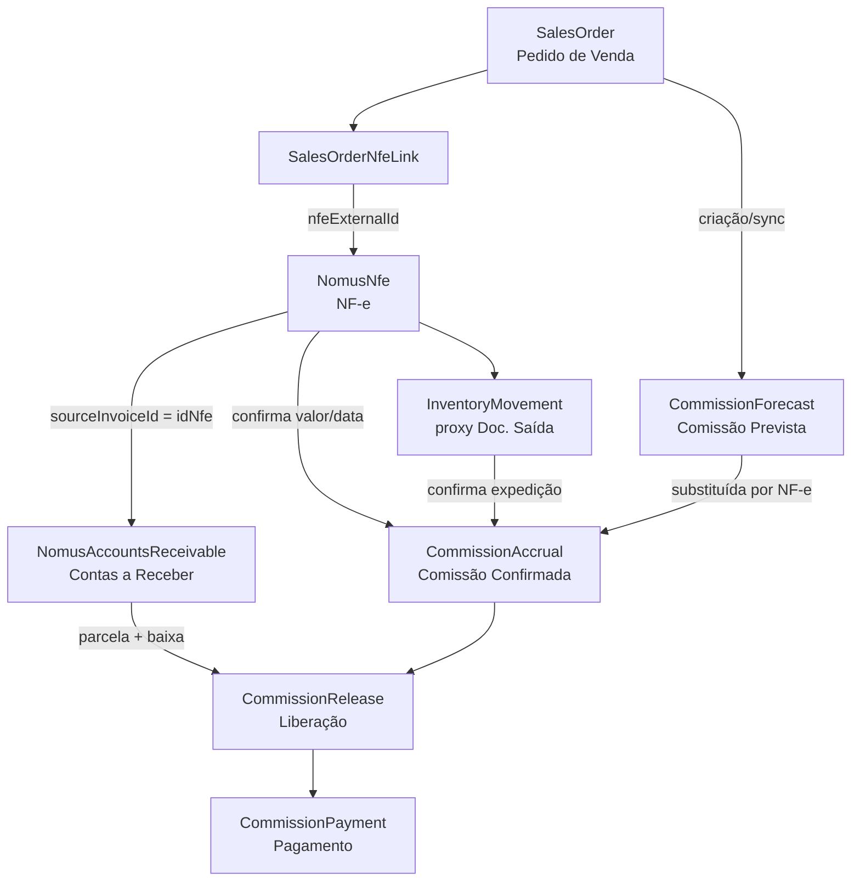

# Blueprint — Módulo Comissões

**Projeto:** IndusCost / My Industry  
**Módulo:** Comissões (novo menu principal)  
**Data do blueprint:** 2026-07-01  
**Status:** Planejamento — auditoria técnica concluída, sem migration nesta etapa

> Documento de referência para implementação do módulo de comissionamento.  
> Complementar: `docs/induscost-system-current-state.md`, `docs/commercial/SALES_ORDER_AS_COMMERCIAL_SOURCE.md`, `docs/finance/FINANCE_COST_CENTER_SUPPLIER_BLUEPRINT.md`.  
> Script de auditoria: `scripts/audit-commission-readiness.ts`.

---

## 1. Visão geral do módulo

### 1.1 Objetivo de negócio

O IndusCost passará a controlar **cálculo, auditoria, liberação e pagamento** de comissões comerciais, usando dados já sincronizados do Nomus como fonte operacional, sem alterar:

- Formação de Preço (`PricingModule`, `ProductPricing.commission` permanece premissa de margem, não motor de comissão operacional);
- Cálculos financeiros existentes (AR/AP, Fluxo de Caixa, Relatório Executivo);
- Sync Nomus existente (somente consumo read-only + tabelas adicionais do módulo).

### 1.2 Regra de negócio central

| Etapa | Evento | Efeito na comissão |
|-------|--------|-------------------|
| 1 | Pedido de Venda sincronizado/criado | Gera **comissão prevista** com base em valor do pedido e regra aplicável |
| 2 | Sem NF-e / Documento de Saída | Previsão usa **condições de pagamento do Pedido** (`paymentTerms`, `paymentMethod`) |
| 3 | NF-e emitida | Substitui previsão do pedido pelas **condições reais da emissão** (valor NF, data processamento) |
| 4 | Documento de Saída confirmado | Confirma **venda real** (expedição) — requisito para transição prevista → confirmada |
| 5 | Contas a Receber | Fonte definitiva de **parcelas, vencimentos, valores, baixas e liberação** |
| 6 | Recebimento (baixa AR) | Libera comissão conforme regra (% na baixa, após recebimento integral, etc.) |
| 7 | Pagamento ao comissionado | Registro interno IndusCost (não altera Nomus) |

### 1.3 Princípios arquiteturais

| Princípio | Detalhe |
|-----------|---------|
| Fonte Nomus read-only | `SalesOrder`, `NomusNfe`, `NomusAccountsReceivable` não são editados pelo módulo |
| Camada gerencial adicional | Comissões vivem em tabelas novas referenciando chaves Nomus/IndusCost |
| Escopo de vendedor | Reutilizar `crmCommercialAccessScope` — vendedor vê apenas seus dados quando `crm.seller.own` |
| Sem dados fake | Telas consomem banco real; estados vazios explícitos |
| Sem hardcode | Vendedores, clientes e representantes vêm de `AppUser`, `SalesOrder`, `CrmCustomerCommercialOwner` ou cadastro dedicado |

---

## 2. Menu proposto

Novo item principal na sidebar, id `commissions`, posicionado após `crm-commercial` e antes de `simulations` (ajustável).

```
Comissões (/commissions)
├── Dashboard                    /commissions
├── Comissões Previstas          /commissions/forecast
├── Comissões Confirmadas        /commissions/confirmed
├── Liberação por Recebimento    /commissions/release
├── Pagamentos                   /commissions/payments
├── Pessoas Comissionadas        /commissions/people
├── Regras de Comissão           /commissions/rules
├── Auditoria                    /commissions/audit
└── Configurações                /commissions/settings
```

### 2.1 Integração com permissões existentes

Seguir padrão de `permissionCatalog.ts` + `modulePermissions.ts`:

| Permissão proposta | Tipo | Descrição |
|--------------------|------|-----------|
| `commissions.view` | menu | Acesso ao módulo |
| `commissions.dashboard.view` | section | Dashboard executivo |
| `commissions.forecast.view` | tab | Comissões previstas |
| `commissions.confirmed.view` | tab | Comissões confirmadas |
| `commissions.release.view` | tab | Liberação por recebimento |
| `commissions.release.manage` | action | Aprovar/liberar manualmente |
| `commissions.payments.view` | tab | Pagamentos |
| `commissions.payments.manage` | action | Registrar pagamento |
| `commissions.people.view` | tab | Pessoas comissionadas |
| `commissions.people.manage` | action | CRUD comissionados |
| `commissions.rules.view` | tab | Regras |
| `commissions.rules.manage` | action | CRUD regras |
| `commissions.audit.view` | tab | Auditoria |
| `commissions.settings.view` | tab | Configurações |
| `commissions.seller.all` | action | Ver todos os vendedores (gestor) |
| `commissions.seller.own` | action | Ver apenas próprio escopo |

Escopo de vendedor: reutilizar lógica de `resolveCrmCommercialAccessScope()` e `crmCommercialSellerMatchFilters()` sobre `SalesOrder.externalSellerId`, `responsible`, `sellerIdentityKey`.

---

## 3. Fluxo Pedido → NF-e → Documento de Saída → Contas a Receber → Comissão



### 3.1 Máquina de estados (comissão)

| Estado | Condição | Fonte |
|--------|----------|-------|
| `FORECAST` | Pedido existe, sem NF-e autorizada | `SalesOrder` |
| `FORECAST_NFE_PENDING` | NF-e vinculada mas não autorizada | `SalesOrderNfeLink` + `NomusNfe.status ≠ 4` |
| `CONFIRMED` | NF-e autorizada + Documento de Saída (quando exigido) | `NomusNfe` + `InventoryMovement` |
| `ACCRUED` | Parcelas AR geradas | `NomusAccountsReceivable` |
| `PARTIALLY_RELEASED` | Baixa parcial AR | `settlementDate`, `amountReceived` |
| `RELEASED` | Regra de liberação satisfeita | Motor interno |
| `PAID` | Pagamento registrado | `CommissionPayment` |
| `CANCELLED` | Pedido/NF cancelada | `SalesOrder.status`, `NomusNfe.status = 7` |

---

## 4. Fontes de verdade por etapa

| Etapa | Fonte primária | Campos-chave | Observação |
|-------|----------------|--------------|------------|
| Pedido | `SalesOrder` | `id`, `orderCode`, `externalSalesOrderId`, `customerId`, `externalSellerId`, `responsible`, `paymentTerms`, `paymentMethod`, `totalNetValue`, `issueDate`, `status` | Sync Nomus via `nomusSalesOrdersSyncV1.ts` |
| Itens | `SalesOrderItem` | `quantity`, `negotiatedPrice`, `totalNetValue`, `marginValue` | Base para comissão por item (fase 2) |
| NF-e | `NomusNfe` | `externalId`, `status`, `numero`, `dataProcessamento`, `valorLiquido`, `xmlVNF` | Status autorizado = `4`, cancelado = `7` (`nomusNfeClassification.ts`) |
| Vínculo pedido-NF | `SalesOrderNfeLink` | `nfeExternalId`, `nfeStatus`, `dataProcessamento` | Também extraído de `nomusRawResponse` como fallback |
| Documento de Saída | **Lacuna Nomus** — proxy local | `InventoryMovement` com `movementType` de saída, `nfeId`, `nfeNumber`, `salesOrderId` | Nomus não sincroniza doc. saída; avaliar sync futuro ou integração manual |
| Contas a Receber | `NomusAccountsReceivable` | `sourceInvoiceId` (= `idNfe`), `dueDate`, `amountReceivable`, `amountReceived`, `balanceReceivable`, `settlementDate` | Única fonte de parcelas e baixas |
| Cliente | `Customer` | `taxId`, `companyName` | AR casa por `personCnpj` |
| Vendedor | `SalesOrder` + `AppUser` | `externalSellerId`, `responsible` | Consolidação via `crmSellerIdentityConsolidation.ts` |
| Representante | **Inexistente no schema** | Inferir de `nomusRawResponse` ou cadastro futuro | Ver seção 10 |

---

## 5. Modelos / tabelas recomendadas

> **Nesta etapa: apenas documentação.** Migrations na Fase 1.

### 5.1 Dimensão — Pessoa comissionada

```prisma
model CommissionPerson {
  id                    String   @id @default(uuid())
  personType            CommissionPersonType  // SELLER, REPRESENTATIVE, BROKER, OTHER
  displayName           String
  externalNomusPersonId Int?     // idPessoa Nomus quando existir
  appUserId             String?  @db.Uuid  // vínculo opcional AppUser
  externalSellerId      Int?     // espelho SalesOrder.externalSellerId
  sellerIdentityKey     String?  // consolidação CRM
  taxId                 String?  // CPF/CNPJ para pagamento
  bankInfo              Json?    // dados bancários (fase pagamentos)
  isActive              Boolean  @default(true)
  createdAt             DateTime @default(now())
  updatedAt             DateTime @updatedAt
}
```

### 5.2 Regras de comissão

```prisma
model CommissionRule {
  id                  String   @id @default(uuid())
  name                String
  priority            Int      @default(100)
  isActive            Boolean  @default(true)
  appliesTo           CommissionRuleScope  // ORDER, ITEM, CUSTOMER_SEGMENT
  calculationType     CommissionCalculationType  // PERCENT_NET, PERCENT_MARGIN, FIXED
  ratePercent         Decimal? @db.Decimal(10, 4)
  fixedAmount         Decimal? @db.Decimal(20, 2)
  releaseTrigger      CommissionReleaseTrigger  // ON_AR_RECEIPT, ON_NFE_AUTH, MANUAL
  releasePercent      Decimal  @default(100) @db.Decimal(10, 4)  // % liberado por baixa
  validFrom           DateTime?
  validTo             DateTime?
  // Filtros opcionais (JSON tipado em serviço)
  filterJson          Json?
  createdAt           DateTime @default(now())
  updatedAt           DateTime @updatedAt
}

model CommissionRuleAssignment {
  id                 String @id @default(uuid())
  commissionRuleId   String @db.Uuid
  commissionPersonId String @db.Uuid
  // Escopo: produto, cliente, vendedor, etc.
  scopeType          String
  scopeRefId         String?
}
```

### 5.3 Previsão e confirmação

```prisma
model CommissionForecast {
  id                  String   @id @default(uuid())
  salesOrderId        String   @db.Uuid
  commissionPersonId  String   @db.Uuid
  commissionRuleId    String?  @db.Uuid
  baseAmount          Decimal  @db.Decimal(20, 2)
  commissionAmount    Decimal  @db.Decimal(20, 2)
  rateApplied         Decimal? @db.Decimal(10, 4)
  paymentTermsSnapshot String?
  sourceStage         String   // ORDER
  status              CommissionForecastStatus  // ACTIVE, SUPERSEDED, CANCELLED
  calculatedAt        DateTime @default(now())
  supersededAt        DateTime?
  supersededByAccrualId String? @db.Uuid
}

model CommissionAccrual {
  id                  String   @id @default(uuid())
  salesOrderId        String   @db.Uuid
  nfeExternalId       Int?
  commissionPersonId  String   @db.Uuid
  commissionRuleId    String?  @db.Uuid
  baseAmount          Decimal  @db.Decimal(20, 2)
  commissionAmount    Decimal  @db.Decimal(20, 2)
  sourceStage         String   // NFE, AR
  status              CommissionAccrualStatus
  confirmedAt         DateTime?
  forecastId          String?  @db.Uuid
}
```

### 5.4 Parcelas, liberação e pagamento

```prisma
model CommissionInstallment {
  id                        String   @id @default(uuid())
  commissionAccrualId       String   @db.Uuid
  nomusArExternalId         Int      // NomusAccountsReceivable.externalId
  installmentNumber         Int
  dueDate                   DateTime?
  amountReceivable          Decimal  @db.Decimal(20, 2)
  amountReceived            Decimal  @default(0) @db.Decimal(20, 2)
  commissionAmount          Decimal  @db.Decimal(20, 2)
  releasedAmount            Decimal  @default(0) @db.Decimal(20, 2)
  status                    CommissionInstallmentStatus
  lastSyncedAt              DateTime
}

model CommissionRelease {
  id                        String   @id @default(uuid())
  commissionInstallmentId   String   @db.Uuid
  releasedAmount            Decimal  @db.Decimal(20, 2)
  releaseReason             String   // AR_SETTLEMENT, MANUAL, RULE
  releasedAt                DateTime @default(now())
  releasedByUserId          String?  @db.Uuid
  nomusArSettlementDate     DateTime?
}

model CommissionPayment {
  id                  String   @id @default(uuid())
  commissionPersonId  String   @db.Uuid
  totalAmount         Decimal  @db.Decimal(20, 2)
  paymentDate         DateTime
  paymentMethod       String?
  reference           String?
  notes               String?
  createdByUserId     String?  @db.Uuid
  createdAt           DateTime @default(now())
  lines               CommissionPaymentLine[]
}

model CommissionAuditLog {
  id          String   @id @default(uuid())
  entityType  String
  entityId    String
  action      String
  payload     Json?
  userId      String?  @db.Uuid
  createdAt   DateTime @default(now())
}
```

### 5.5 Relacionamentos com modelos existentes (soft keys)

| Nova tabela | Referência existente | Chave |
|-------------|---------------------|-------|
| `CommissionForecast` | `SalesOrder` | `salesOrderId` FK |
| `CommissionAccrual` | `NomusNfe` | `nfeExternalId` = `externalId` (sem FK Prisma) |
| `CommissionInstallment` | `NomusAccountsReceivable` | `nomusArExternalId` = `externalId` |
| `CommissionPerson` | `AppUser` | `appUserId` FK opcional |
| `CommissionPerson` | Nomus pessoa | `externalNomusPersonId` |

---

## 6. Endpoints internos propostos

Padrão: `registerCommissionsRoutes(app, auth)` em `src/lib/commissionsRoutes.ts`, chamado de `server.ts`.

### 6.1 Dashboard

| Método | Rota | Permissão | Descrição |
|--------|------|-----------|-----------|
| GET | `/api/commissions/dashboard` | `commissions.dashboard.view` | KPIs: previsto, confirmado, liberado, pago, pendente |
| GET | `/api/commissions/dashboard/by-seller` | `commissions.dashboard.view` | Ranking por comissionado |

### 6.2 Previsões e confirmadas

| Método | Rota | Permissão |
|--------|------|-----------|
| GET | `/api/commissions/forecast` | `commissions.forecast.view` |
| GET | `/api/commissions/forecast/:id` | `commissions.forecast.view` |
| GET | `/api/commissions/confirmed` | `commissions.confirmed.view` |
| GET | `/api/commissions/confirmed/:id` | `commissions.confirmed.view` |

Query params padrão (seguir `SalesOrdersModule`): `year`, `month`, `startDate`, `endDate`, `sellerId`, `customerId`, `status`, `page`, `pageSize`, `q`.

### 6.3 Liberação e pagamentos

| Método | Rota | Permissão |
|--------|------|-----------|
| GET | `/api/commissions/release` | `commissions.release.view` |
| POST | `/api/commissions/release/:installmentId` | `commissions.release.manage` |
| GET | `/api/commissions/payments` | `commissions.payments.view` |
| POST | `/api/commissions/payments` | `commissions.payments.manage` |
| GET | `/api/commissions/payments/:id` | `commissions.payments.view` |

### 6.4 Cadastros

| Método | Rota | Permissão |
|--------|------|-----------|
| GET/POST/PUT | `/api/commissions/people` | `commissions.people.*` |
| GET/POST/PUT/DELETE | `/api/commissions/rules` | `commissions.rules.*` |
| GET | `/api/commissions/audit` | `commissions.audit.view` |
| GET/PUT | `/api/commissions/settings` | `commissions.settings.view` |

### 6.5 Jobs internos (sem HTTP)

| Job | Trigger | Função |
|-----|---------|--------|
| `commissionForecastSync` | Após sync pedidos Nomus | Recalcular previsões novos/alterados |
| `commissionAccrualSync` | Após sync NF-e + AR | Confirmar comissões, gerar parcelas |
| `commissionReleaseSync` | Após sync AR | Liberar por baixa |

Integração inicial: hooks opcionais pós-sync em `nomusSalesOrdersSyncV1.ts`, `nomusNfesSync.ts`, `nomusAccountsReceivableSync.ts` — **somente após mapeamento de impacto** (requisito explícito do escopo).

---

## 7. Serviços / backend propostos

| Arquivo | Responsabilidade |
|---------|------------------|
| `src/lib/commissionsRoutes.ts` | Registro HTTP + guards |
| `src/lib/commissionsAccessScope.ts` | Escopo vendedor (wrapper sobre CRM) |
| `src/lib/commissionForecastService.server.ts` | Cálculo previsão a partir de `SalesOrder` |
| `src/lib/commissionAccrualService.server.ts` | Transição prevista → confirmada via NF-e |
| `src/lib/commissionInstallmentService.server.ts` | Espelha parcelas AR |
| `src/lib/commissionReleaseService.server.ts` | Regras de liberação por recebimento |
| `src/lib/commissionPaymentService.server.ts` | Registro de pagamentos |
| `src/lib/commissionRuleEngine.ts` | Motor puro de regras (testável) |
| `src/lib/commissionPersonResolver.server.ts` | Resolve comissionado: vendedor, representante, manual |
| `src/lib/commissionAuditService.server.ts` | Trilha de auditoria |
| `src/lib/commissionsDashboard.ts` | Agregações KPI |
| `src/lib/commissionsListQuery.ts` | Filtros/paginação |
| `src/lib/commissionsClient.ts` | Fetch helpers frontend |

### 7.1 Reutilização explícita

| Serviço existente | Uso no módulo Comissões |
|-------------------|-------------------------|
| `crmCommercialAccessScope.ts` | Escopo de vendedor |
| `crmSellerIdentityConsolidation.ts` | Identidade consolidada |
| `salesOrderLinkedNfe.ts` | Contexto NF vinculada ao pedido |
| `nomusNfeClassification.ts` | Status autorizado/cancelado |
| `financeAccountsReceivableManagement.ts` | Carga de títulos AR |
| `formatCurrency` / padrões finance | Formatação BRL |

**Não reutilizar** para cálculo de comissão operacional: `pricingUnitCalculationBreakdown.ts`, `ProductPricing.commission` (premissa de formação de preço).

---

## 8. Telas propostas

### 8.1 Padrões de UI a seguir

| Padrão | Referência existente |
|--------|---------------------|
| Shell de página | `ModulePageShell` em `App.tsx` |
| Menu lateral | `Sidebar.tsx` + `modulePermissions.ts` |
| Sub-navegação | `FinanceModule` + `financeNavigation.ts` (tabs + nested routes) |
| KPI cards | `MetricCard` + `MetricCardGrid` |
| Dashboard BI | `FinanceBiDashboardShell`, `FinanceBiFilterPanel` |
| Tabelas | `SalesOrderListTable.tsx` (card wrapper, loading, empty) |
| Filtros server-side | `SalesOrdersModule.tsx` (debounce 300ms, URL params) |
| Autocomplete cliente | `CustomerAutocompleteFilter` |
| Escopo vendedor | `CrmCommercialManagementTabs` |

### 8.2 Especificação por tela

| Tela | Componente proposto | Conteúdo principal |
|------|---------------------|-------------------|
| Dashboard | `CommissionsDashboardPage.tsx` | KPIs, gráfico previsto vs confirmado vs pago, filtro ano/mês/vendedor |
| Previstas | `CommissionsForecastPage.tsx` | Tabela: pedido, cliente, vendedor, valor base, %, comissão, cond. pagamento, status |
| Confirmadas | `CommissionsConfirmedPage.tsx` | Tabela: pedido, NF-e, doc. saída, valor NF, comissão, data confirmação |
| Liberação | `CommissionsReleasePage.tsx` | Parcelas AR, % recebido, comissão liberável, ação liberar |
| Pagamentos | `CommissionsPaymentsPage.tsx` | Histórico pagamentos, saldo a pagar por comissionado |
| Pessoas | `CommissionsPeoplePage.tsx` | CRUD comissionados, vínculo AppUser/Nomus |
| Regras | `CommissionsRulesPage.tsx` | CRUD regras, simulador read-only |
| Auditoria | `CommissionsAuditPage.tsx` | Log + inconsistências (consumir script/endpoint) |
| Configurações | `CommissionsSettingsPage.tsx` | Exigir doc. saída, arredondamento, ciclo pagamento |

### 8.3 Módulo wrapper

`CommissionsModule.tsx` — espelha `FinanceModule.tsx`:

```tsx
// Rotas internas
/commissions           → Dashboard
/commissions/forecast  → Previstas
/commissions/confirmed → Confirmadas
// ...
```

Registro em `App.tsx`:

```tsx
<Route path="commissions/*" element={
  <ModulePageShell title="Comissões" description="...">
    <CommissionsModule />
  </ModulePageShell>
} />
```

---

## 9. Riscos técnicos

| Risco | Severidade | Mitigação |
|-------|------------|-----------|
| Documento de Saída Nomus não sincronizado | **Alta** | Fase 0: proxy `InventoryMovement`; Fase 2: avaliar API Nomus ou flag "confirmar sem doc." configurável |
| Representante inexistente no schema | **Alta** | Auditar `nomusRawResponse`; cadastro manual `CommissionPerson`; sync futuro |
| Joins soft entre Nomus stage tables | **Média** | Validar integridade no job de accrual; índices em chaves lógicas |
| Dupla fonte NF-e (link + raw JSON) | **Média** | Preferir `SalesOrderNfeLink`; fallback `salesOrderLinkedNfe.ts` |
| AR sem `idNfe` (títulos antecipados) | **Média** | Comissão por pedido/NF não liberada até vínculo AR↔NF |
| Vendedor sem `externalSellerId` no AppUser | **Média** | Matching por `sellerIdentityKey` / `responsible` normalizado |
| Pedidos sem vendedor | **Média** | Fila de exceções na Auditoria; não calcular comissão automática |
| NF-e cancelada após confirmação | **Média** | Estorno automático de accrual/liberação |
| Performance recálculo em massa | **Baixa** | Jobs incrementais pós-sync; não recalcular universo completo |
| Conflito com comissão em Pricing | **Baixa** | Documentar separação: pricing = premissa custo; commissions = operacional |

---

## 10. Pontos de integração com dados Nomus sincronizados

| Sync existente | Script | Model destino | Uso Comissões |
|----------------|--------|---------------|---------------|
| Pedidos | `nomusSalesOrdersSyncV1.ts` | `SalesOrder`, `SalesOrderItem`, `SalesOrderNfeLink` | Gatilho previsão; vendedor; cond. pagamento |
| NF-e | `nomusNfesSync.ts` | `NomusNfe` | Confirmação; valor; status |
| Contas a Receber | `nomusAccountsReceivableSync.ts` | `NomusAccountsReceivable` | Parcelas; baixas; liberação |
| Clientes | `nomusCustomersSyncV1.ts` | `Customer` | Identificação; segmento para regras |
| Pessoas/vendedores | Indireto via pedidos + `AppUser.externalSellerId` | — | Resolver comissionado |

**Não alterar** mappers/syncs nesta fase. Hooks pós-sync devem ser adicionados somente após revisão de impacto em `IntegrationRun` e duração dos jobs cron.

---

## 11. Lacunas encontradas no schema atual

| Lacuna | Impacto | Ação recomendada |
|--------|---------|------------------|
| Sem model `Representante` / `CommissionPerson` | Não há "Pessoas Comissionadas" | Migration Fase 1 |
| Representante não extraído do sync Nomus | Pedidos "sem representante" | Diagnosticar API Nomus; estender sync se campo existir |
| Documento de Saída Nomus ausente | Confirmação de expedição incompleta | Proxy `InventoryMovement`; integração futura |
| `SalesOrderItem` sem `externalLineId` | Comissão por linha imprecisa | Usar tag `[nomus-line:id]` em `notes` (já existente) ou coluna futura |
| `Customer` sem `externalPersonId` | Vínculo fraco cliente Nomus | Usar `SalesOrder.externalCustomerId` ou parse `Customer.notes` |
| Sem FK Prisma NomusNfe ↔ AR ↔ SalesOrder | Integridade referencial manual | Jobs de validação + auditoria |
| `InventoryMovement.nfeId` pouco populado | Doc. saída não rastreável hoje | Processo operacional ou sync |
| Comissão em `ProductPricing` vs operacional | Confusão de domínio | Manter separados; regra pode **referenciar** % pricing como default |
| Permissões `commissions.*` inexistentes | Módulo inacessível | Adicionar em `permissionCatalog.ts` Fase 1 |

---

## 12. Plano de implementação em fases

### Fase 0 — Auditoria e blueprint (esta etapa) ✅

- [x] Blueprint técnico (`docs/commissions/commission-module-blueprint.md`)
- [x] Script read-only (`scripts/audit-commission-readiness.ts`)
- [x] Validações de build

### Fase 1 — Fundação (schema + menu vazio)

- Migration: models `CommissionPerson`, `CommissionRule`, `CommissionAuditLog`
- Permissões + sidebar + `CommissionsModule` shell com tabs
- `commissionsRoutes.ts` — endpoints stub retornando `{ ok: true, data: [] }`
- Seed opcional de regra default

### Fase 2 — Previsão (Pedido → Comissão Prevista)

- `commissionForecastService` — escuta pedidos sync
- Tela Comissões Previstas + Dashboard parcial
- Resolver comissionado (vendedor via `externalSellerId` / CRM)
- Testes unitários `commissionRuleEngine`

### Fase 3 — Confirmação (NF-e + Doc. Saída)

- `commissionAccrualService` — substitui previsão
- Integração `NomusNfe.status = 4`
- Flag configurável para exigir `InventoryMovement` de saída
- Tela Comissões Confirmadas

### Fase 4 — Parcelas e liberação (AR)

- `commissionInstallmentService` — espelha `NomusAccountsReceivable`
- Job pós-sync AR
- Tela Liberação por Recebimento
- Regras: liberar proportionalmente a `amountReceived / amountReceivable`

### Fase 5 — Pagamentos e auditoria

- `commissionPaymentService`
- Telas Pagamentos + Auditoria
- Export CSV
- Relatório de inconsistências (evolução do script de auditoria)

### Fase 6 — Representantes e regras avançadas

- Sync/cadastro representante
- Regras por produto/cliente/segmento
- Comissão por item (`SalesOrderItem`)
- Integração opcional Documento de Saída Nomus (se API disponível)

---

## 13. Referência de arquivos existentes

| Área | Arquivos |
|------|----------|
| Rotas frontend | `src/App.tsx`, `src/main.tsx` |
| Menu | `src/components/layout/Sidebar.tsx`, `src/lib/modulePermissions.ts` |
| Permissões | `src/lib/permissionCatalog.ts`, `src/lib/appAuthMiddleware.ts` |
| Escopo vendedor | `src/lib/crmCommercialAccessScope.ts` |
| Pedidos | `src/components/SalesOrdersModule.tsx`, `src/lib/salesOrderIntelligenceRoutes.ts` |
| NF-e | `src/lib/financeBillingRoutes.ts`, `src/lib/nomusNfeMapper.ts` |
| AR | `src/lib/financeAccountsReceivableRoutes.ts`, `src/lib/nomusAccountsReceivableMapper.ts` |
| Estoque | `src/lib/inventoryRoutes.ts`, `prisma/schema.prisma` (`InventoryMovement`) |
| Sync Nomus | `scripts/nomusSalesOrdersSyncV1.ts`, `scripts/nomusNfesSync.ts`, `scripts/nomusAccountsReceivableSync.ts` |
| Blueprint referência | `docs/finance/FINANCE_COST_CENTER_SUPPLIER_BLUEPRINT.md` |

---

## 14. Execução da auditoria

```bash
# Ano padrão 2026
npx tsx scripts/audit-commission-readiness.ts

# Ano explícito
npx tsx scripts/audit-commission-readiness.ts --year=2026

# Mês específico
npx tsx scripts/audit-commission-readiness.ts --year=2026 --month=6

# Intervalo customizado
npx tsx scripts/audit-commission-readiness.ts --from=2026-01-01 --to=2026-06-30
```

O relatório lista modelos/campos consultados, totais, percentuais e amostras de inconsistências — **sem alterar dados**.

---

*Documento gerado na etapa de auditoria técnica. Próximo passo: Fase 1 após aprovação do blueprint.*
