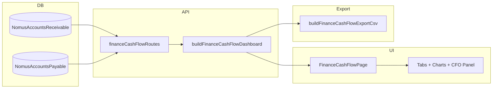

# Blueprint — Fluxo de Caixa / Fluxo Financeiro

**Projeto:** IndusCost  
**Módulo:** Financeiro → Fluxo de Caixa (`/finance/cash-flow`)  
**Data do blueprint:** 2026-06-09  
**Fase:** Objetivo 1 — auditoria e documentação (sem alteração de UI)

> Documento de referência para evolução do painel executivo financeiro.  
> Especificação técnica complementar: `docs/generated/finance-cash-flow-dashboard-spec.md`.

---

## 1. Objetivo de negócio da tela

O **Fluxo de Caixa** responde: *quanto dinheiro entra, quanto sai e qual a posição líquida projetada ou realizada*, com base em títulos de **Contas a Receber** e **Contas a Pagar** sincronizados do Nomus.

| Pergunta do gestor | Onde a tela responde |
|--------------------|----------------------|
| Estamos em superávit ou déficit de caixa? | Hero YTD, `netCashPosition`, `FinanceCashFlowNetPositionHero` |
| Como evoluiu o caixa no ano? | Bloco YTD + gráfico de tendência mensal |
| O que acontece nos próximos meses? | Previsão 12m, cenários conservador/crítico |
| Onde está o risco? | Aba Risco, score de saúde, vencidos, concentração |
| O que fazer agora? | CFO Panel / `executiveInsights.recommendedActions` |
| Qual o impacto dos filtros? | Chips, banner de escopo, nota de saneamento |

**Não é faturamento.** Faturamento mede venda/NF-e; fluxo de caixa mede movimentação financeira (AR/AP).

**Não há saldo bancário real.** `hasInitialBankBalance: false` — saldo acumulado é fluxo projetado acumulado, não extrato bancário.

---

## 2. Como o gestor financeiro deve interpretar a tela

### Leitura recomendada (topo → baixo)

1. **Cabeçalho executivo** — fonte (AR+AP), última sync Nomus, ações Atualizar/Exportar.
2. **Banner de filtros + saneamento** — confirma escopo ativo e títulos excluídos da visão gerencial.
3. **Resumo YTD** — visão anual independente do mês filtrado (recebido/pago acumulado, posição líquida).
4. **Painel CFO** — score 0–100, alertas, oportunidades, watchlist, plano de ação (máx. 5 itens).
5. **Fluxo mensal** — gráfico do período com filtros aplicados.
6. **Previsão e cenários** — horizonte 12 meses, necessidade de caixa, recomendações.
7. **Listas críticas** — maiores entradas/saídas, vencidos, top clientes/fornecedores.
8. **Abas Calendário e Risco** — visão diária e análise de concentração/pressão de pagamento.

### Modos de visão (`viewMode`)

| Modo | Significado para o gestor |
|------|---------------------------|
| `projected` | O que **ainda vai entrar/sair** (títulos em aberto por vencimento) |
| `realized` | O que **já entrou/saiu** (baixas/pagamentos efetivados) |
| `combined` | Previsto + realizado no mesmo bucket mensal |

### Saneamento gerencial

Títulos excluídos dos cálculos (permanecem no banco):

- Grupo interno (Lazarios, Koppetel, SM)
- Títulos fantasma
- Agendas de pedido de compra (AP)

Contagem exibida em `dataSanitization` via `FinanceManagementSanitizationNote`.

---

## 3. Mapa de componentes React

### Roteamento

| Arquivo | Função |
|---------|--------|
| `src/components/FinanceModule.tsx` | Router do módulo financeiro |
| `src/lib/financeNavigation.ts` | `FINANCE_SECTIONS` — label "Fluxo de Caixa", path `/finance/cash-flow` |

### Página principal

| Componente | Caminho | Responsabilidade |
|------------|---------|------------------|
| `FinanceCashFlowPage` | `src/components/finance/FinanceCashFlowPage.tsx` | Estado draft/applied filters, fetch API, tabs, export, composição geral |

### Shell BI compartilhado (`src/components/finance/bi/`)

| Componente | Uso no Fluxo de Caixa |
|------------|----------------------|
| `FinanceBiDashboardShell` | Layout página (`bg #F9FAFB`, espaçamento) |
| `FinanceBiExecutiveHeader` | Eyebrow, título, meta, refresh, export |
| `FinanceBiFilterPanel` | Painel filtros + Apply/Clear |
| `FinanceBiFilterChips` | Chips removíveis (via `buildFinanceCashFlowFilterChips`) |
| `FinanceBiFilterStatusBadge` | Badge none/applied/pending |
| `FinanceBiKpiCard` | Base de KPI (usado por `FinanceCashFlowKpiCard`) |
| `FinanceBiEmptyState` | Empty states de gráficos |

### Componentes específicos (`src/components/finance/cash-flow/`)

| Componente | Responsabilidade |
|------------|------------------|
| `FinanceCashFlowYtdSummary` | Bloco YTD: cards compactos, leitura executiva, gráfico tendência |
| `FinanceCashFlowYtdTrendChart` | Linha mensal YTD |
| `FinanceCashFlowYtdTotalsPanel` | Totais carteira AR/AP |
| `FinanceCashFlowNetPositionHero` | Hero superávit/déficit |
| `FinanceCashFlowKpiCard` | Wrapper KPI com formatação cash-flow |
| `FinanceCashFlowCfoPanel` | Action center CFO: score, insights, plano |
| `FinanceCashFlowExecutiveReading` | Bullets determinísticos |
| `FinanceCashFlowScenarioChart` | Gráfico base/conservador/stress |
| `FinanceCashFlowCashNeedPanel` | Necessidade de caixa por horizonte |
| `FinanceCashFlowRecommendations` | Lista de recomendações operacionais |
| `FinanceCashFlowCalendar` | Grid diário (aba Calendário) |
| `FinanceCashFlowRiskTab` | Aba Risco de Caixa |
| `FinanceCashFlowDetailTable` | Tabela críticos inflow/outflow |
| `FinanceCashFlowChartShell` | Wrapper gráfico + altura fixa + empty |

### Gráficos

| Componente | Caminho |
|------------|---------|
| `FinanceCashFlowMonthlyChart` | `src/components/finance/FinanceCashFlowCharts.tsx` |

### Banners compartilhados

| Componente | Caminho |
|------------|---------|
| `FinanceFilterScopeBanner` | Escopo de filtros ativos |
| `FinanceManagementSanitizationNote` | Nota de saneamento |

### Componentes locais na página (não exportados)

- `PartyList` — top clientes/fornecedores
- `CriticalList` — maiores movimentos / vencidos

### Abas (Phase 1 habilitadas)

| Tab ID | Label | Habilitada |
|--------|-------|------------|
| `overview` | Visão geral | Sim |
| `calendar` | Calendário | Sim |
| `risk` | Risco de Caixa | Sim |
| `accumulated` | Acumulado | Não (fase posterior) |
| `detailed` | Detalhado | Não |
| `inflows` | Entradas | Não |
| `outflows` | Saídas | Não |

Definição: `PHASE1_FINANCE_CASH_FLOW_TABS` em `financeCashFlowDashboardTypes.ts`.

---

## 4. Mapa de endpoints

Registrados em `server.ts` via `registerFinanceCashFlowRoutes` (`src/lib/financeCashFlowRoutes.ts`).

| Método | Rota | Permissões | Resposta |
|--------|------|------------|----------|
| `GET` | `/api/finance/cash-flow/dashboard` | `FINANCE_CASH_FLOW_VIEW_PERMISSIONS` | JSON `FinanceCashFlowDashboardPayload` |
| `GET` | `/api/finance/cash-flow/export` | `FINANCE_CASH_FLOW_EXPORT_PERMISSIONS` | CSV attachment |

### Fluxo do endpoint dashboard

```
query params
  → parseFinanceCashFlowDashboardFilters()
  → buildFinanceArPrismaWhere / buildFinanceApPrismaWhere
  → prisma.nomusAccountsReceivable.findMany
  → prisma.nomusAccountsPayable.findMany
  → buildFinanceCashFlowDashboard(arRows, apRows, filters)
  → JSON payload
```

### Permissões (`financeCashFlowPermissions.ts`)

- View: `canViewFinanceCashFlow`
- Export: `canExportFinanceCashFlow`

---

## 5. Mapa das libs de cálculo

### Motor principal

| Arquivo | Funções-chave |
|---------|---------------|
| `financeCashFlowDashboard.ts` | `buildFinanceCashFlowDashboard`, `buildFinanceCashFlowMonthlySeries`, `filterCashFlowArRows`, `filterCashFlowApRows`, `parseFinanceCashFlowDashboardFilters`, `financeCashFlowMetricsAreFinite` |
| `financeCashFlowDashboardTypes.ts` | Tipos payload, `buildFinanceCashFlowDashboardQuery`, tabs, opções de filtro UI |

### Módulos satélite

| Arquivo | Funções-chave |
|---------|---------------|
| `financeCashFlowIntelligence.ts` | `buildNetCashPositionMetrics`, `buildCashFlowExecutiveReading`, `resolveMonthlyNetStatus` |
| `financeCashFlowForecast.ts` | `buildCashFlowForecast`, `buildConservativeScenario`, `buildStressScenario`, `buildScenarioChartPoints`, `buildCashFlowOperationalRecommendations` |
| `financeCashFlowCfoDiagnostics.ts` | `buildCashHealthScore`, `buildCashFlowDailyCalendar`, `buildCashFlowExecutiveInsights`, `cashFlowCfoMetricsAreFinite` |
| `financeCashFlowExecutiveYtd.ts` | `buildFinanceCashFlowExecutiveYtd`, `buildYtdDashboardFilters`, `buildCashFlowExecutiveYtdReading` |
| `financeCashFlowDisplay.ts` | `computeCashFlowNetPosition`, `cashFlowMonthlySeriesHasData`, `formatCashFlowKpiDisplay` |
| `financeCashFlowExport.ts` | `buildFinanceCashFlowExportCsv`, `financeCashFlowExportFilename` |
| `financeCashFlowPageUi.ts` | `countActiveCashFlowFilters` |
| `financeCashFlowPermissions.ts` | Guards de permissão |
| `financeCashFlowRoutes.ts` | Registro Express |

### Libs compartilhadas (AR/AP reutilizadas)

| Arquivo | Papel no cash-flow |
|---------|-------------------|
| `financeAccountsReceivableDashboard.ts` | Where Prisma AR, filtro row, classificação título, open/settled/overdue |
| `financeAccountsPayableDashboard.ts` | Equivalente AP |
| `financeInternalGroupExclusions.ts` | Exclusões intercompany/fantasma/agenda PC |
| `financeFilterScope.ts` | Constantes de escopo (`FINANCE_CASH_FLOW_*`) |
| `financeBiFilterChips.ts` | `buildFinanceCashFlowFilterChips` |
| `financeBiFilterState.ts` | `resolveFinanceBiFilterStatus` (draft vs applied) |
| `financeBiDashboardTheme.ts` | Tokens visuais BI |
| `financeAccountsReceivableFormat.ts` | `formatFinanceCurrency`, `formatFinanceDateTime` |

### O que NÃO existe no Fluxo de Caixa

- **Aging buckets** (`AGING_BUCKET_DEFS`) — exclusivos de AR/AP
- **Schedule buckets** (`SCHEDULE_BUCKET_DEFS`) — exclusivos de AR/AP
- **Action center AR/AP** (`FinanceArActionCenter`, `FinanceApActionCenter`) — cash-flow usa `executiveInsights` do CFO Panel

---

## 6. Fluxo de dados: banco → cálculo → UI → export



### Etapas detalhadas

1. **Sync Nomus** popula `NomusAccountsReceivable` e `NomusAccountsPayable` (fora do escopo desta tela).
2. **UI** mantém `draftFilters` (edição) e `appliedFilters` (consulta).
3. **Query string** montada por `buildFinanceCashFlowDashboardQuery(appliedFilters)`.
4. **API** carrega linhas Prisma com selects mínimos (`FINANCE_CASH_FLOW_AR_SELECT`, `FINANCE_CASH_FLOW_AP_SELECT`).
5. **Motor** aplica filtros row-level, saneamento, agregações mensais, YTD, forecast, CFO diagnostics.
6. **Validação** `financeCashFlowMetricsAreFinite` + `cashFlowCfoMetricsAreFinite` + `executiveYtdMetricsAreFinite`.
7. **UI** renderiza por aba; gráficos usam `monthlySeries`, `scenarioChartPoints`, `dailyCalendar`.
8. **Export** reutiliza mesmo payload/filtros → CSV mensal + linhas de necessidade de caixa.

---

## 7. Regras dos filtros

### Campos disponíveis

| Campo UI | Query param | Default |
|----------|-------------|---------|
| Ano | `year` | Ano corrente |
| Mês | `month` | vazio = ano inteiro |
| Empresa | `companyName` | vazio |
| Visão | `viewMode` | `projected` |
| Data base | `dateBase` | `due` |
| Status | `status` | `all` |
| Cliente | `customerName` | vazio |
| Fornecedor | `supplierName` | vazio |
| CNPJ/CPF | `personCnpj` | vazio |
| Forma pagamento | `paymentMethodName` | vazio |
| Conta bancária | `bankAccountName` | vazio |
| NF emitida | `invoiceIssued` | `all` |

### Draft vs applied

| Estado | Comportamento |
|--------|---------------|
| `draftFilters` | Editado nos inputs; **não dispara fetch** |
| `appliedFilters` | Usado em `appliedQuery`; dispara `loadDashboard` e export |
| `hasPendingFilterChanges` | `appliedQuery !== draftQuery` |
| **Aplicar** | Copia draft normalizado → applied |
| **Limpar** | Reseta ambos para `createDefaultFinanceCashFlowUiFilters()` |
| **Remover chip** | Limpa campo e **aplica imediatamente** (draft + applied) |

### Status do filtro (badge)

`resolveFinanceBiFilterStatus(filtersActive, hasPendingChanges)`:

- `pending` — alterações não aplicadas
- `applied` — filtros ativos
- `none` — sem filtros além do default

### Exceção YTD

`executiveYtd` usa `buildYtdDashboardFilters()` que **remove `month`** — bloco YTD é sempre escopo anual, não mensal.

### Data base efetiva

No modo `projected`, data base efetiva é sempre `dueDate`, independente do filtro `dateBase`.

---

## 8. Regras dos cards (KPIs)

Objeto `payload.cards` (`FinanceCashFlowDashboardCards`):

| Campo | Regra |
|-------|-------|
| `totalReceivableOpen` | Soma saldos abertos AR filtrados |
| `totalPayableOpen` | Soma saldos abertos AP filtrados |
| `inflowAmount` / `outflowAmount` / `netFlowAmount` | Do mês filtrado em `monthlySeries` (ou ano se sem mês) |
| `netCashPosition` | `totalReceivableOpen − totalPayableOpen` |
| `netCashPositionStatus` | `surplus` ≥ 0, `deficit` < 0 |
| `cashCoverageRatio` | AR/AP quando AP > 0; `null` se AP = 0 |
| `cashNeedAmount` | \|déficit\| ou 0 em superávit |
| `overdueCashImpact` | Soma vencidos AR + AP em aberto |
| `accumulatedBalance` | Soma corrida de `netFlow`; **sem saldo bancário inicial** |
| `negativeBalanceMonthsCount` | Meses com net negativo na série |
| `outflowToInflowPercent` | AP/AR em % quando AR > 0 |
| `lastSyncAt` | MAX(`syncedAt`) das linhas carregadas |
| `arRecords` / `apRecords` | Contagem após filtros |

Cards YTD separados em `payload.executiveYtd` (recebido/pago YTD por baixa).

---

## 9. Regras dos gráficos

| Gráfico | Dados | Empty state |
|---------|-------|-------------|
| Fluxo mensal (`FinanceCashFlowMonthlyChart`) | `monthlySeries` | `cashFlowMonthlySeriesHasData()` |
| Tendência YTD (`FinanceCashFlowYtdTrendChart`) | `executiveYtd.monthlyTrend` | Componente interno |
| Cenários (`FinanceCashFlowScenarioChart`) | `scenarioChartPoints` | Via `FinanceCashFlowChartShell` |
| Calendário (`FinanceCashFlowCalendar`) | `dailyCalendar` | Mensagem por dia vazio |

### Série mensal

- Meses futuros em `realized`: valores `null` (não zero).
- `status` por mês: `positive` / `negative` / `null`.
- AP exibido como saída (sinal visual negativo na UI).

### Cenários

| Cenário | Fator AR aberto | Fator AR vencido | AP |
|---------|-----------------|------------------|-----|
| Base | 100% | 100% | 100% |
| Conservador | 80% | 50% | 100% |
| Stress | 60% | 30% | 100% |

---

## 10. Regras do action center (CFO Panel)

Equivalente gerencial ao action center de AR/AP, implementado em `FinanceCashFlowCfoPanel` + `buildCashFlowExecutiveInsights`.

### Estrutura `executiveInsights`

| Seção | Conteúdo |
|-------|----------|
| `cashHealth` | Score 0–100, classificação healthy/attention/risk/critical |
| `alerts` | Itens severity warning/critical (concentração, vencidos, déficit) |
| `opportunities` | Cobrança, renegociação, antecipação |
| `watchlist` | Clientes/fornecedores críticos |
| `recommendedActions` | Plano de ação (máx. 5), priorizado por severidade |

### Limiares

- Concentração alerta: `CFO_CONCENTRATION_ALERT_PERCENT = 40%`
- Janelas de risco curto prazo: 7, 15, 30 dias

---

## 11. Regras dos grids / listas

| Grid/Lista | Fonte payload | Limite UI |
|------------|---------------|-----------|
| Maiores entradas previstas | `largestProjectedInflows` | 5 itens |
| Maiores saídas previstas | `largestProjectedOutflows` | 5 itens |
| Vencidos a receber | `overdueReceivables` | 5 itens |
| Pagamentos vencidos | `overduePayables` | 5 itens |
| Top clientes | `topCustomers` | 6 itens |
| Top fornecedores | `topSuppliers` | 6 itens |
| Tabela detalhe | merge inflows + outflows críticos | `FinanceCashFlowDetailTable` |
| Calendário diário | `dailyCalendar` | Mês filtrado ou mês de referência |
| Aba Risco | `cashHealthScore`, concentração, pressão pagamento | `FinanceCashFlowRiskTab` |

**Não há grid paginado de títulos** no Fluxo de Caixa (diferente de AR/AP). Listas são rankings/top-N.

---

## 12. Reconciliação cards ↔ gráficos ↔ export

| Verificação | Mecanismo |
|-------------|-----------|
| Sem NaN/Infinity | `financeCashFlowMetricsAreFinite`, testes dedicados |
| Net mensal = inflow − outflow | `buildFinanceCashFlowMonthlySeries` |
| Acumulado = soma corrida | Mesma série mensal |
| Gráfico = série mensal | `buildCashFlowNetPositionChartRows` espelha `monthlySeries` |
| Export CSV = série mensal | `buildFinanceCashFlowExportCsv` itera `monthlySeries` + cenários |
| YTD independente do mês | `buildYtdDashboardFilters` sem `month` |
| Cards período vs YTD | Cards usam filtro completo; YTD ignora mês |

Testes de consistência cross-dashboard em `financeDashboardConsistencyAudit.test.ts` (foco AR/AP; cash-flow tem suite própria).

---

## 13. Padrões visuais candidatos a design system

Tokens em `financeBiDashboardTheme.ts`:

| Token | Valor | Uso |
|-------|-------|-----|
| Background | `#F9FAFB` | Shell página |
| Card | `#FFFFFF` + border `#E5E7EB` | Cards, seções |
| Text primary | `#111827` | Títulos, valores |
| Text secondary | `#6B7280` | Labels, hints |
| Primary | `#2563EB` | Ações, destaque |
| Success | `#059669` | Entradas |
| Risk | `#DC2626` | Saídas, alertas |
| Warning | `#D97706` | Atenção |

### Padrões estruturais reutilizáveis

1. **Shell** — `FinanceBiDashboardShell` (fundo cinza claro, `space-y-5`)
2. **Header executivo** — eyebrow + título + meta chips + ações outline/accent
3. **Filter panel** — alwaysVisible (6 cols) + advanced collapsible + chips + Apply/Clear
4. **Section card** — `financeBiSectionClass` com header border-bottom
5. **KPI compact** — label 10px uppercase, valor tabular-nums, ícone Lucide
6. **Tabs inferiores** — border-bottom, disabled com tooltip fase posterior
7. **Empty state** — texto muted, sem quebrar layout
8. **Loading** — spinner centralizado + header ainda visível
9. **Error** — banner vermelho `border-red-200 bg-red-50`
10. **Scope banner** — filtros ativos + nota saneamento

### Classes utilitárias

- `financeBiCardClass`, `financeBiSectionClass`, `financeBiKpiLabelClass`
- `filterFieldClass()` e `labelClass()` locais na página (candidatos a extrair no Objetivo 2)

---

## 14. Problemas de UX identificados hoje

| # | Problema | Impacto |
|---|----------|---------|
| 1 | Abas `accumulated`, `detailed`, `inflows`, `outflows` desabilitadas sem preview | Expectativa frustrada do usuário |
| 2 | Sem saldo bancário real — acumulado é fluxo projetado | Pode confundir gestor acostumado a extrato |
| 3 | YTD e período filtrado coexistem — escopos diferentes | Requer leitura atenta dos subtítulos |
| 4 | `resolveFinanceBiFilterStatus` recebe `appliedQuery` (string) em vez de boolean na página | Funciona por coerção JS, mas frágil |
| 5 | Listas críticas limitadas a 5–6 itens sem "ver todos" | Drill-down incompleto vs AR/AP |
| 6 | Cores hardcoded (`#E5E7EB`, etc.) misturadas com tokens theme | Manutenção e dark mode inconsistentes |
| 7 | Filtros avançados colapsados por default | Cliente/fornecedor menos visíveis |
| 8 | Export só CSV mensal — sem export de títulos críticos | Análise offline limitada |
| 9 | Action center não linka para AR/AP com filtro pré-aplicado | Fricção operacional |
| 10 | Responsivo: grid 6 colunas de filtro aperta em tablet | Campos truncados |

---

## 15. Riscos se mexer errado

| Risco | Mitigação |
|-------|-----------|
| Quebrar reconciliação AR/AP ↔ Cash Flow | Reutilizar `filterFinanceArRows` / `filterFinanceApRows`; não duplicar regras |
| Alterar saneamento e divergir totais entre telas | Centralizar em `financeInternalGroupExclusions.ts` |
| Mudar `viewMode` e gerar zeros falsos em meses futuros | Manter `null` em `realized` para meses futuros |
| Refatorar filtros e quebrar export | Export usa mesmos `appliedFilters` e query builder |
| Mexer em Prisma select e omitir campos de cálculo | Manter `FINANCE_CASH_FLOW_AR_SELECT` / `AP_SELECT` sincronizados |
| Introduzir Control Room antigo | Proibido: `finance-control-room.css`, `financeControlRoomTheme.ts` |
| Alterar Nomus sync | Fora de escopo — cash-flow é read-only sobre tabelas sync |
| UI refactor sem testes | Rodar `test:finance:cash-flow` + `test:finance:accounts-receivable` + `test:finance:accounts-payable` |
| Confundir faturamento com caixa | Não usar `SalesOrder` / NF-e como fonte principal |

---

## 16. Checklist — reaproveitar em AR / AP / Faturamento

| Padrão | AR | AP | Faturamento | Cash Flow (origem) |
|--------|----|----|-------------|-------------------|
| `FinanceBiDashboardShell` | Parcial | Parcial | Parcial | Referência |
| `FinanceBiExecutiveHeader` | Sim | Sim | Sim | Referência |
| `FinanceBiFilterPanel` draft/applied | Sim | Sim | Sim | Referência |
| Filter chips removíveis | Sim | Sim | Sim | `financeBiFilterChips` |
| Scope banner + saneamento | Sim | Sim | Parcial | `FinanceFilterScopeBanner` |
| KPI cards executivos | Sim | Sim | Sim | YTD compact cards |
| Action center | `FinanceArActionCenter` | `FinanceApActionCenter` | — | `FinanceCashFlowCfoPanel` |
| Aging / schedule buckets | Sim | Sim | — | Não aplicável |
| Gráficos Recharts em shell | Parcial | Parcial | Sim | `FinanceCashFlowChartShell` |
| Export CSV alinhado a filtros | Sim | Sim | Sim | `buildFinanceCashFlowExportQuery` |
| Tabs inferiores | Sim | Sim | Parcial | Phase 1 pattern |
| Empty / loading / error states | Parcial | Parcial | Parcial | Padronizar no DS |
| Tokens `financeBiDashboardTheme` | Parcial | Parcial | Parcial | Fonte única |
| Testes de contrato UI | `*PageFilters.test.ts` | `*PageFilters.test.ts` | `*PageFilters.test.ts` | `financeCashFlowPageFilters.test.ts` |
| Auditoria consistência | `financeDashboardConsistencyAudit` | idem | idem | Incluir cash-flow na próxima fase |

---

## Arquivos analisados (inventário)

### UI

- `src/components/FinanceModule.tsx`
- `src/components/finance/FinanceCashFlowPage.tsx`
- `src/components/finance/FinanceCashFlowCharts.tsx`
- `src/components/finance/FinanceFilterScopeBanner.tsx`
- `src/components/finance/bi/*` (7 componentes)
- `src/components/finance/cash-flow/*` (14 componentes)

### API e motor

- `src/lib/financeCashFlowRoutes.ts`
- `src/lib/financeCashFlowDashboard.ts`
- `src/lib/financeCashFlowDashboardTypes.ts`
- `src/lib/financeCashFlowIntelligence.ts`
- `src/lib/financeCashFlowForecast.ts`
- `src/lib/financeCashFlowCfoDiagnostics.ts`
- `src/lib/financeCashFlowExecutiveYtd.ts`
- `src/lib/financeCashFlowDisplay.ts`
- `src/lib/financeCashFlowExport.ts`
- `src/lib/financeCashFlowPageUi.ts`
- `src/lib/financeCashFlowPermissions.ts`

### Compartilhados

- `src/lib/financeAccountsReceivableDashboard.ts`
- `src/lib/financeAccountsPayableDashboard.ts`
- `src/lib/financeInternalGroupExclusions.ts`
- `src/lib/financeFilterScope.ts`
- `src/lib/financeBiFilterChips.ts`
- `src/lib/financeBiFilterState.ts`
- `src/lib/financeBiDashboardTheme.ts`
- `src/lib/financeNavigation.ts`

### Testes (cash-flow)

- `src/lib/financeCashFlowDashboard.test.ts`
- `src/lib/financeCashFlowForecast.test.ts`
- `src/lib/financeCashFlowCfoDiagnostics.test.ts`
- `src/lib/financeCashFlowExecutiveYtd.test.ts`
- `src/lib/financeCashFlowValidation.test.ts`
- `src/lib/financeCashFlowPageFilters.test.ts`
- `src/lib/financeCashFlowExport.test.ts`
- `src/lib/financeCashFlowDisplay.test.ts`
- `src/lib/financeCashFlowIntelligence.test.ts`

### Documentação existente

- `docs/generated/finance-cash-flow-dashboard-spec.md`
- `docs/generated/finance-bi-dashboard-ux-guidelines.md`
- `docs/generated/finance-dashboard-consistency-audit.md`

---

## Comandos de validação

```bash
npm run test:finance
npm run test:finance:cash-flow   # suite específica do módulo
npm run lint
npm run build
```
