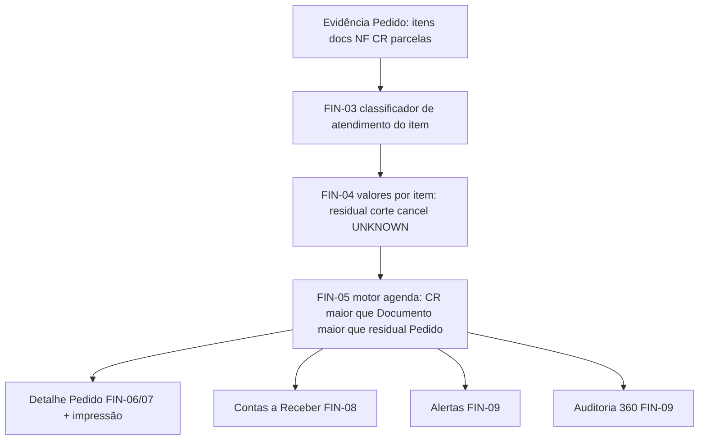

# FIN-12 — Release candidate: agenda financeira efetiva (Pedido → Documento → CR)

| | |
|---|---|
| **Projeto** | IndusCost / My Industry |
| **Ticket** | FIN-12 |
| **Atualizado** | 2026-07-17 |
| **Status** | Release candidate |
| **Política** | `docs/finance/effective-schedule-policy.md` (FIN-02) |
| **Motor canônico** | `src/lib/finance/salesOrderEffectiveFinancialSchedule.ts` (FIN-05) |
| **Consumidores** | `docs/finance/effective-schedule-consumers.md` (FIN-09) |
| **Auditoria read-only** | `docs/finance/effective-schedule-audit-runbook.md` (FIN-10) |
| **Matriz de testes** | FIN-11 (`effectiveScheduleMatrix.integration.test.ts`) |

Este documento fecha a série FIN-01…FIN-11: arquitetura oficial, regras finais, validação da matriz, anti-paralelo **Pedido − CR**, permissões, desempenho e limitações que só se confirmam no servidor.

---

## 1. Arquitetura oficial



Pipeline textual: evidência → FIN-03 → FIN-04 → FIN-05 → consumidores (Detalhe, AR, Alertas, Auditoria 360°, impressão).

**Precedência imutável:** `CR real > condição comprovada do Documento > previsão residual do Pedido`.

**Anti-regra:** não somar camadas (Pedido + Documento + NF + CR). Evidência superior **substitui** a inferior na parte coberta.

---

## 2. Trilha FIN-01 → FIN-11

| Ticket | Entrega |
|---|---|
| FIN-01 | Inventário do fluxo atual (`effective-schedule-current-flow.md`) |
| FIN-02 | Política normativa (`effective-schedule-policy.md`) |
| FIN-03 | Classificador de atendimento do item |
| FIN-04 | Valores financeiros por item (Decimal) |
| FIN-05 | Motor único da agenda efetiva |
| FIN-06 | Detalhe do Pedido → FIN-05 |
| FIN-07 | UI do detalhe (cards, residual, histórico) |
| FIN-08 | Contas a Receber contextual sem duplicar Pedido×CR |
| FIN-09 | Alertas + Auditoria 360° + checklist de consumidores |
| FIN-10 | Script/runbook de auditoria read-only no servidor |
| FIN-11 | Matriz integrada (24 cenários + invariantes) |
| **FIN-12** | **Release candidate + homologação** |

---

## 3. Regras finais (checklist de validação)

| Tema | Regra oficial | Como validar |
|---|---|---|
| Classificação de itens | FIN-03 (status + qty + flags Nomus) | `salesOrderItemFinancialFulfillmentClassifier.test.ts` |
| Atendimento total | Residual item = 0 | Matriz #4 |
| Corte | `cutAmount`; fora de AR/FC/alertas de aberto | Matriz #5 |
| Atendimento parcial | Só saldo ativo; datas originais do Pedido | Matriz #6 |
| Cancelamento | `canceledAmount`; residual 0 | Matriz #8 |
| Status desconhecido | `unresolvedAmount` + alerta; nunca zerar silencioso | Matriz #9 |
| Cobertura por Documento | Parte coberta sai do Pedido | Matriz #2, #11, #12 |
| Condição do Documento | Comprovada → agenda Doc; senão → aguardando (sem datas Pedido) | Matriz #23 |
| CR real | Substitui Doc da mesma NF; valores oficiais preservados | Matriz #3, #13–#16 |
| Previsão residual | Soma dos `activeResidual` dos itens, redistribuída | Matriz #1, #6, #7 |
| Redistribuição de parcelas | Proporcional; centavos na última | Matriz #20 |
| Detalhe do Pedido | `engine = salesOrderEffectiveFinancialSchedule` | FIN-06/07 tests |
| Contas a Receber | Linhas CR / Doc aguardando / residual; sem substituída | FIN-08 + matriz #17 |
| Fluxo de Caixa | **Somente** AR/AP Nomus; **sem** previsão de Pedido | `effectiveScheduleConsumers.test.ts` |
| Alertas | Residual vencido sim; substituída/corte não | FIN-09 |
| Auditoria 360° | `projectEffectiveScheduleForOrderAudit` | FIN-09 |
| Impressão | Mesma payload FIN-05 do Detalhe (`SalesOrderDetailDialog` print) | FIN-07 + wiring |
| Permissões | AR / detalhe / auditoria usam recursos financeiros existentes; sem bypass | catálogo `financeiro.*` / `finance.*` |
| Desempenho | Motor puro (sem I/O); AR contextual com pool paralelo ≤ 4 e `limit` ≤ 40 | ver §6 |
| N+1 | Detalhe/Audit: carregamento batch no `getOrderFullAudit`; AR contextual: 1 audit/pedido em paralelo (não sequencial) | ver §6 |

---

## 4. Confirmação anti-paralelo: **não existe Pedido − CR**

| Verificação | Resultado |
|---|---|
| Residual oficial | `sum(item.activeResidual)` via FIN-04 (tipo de atendimento), **não** `valorPedido − Σ CR` |
| Legado `buildSalesOrderPlannedReceivables` | Arquivo mantido só para testes/histórico; **nenhum consumidor de produção chama** |
| Cobertura legada `orderActiveValue − coveredByDominant` | Não usada no Detalhe, AR, Alertas nem Auditoria 360° |
| Diff Documento × CR | CR oficial preservado; residual comercial **não** = Pedido − CR (matriz #16) |
| Regressão FIN-12 | `effectiveScheduleConsumers.test.ts` — bloco “anti-paralelo Pedido−CR” |

O cálculo oficial **sempre** passa por:

1. classificação do item (FIN-03);
2. valores por item (FIN-04);
3. motor de agenda (FIN-05).

---

## 5. Matriz de consumidores (RC)

| Consumidor | Motor | Estado |
|---|---|---|
| Detalhe do Pedido | FIN-05 | Oficial |
| Impressão / PDF do Detalhe | FIN-05 (mesma payload) | Oficial |
| Contas a Receber (filtro Pedido/cliente) | FIN-05 | Oficial |
| Resolver receivables por pedido | FIN-05 | Oficial |
| Alertas financeiros | FIN-05 | Oficial |
| Auditoria 360° (financeiro / planned) | FIN-05 | Oficial |
| Documentos de Saída (evidência) | max(CR, Doc) — sem soma | Alinhado |
| Fluxo de Caixa oficial | Nomus AR/AP only | **Fora** da previsão de Pedido (correto) |
| Contas a Pagar / comissões | Intactos | Fora de escopo FIN |

---

## 6. Desempenho e N+1

| Superfície | Comportamento |
|---|---|
| Motor FIN-05 | Puro, síncrono, Decimal — adequado a hot path |
| Detalhe do Pedido | Um `getOrderFullAudit` + FIN-05 em memória |
| Auditoria 360° | Mesmo audit; projeção FIN-05 sem segundo motor |
| Contas a Receber contextual | `findMany` pedidos (`take` ≤ 40) + audits em **pool paralelo (4)**; não há loop `await` sequencial |
| Listagem AR sem filtro Pedido/cliente | Nomus-only — **não** dispara agendas FIN-05 |

**Limitação remanescente:** cada pedido contextual ainda executa um `getOrderFullAudit` completo (custo I/O proporcional ao número de pedidos no filtro). Mitigações: limite 40, concurrency 4, só quando há hint Pedido/cliente. Batch único multi-pedido fica como evolução pós-RC (depende do servidor).

---

## 7. Permissões

- Contas a Receber: `financeiro.contas_receber` / `finance.accountsReceivable.view`.
- Pedidos / detalhe: permissões comerciais de pedidos de venda já existentes.
- Auditoria 360° / conciliação: recursos de portfolio / auditoria pedido-caixa.
- FIN **não** introduz bypass de auth; motores puros não acessam HTTP/Prisma.

---

## 8. Limitações que dependem do servidor

O Cursor **não** tem `DATABASE_URL` de produção. No servidor (stage/prod read-only):

1. Rodar `npm run audit:sales-order:effective-schedule -- --order="PD XXXXX"` (FIN-10) em amostra real.
2. Homologar Detalhe + AR + Auditoria 360° com pedidos: sem Doc; Doc sem CR; Doc+CR; corte; parcial; UNKNOWN.
3. Confirmar latência AR com filtro de cliente (vários pedidos) sob carga.
4. Impressão do Detalhe em Chrome (print CSS) com agenda efetiva visível.
5. Revisar visual 1366×768 e 1920×1080 no ambiente com dados reais (ver §10).

---

## 9. Como executar a suíte RC

```bash
# Direcionados FIN
npm run test:finance:effective-schedule-matrix
npx tsx --test \
  src/lib/finance/salesOrderItemFinancialFulfillmentClassifier.test.ts \
  src/lib/finance/salesOrderItemFinancialAmounts.test.ts \
  src/lib/finance/salesOrderEffectiveFinancialSchedule.test.ts \
  src/lib/sales-orders/salesOrderDetailEffectiveFinancial.test.ts \
  src/lib/finance/financeAccountsReceivableEffectiveTitles.test.ts \
  src/lib/finance/effectiveScheduleConsumers.test.ts \
  src/lib/finance/effectiveSalesOrderScheduleAudit.test.ts \
  src/lib/finance/effectiveScheduleMatrix.integration.test.ts

npm test
npm run build
git diff --check
```

Critérios de aceite RC:

- [x] Matriz FIN-11 24/24
- [x] Sem chamada produção a `buildSalesOrderPlannedReceivables`
- [x] Residual ≠ Pedido − CR
- [x] Fluxo de Caixa sem previsão de Pedido
- [x] Build limpo
- [x] `git diff --check` limpo
- [ ] Homologação com dados reais no servidor (FIN-10)

---

## 10. Revisão visual (UI)

Superfície principal: **Detalhe do Pedido** — aba/seção financeira (cards de cobertura, tabela residual, histórico substituído, alertas).

Preview estático RC: `docs/finance/effective-schedule-ui-preview.html` (CSS de produção `sales-order-detail-view.css`).

| Viewport | Resultado RC (2026-07-17) |
|---|---|
| 1366×768 | 5 KPIs em grade; meta wrap com gap reduzido (`max-width: 1365px`); tabela legível; histórico substituído separado |
| 1920×1080 | Mesma hierarquia ampliada; KPIs 5 colunas (`min-width: 1024px`); sem overflow horizontal |

Checklist UI:

- [x] Previsão substituída **não** aparece como “Vencido” operacional (bloco histórico separado).
- [x] Corte/cancelado em meta, não como parcela aberta.
- [x] Residual e CR em linhas distintas (sem soma Pedido+CR).
- [x] Impressão usa `#sales-order-detail-print-root` (mesmo conteúdo FIN-05) — validar no servidor com pedido real.

---

## 11. Segurança (escopo FIN)

- Motores FIN-03…05 sem I/O — sem SQL injection / SSRF.
- Script FIN-10: read-only; senha sanitizada na saída.
- APIs de detalhe/AR/audit: auth + resource guards existentes.
- Revisão de segurança do diff FIN-12 (uncommitted): **sem findings medium/high/critical**.
  Auth de Contas a Receber preservada; pool paralelo de audits não amplia escopo;
  compare de overrides com dual-write é correção de idempotência (não bypass).

---

## 12. Declaração de release candidate

A agenda financeira efetiva **Pedido → Documento → CR** está pronta para homologação em stage com dados reais, desde que:

1. a suíte acima esteja verde no CI/local;
2. o runbook FIN-10 rode com sucesso em pedidos amostrais no servidor;
3. não haja regressão visual nas viewports §10.

Qualquer cálculo concorrente que use **Pedido − CR** como residual deve ser tratado como **bug** e removido em favor de FIN-05.
