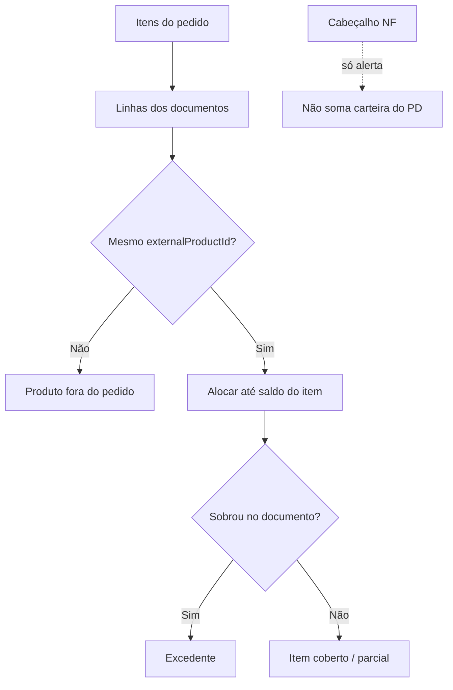

# Central de Auditoria da Carteira e Fluxo Planejado

**Subtítulo:** Metodologia para auditar o caminho **Pedido → Documento de Saída → NF → Contas a Receber → Baixa**.

| | |
|---|---|
| **Projeto** | IndusCost / My Industry |
| **Módulo** | Financeiro → Conciliação de Carteira → **Inteligência / Auditoria da Carteira** |
| **Tipo** | Requisitos oficiais (negócio + técnico + visual) |
| **Data** | 2026-07-11 |
| **Estado** | Documento de requisitos — **antes** de código novo desta evolução |
| **Preferência de cálculo** | Fatos e tabelas já materializados (sem migration) |

> Documentos relacionados:  
> [`portfolio-intelligence-requirements.md`](./portfolio-intelligence-requirements.md) ·  
> [`portfolio-order-fulfillment-map-requirements.md`](./portfolio-order-fulfillment-map-requirements.md) ·  
> [`portfolio-order-fulfillment-map-validation.md`](./portfolio-order-fulfillment-map-validation.md) ·  
> [`portfolio-intelligence-fulfillment-execution-report.md`](./portfolio-intelligence-fulfillment-execution-report.md)

---

## Sumário

1. [Objetivo da tela](#1-objetivo-da-tela)  
2. [Escopo](#2-escopo)  
3. [Paradigma](#3-paradigma)  
4. [Hierarquia de evidência](#4-hierarquia-de-evidência)  
5. [Unidade mínima de cálculo](#5-unidade-mínima-de-cálculo)  
6. [Status financeiro](#6-status-financeiro)  
7. [Status operacional](#7-status-operacional)  
8. [Alertas técnicos](#8-alertas-técnicos)  
9. [Regras de atendimento item a item](#9-regras-de-atendimento-item-a-item)  
10. [Regra de valores](#10-regra-de-valores)  
11. [Regra de forecast](#11-regra-de-forecast)  
12. [Indicador de confiança](#12-indicador-de-confiança)  
13. [Layout esperado](#13-layout-esperado)  
14. [Cards obrigatórios](#14-cards-obrigatórios)  
15. [Drawer obrigatório](#15-drawer-obrigatório)  
16. [Cores oficiais](#16-cores-oficiais)  
17. [Tipografia](#17-tipografia)  
18. [Definition of Ready (DoR)](#18-definition-of-ready-dor)  
19. [Definition of Done (DoD)](#19-definition-of-done-dod)  
20. [Casos obrigatórios](#20-casos-obrigatórios)  
21. [Glossário](#21-glossário)

---

## 1. Objetivo da tela

A Central de Auditoria da Carteira e Fluxo Planejado existe para a diretoria, financeiro e comercial **enxergarem o caminho completo** do pedido até o caixa — sem misturar previsão com dinheiro, e sem deixar cabeçalho de NF “parecer” carteira.

A tela deve responder, de forma auditável:

| # | Pergunta de negócio |
|---|---------------------|
| 1 | Quanto tenho de **caixa confirmado** (já baixado / recebido)? |
| 2 | Quanto tenho de **CR aberto** (direito financeiro formalizado, ainda não caixa)? |
| 3 | Quanto tenho de **pedido planejado saudável** (futuro, com evidência mínima ok)? |
| 4 | Quanto está em **atenção** (janela próxima, só pedido)? |
| 5 | Quanto está **bloqueado** (vencido / antigo sem evolução)? |
| 6 | Quais pedidos foram entregues **total** ou **parcialmente**? |
| 7 | Quais **itens** foram entregues? |
| 8 | Por quais **documentos de saída**? |
| 9 | Houve **quantidade excedente** no documento? |
| 10 | Houve **produto fora do pedido**? |
| 11 | O **CR** corresponde ao pedido (rateio seguro) ou só ao **cabeçalho da NF**? |
| 12 | O **fluxo planejado** está sendo **inflado** (cabeçalho, excesso, pedido sem evidência)? |

**Regra-mãe (IndusCost):**  
planejar pelo **pedido** → confirmar pela **entrega / documento de saída** → formalizar pelo **CR** → realizar pela **baixa**.

---

## 2. Escopo

### 2.1 O que a tela é

| Dimensão | Significado |
|----------|-------------|
| **Read-only** | Apenas leitura de fatos/tabelas já existentes |
| **Auditoria** | Trilha de evidências com fonte, confiança e explicação |
| **Inteligência** | Classificação por maturidade e atendimento |
| **Gestão de risco** | Superestimação, bloqueio, alertas técnicos |
| **Previsão de fluxo por maturidade** | Forecast que nasce do pedido e é substituído por evidências mais fortes |

### 2.2 O que a tela não pode

- Alterar **Fluxo de Caixa oficial**
- Alterar **Contas a Receber oficial**
- Alterar **Comissões** (nem importar services / conceito de vendedor comissionável)
- Alterar **Relatório Presidencial**
- Alterar **Contas a Pagar**, Precificação, Engenharia/BOM, Suprimentos
- Alterar dados do **Nomus**
- Fazer **write** / mutation no banco
- Criar **migration** sem aprovação explícita
- Somar **Pedido + NF + CR** como se fossem a mesma coisa
- Usar **cabeçalho de NF/documento** como valor automático do pedido

### 2.3 Arquitetura a reutilizar (sem duplicar motor)

- `portfolioReconciliationAllocationEngine`
- `portfolioReconciliationOrderTrace`
- `portfolioReconciliationApi`
- `portfolioMaturityClassification`
- `portfolioMaturityAnalytics`
- `portfolioMaturityIntelligenceApi`
- `portfolioOrderFulfillmentMap` (mapa item a item)
- `financePortfolioReconciliationRoutes`
- Componentes em `portfolio-reconciliation/`

UI **não** calcula regra crítica: apenas exibe payload da API.

---

## 3. Paradigma

```text
Pedido  ──planeja──►  Documento de saída  ──comprova entrega──►  NF  ──comprova fiscal──►  CR  ──formaliza──►  Baixa  ──confirma caixa
```

| Etapa | Papel no IndusCost |
|-------|--------------------|
| **Pedido de venda** | Previsão inicial / compromisso comercial |
| **Item do pedido** | Unidade mínima de planejamento e atendimento |
| **Documento de saída** | Evidência operacional de entrega |
| **NF** | Evidência fiscal |
| **Contas a Receber (CR)** | Direito financeiro formalizado |
| **Baixa** | Caixa realizado |

**Pedido ≠ caixa.** Cabeçalho de NF ≠ valor da carteira do pedido. Alerta técnico ≠ dinheiro novo.

---

## 4. Hierarquia de evidência

Da mais forte para a mais fraca (a evidência superior **substitui** a inferior no forecast e na leitura de maturidade):

```text
Baixa  >  CR  >  NF / Documento de saída  >  Pedido futuro  >  Pedido em atenção  >  Pedido bloqueado
```

| Nível | Evidência | Leitura executiva |
|-------|-----------|-------------------|
| 1 | Baixa | Caixa confirmado |
| 2 | CR aberto | Direito financeiro — ainda não caixa |
| 3 | NF / documento | Entrega/fiscal — pode ainda não ter CR |
| 4 | Pedido futuro | Planejamento saudável |
| 5 | Pedido em atenção | Janela próxima — acompanhar |
| 6 | Pedido bloqueado | Risco / superestimação — não tratar como fluxo confiável |

---

## 5. Unidade mínima de cálculo

A menor unidade é o **item do pedido** (`externalProductId` + quantidade + preço do pedido), **não**:

- o cabeçalho do pedido sozinho;
- o cabeçalho da NF;
- o total do documento de saída.

Tudo que for valor “do pedido” na auditoria deve poder ser rastreado até item(s). Totais de cabeçalho são **evidência / alerta**, não base automática de carteira.

---

## 6. Status financeiro

Eixo: **já virou direito financeiro / caixa?**  
Códigos canônicos (`FIN_*`). Podem coexistir com status operacional e alertas.

| Código | Nome exibido | Definição | Fonte | Regra de cálculo | Como interpretar |
|--------|--------------|-----------|-------|------------------|------------------|
| `FIN_RECEBIDO` | Já recebido | Há baixa / valor recebido associado ao pedido (sem inventar) | Títulos CR + settlement / received nos fatos | Existe evidência de recebimento suficiente para classificar como recebido | É **caixa** (ou parcela realizada). Maior confiança financeira. |
| `FIN_CR_ABERTO` | CR aberto | Existe Contas a Receber em aberto ligado ao pedido | Títulos CR materializados / agregados | Há CR com saldo aberto; não está totalmente baixado | Direito formalizado — **ainda não é caixa**. Forecast deve preferir vencimentos do CR. |
| `FIN_FATURADO_SEM_CR` | Faturado sem CR | Há NF e/ou documento de saída, mas **não** há CR | Fatos de NF/doc sem receivable | `hasNfeOrDoc && !hasCr` | Operação avançou; financeiro formal **atrasado ou ausente**. Cobrar abertura de CR / sync. |
| `FIN_SEM_CR` | Sem CR | Pedido ainda sem título financeiro (pode ou não ter doc) | Ausência de CR nos fatos | Sem receivable atribuído | Planejamento puro ou risco, conforme calendário / idade do pedido. |

**Importante:** status financeiro **único por eixo** no mapa; não substitui o operacional.

---

## 7. Status operacional

Eixo: **os itens do pedido foram atendidos pelos documentos?**  
Códigos canônicos (`OP_*`).

| Código | Nome exibido | Definição | Fonte | Regra de cálculo | Como interpretar |
|--------|--------------|-----------|-------|------------------|------------------|
| `OP_TOTALMENTE_ATENDIDO` | Totalmente atendido | Todos os itens com quantidade atendida (capped) = pedida; sem excedente relevante | Cobertura item a item | `remaining = 0` em todos os itens e sem excesso | Entrega do pedido completa — **não** implica caixa. |
| `OP_TOTALMENTE_ATENDIDO_COM_EXCEDENTE` | Totalmente atendido (com excedente) | Itens do pedido cobertos, mas documento(s) têm quantidade a mais | Cap + surplus | `remaining = 0` e `hasExcess` | Pedido ok; **excesso** é alerta, não carteira. |
| `OP_PARCIALMENTE_ATENDIDO` | Parcialmente atendido | Algum item atendido, algum restante | Cobertura parcial | `0 < attended < ordered` (em algum item / no total) | Ainda há saldo a entregar / faturar. |
| `OP_NAO_ATENDIDO` | Não atendido | Nenhum atendimento itemizado válido | Sem alocação | `attended = 0` | Só pedido (ou vínculo sem itemização útil). |
| `OP_DOCUMENTO_SEM_ITEMIZACAO` | Documento sem itemização | Há documento/NF, mas sem linhas confiáveis para casar item | Fatos sem linhas | Documento presente, itens do doc ausentes/insuficientes | Não dá para afirmar atendimento item a item. |
| `OP_VINCULO_APENAS_CABECALHO` | Vínculo só de cabeçalho | Ligação pedido↔NF só por cabeçalho, sem rateio item seguro | Links / fatos de cabeçalho | Vínculo sem alocação itemizada segura | Risco alto de interpretar cabeçalho como valor do pedido. |

---

## 8. Alertas técnicos

Eixo: **há risco de interpretação / qualidade de vínculo?**  
Regra obrigatória:

> Alertas técnicos **podem coexistir** com financeiro e operacional.  
> Alertas técnicos **não somam carteira**.  
> Alertas **não substituem** status financeiro.

| Código | Nome exibido | Definição | Fonte | Como interpretar |
|--------|--------------|-----------|-------|------------------|
| `NF_CABECALHO_MAIOR_PEDIDO` | NF maior que pedido | Soma/cabeçalho de NF(s) > valor oficial do pedido | Cabeçalho NF vs `orderValue` | Risco de inflar fluxo; mostrar atribuído vs não atribuído |
| `DIVERGENCIA_PRECO` | Divergência de preço | Preço do documento ≠ preço do pedido | Fatos `PRICE_MISMATCH` | Conferir comercial / cadastro |
| `QUANTIDADE_EXCEDENTE_DOCUMENTO` | Quantidade excedente no documento | Doc entregou mais qtde que o saldo do item | Surplus após cap | Excesso separado — não aumenta pedido |
| `PRODUTO_FORA_DO_PEDIDO` | Produto fora do pedido | Produto no doc sem item no PD | `itemsOutsideOrder` | Remessa / vínculo errado — não fecha item inexistente |
| `ITEM_DO_PEDIDO_NAO_ATENDIDO` | Item do pedido não atendido | Item com restante > 0 | Cobertura de itens | Saldo operacional ainda aberto |
| `DOCUMENTO_SEM_CR` | Documento sem CR | Há doc/NF e não há CR | Evidências | Formalização financeira pendente |
| `CR_SEM_RATEIO_SEGURO` | CR sem rateio seguro | CR existe, mas não dá para afirmar rateio item a item | Agregação de títulos | CR pode refletir cabeçalho NF — tratar com cautela |
| `VINCULO_INCOMPLETO` | Vínculo incompleto | Cadeia pedido–doc–NF–CR quebrada ou parcial | Fatos / links | Não inventar elo; sinalizar lacuna |
| `SEM_CONDICAO_PAGAMENTO` | Sem condição de pagamento | Falta condição para projetar vencimentos | Cadastro / fatos | Forecast frágil |
| `DADO_DESATUALIZADO` | Dado desatualizado | Run/sync/frescor indica materialização antiga ou não última | Meta da run / freshness | Pedir sync + rebuild antes de decidir |

> Observação de implementação: alertas já existentes no mapa (`DIVERGENCIA_TECNICA`, `NF_SEM_DOCUMENTO`, `PEDIDO_ANTIGO_SEM_EVOLUCAO`) permanecem válidos como extensão; `DADO_DESATUALIZADO` formaliza o eixo de frescor nesta Central.

---

## 9. Regras de atendimento item a item

1. **Casar** item do pedido com item do documento por `externalProductId` (e identidade de linha quando existir nos fatos).  
2. **Somar** alocações de **múltiplos** documentos de saída no mesmo item.  
3. **Limitar** atendimento ao **saldo** do pedido:  
   `attendedCapped = min(soma_alocada, orderedQuantity)`.  
4. **Percentual máximo** de atendimento do item = **100%**.  
5. O que passar do saldo → **excedente** (`surplus` / `excessQuantity`) — **separado**.  
6. Produto no documento sem item no pedido → **fora do pedido** — **separado**.  
7. Cabeçalho NF/documento → **referência de risco** — **separado**; nunca vira valor automático do pedido.  
8. Valor atribuído ao pedido usa **preço do pedido** × quantidade capped (não o total do cabeçalho).



---

## 10. Regra de valores

Cada valor na tela precisa ter **fonte**, **evidência**, **confiança** e **explicação**. **Não** somar Pedido + NF + CR.

| Valor | Definição | Fonte típica | Soma carteira do pedido? |
|-------|-----------|--------------|--------------------------|
| **Valor do pedido** | Total líquido oficial do PD | Pedido / fatos | Sim — base da carteira analisada |
| **Valor atribuído ao pedido** | Soma do atendimento capped × preço do pedido | Mapa de atendimento | ≤ valor do pedido |
| **Valor excedente** | Qtde/valor além do saldo do item | Surplus nos docs | **Não** |
| **Valor fora do pedido** | Produtos não pertencentes ao PD | `itemsOutsideOrder` | **Não** |
| **Valor cabeçalho NF/documento** | Total fiscal/operacional do cabeçalho | NF / doc | **Não** (alerta se > pedido) |
| **Valor CR** | Total dos títulos atribuídos | Contas a Receber materializado | Eixo financeiro (não somar de novo ao pedido) |
| **Valor recebido** | Parte baixada | Settlement / received | Caixa |
| **Valor aberto** | Saldo em aberto no CR | Open value | CR aberto |

**Teste de sanidade:**  
`atribuído ≤ pedido` · `excedente e fora e cabeçalho não aumentam pedido` · cards principais **não duplicam** o mesmo real entre status exclusivos.

---

## 11. Regra de forecast

### 11.1 Nascimento do forecast

O forecast nasce do **item do pedido**:

1. data prevista de entrega / faturamento (quando existir);  
2. **condição de pagamento**;  
3. **calendário do cliente** (quando existir).

Sem condição de pagamento → alerta `SEM_CONDICAO_PAGAMENTO` e confiança reduzida — **não inventar** prazo.

### 11.2 Substituição por evidência

| Quando aparece… | O forecast… |
|-----------------|-------------|
| **Baixa** | Substitui CR / previsão anterior → caixa realizado |
| **CR** | Substitui documento/NF / pedido como âncora de vencimento |
| **Documento / NF** | Substitui previsão pura do pedido (ainda pode faltar CR) |
| **Pedido vencido sem evidência** | Vai para **risco / bloqueio** (`CARTEIRA_VENCIDA_BLOQUEADA`) |

Forecast da Central é **auditoria / maturidade**, paralelo ao Fluxo de Caixa oficial — **não o substitui**.

---

## 12. Indicador de confiança

Score **0 a 100**, com faixas:

| Faixa | Label | Interpretação |
|-------|-------|---------------|
| 85–100 | **Alta** | Evidência financeira forte |
| 60–84 | **Média** | Planejamento ou faturamento com lacunas aceitáveis |
| 35–59 | **Baixa** | Atenção / evidência fraca |
| 0–34 | **Muito baixa** | Bloqueio / risco de superestimação |

### Base sugerida (âncora por maturidade)

| Situação | Score base sugerido |
|----------|---------------------|
| Recebido | 100 |
| CR aberto | 90 |
| Documento/NF sem CR | 75 |
| Pedido futuro saudável | 65 |
| Pedido em atenção | 50 |
| Pedido vencido sem documento | 20 |
| Pedido antigo sem evolução | 5 |

Penalidades típicas (não cumulativas de forma a inventar dados): ausência de condição de pagamento, vínculo só de cabeçalho, divergência técnica, dado desatualizado. O motor de classificação existente deve permanecer a fonte de cálculo; este quadro é o **contrato de negócio**.

---

## 13. Layout esperado

Três blocos visuais distintos (um propósito por bloco):

```text
┌─────────────────────────────────────────────────────────────┐
│  Título + subtítulo + aviso: pedido ≠ caixa até CR          │
│  Frescor dos dados (quando disponível)                      │
├─────────────────────────────────────────────────────────────┤
│  1. FINANCEIRO CONFIRMADO                                   │
│     cards: Recebido · CR aberto · Faturado sem CR           │
├─────────────────────────────────────────────────────────────┤
│  2. CARTEIRA OPERACIONAL                                    │
│     futuro · atenção · bloqueada · sem evidência            │
├─────────────────────────────────────────────────────────────┤
│  3. ATENDIMENTO E ALERTAS TÉCNICOS  (selo: não soma carteira)│
│     atendidos · parciais · não atendidos · excessos · NF…   │
├─────────────────────────────────────────────────────────────┤
│  Sanfonas / grid / KPIs (mesma lógica dos três blocos)      │
└─────────────────────────────────────────────────────────────┘
```

- Cards de alerta: visual **tracejado / “alerta”**, texto explícito **“não soma carteira”**.  
- Ajuda “?” em cada métrica (linguagem leiga).  
- Sem JSON cru, stack ou nomes técnicos de Prisma na UI.

---

## 14. Cards obrigatórios

### 14.1 Financeiro confirmado

| Card | Pergunta |
|------|----------|
| **Recebido** | Quanto já virou caixa? |
| **CR aberto** | Quanto é direito financeiro ainda em aberto? |
| **Faturado sem CR** | Quanto já tem NF/doc mas ainda sem título? |

### 14.2 Carteira operacional

| Card | Pergunta |
|------|----------|
| **Pedido futuro provável** | Planejamento saudável à frente |
| **Presente / atenção** | Janela próxima — só pedido |
| **Carteira vencida bloqueada** | Antigo sem evolução — risco |
| **Sem evidência suficiente** | Lacuna de dados para classificar com segurança |

### 14.3 Atendimento e alertas técnicos

| Card | Pergunta | Soma carteira? |
|------|----------|----------------|
| **Totalmente atendidos** | Pedidos 100% item a item | Operacional (não misturar com caixa) |
| **Parcialmente atendidos** | Entrega incompleta | Idem |
| **Não atendidos** | Sem atendimento itemizado | Idem |
| **Quantidade excedente** | Docs acima do saldo | **Não** |
| **Produto fora do pedido** | Remessa/vínculo estranho | **Não** |
| **NF maior que pedido** | Cabeçalho inflado | **Não** |
| **Risco de superestimação** | Tipicamente = vencida/bloqueada | Sim no eixo de risco (já contado uma vez) |

---

## 15. Drawer obrigatório

Ao abrir um pedido, a **primeira aba** deve ser:

### Mapa de Atendimento

Conteúdo mínimo:

1. **Resumo** — valor do pedido, atribuído, restante, eixos FIN/OP, alertas (chips).  
2. **Grid de itens** — produto, qtde pedida, atendida (capped), restante, %, documentos usados.  
3. **Grid de documentos** — NF/doc, cabeçalho, atribuído, não atribuído, matched / surplus / fora.  
4. **Grid de CR** — títulos, vencimentos, aberto/recebido; estado vazio se não houver (**não inventar**).  
5. **Conclusão executiva** — texto em português, legível, cobrindo financeiro × operacional × alertas.

Demais abas (evidências, timeline, etc.) permanecem secundárias ao Mapa.

---

## 16. Cores oficiais

| Uso | Fundo | Borda | Texto |
|-----|-------|-------|-------|
| **Financeiro positivo** | `#ECFDF3` | `#ABEFC6` | `#067647` |
| **Futuro provável** | `#EFF8FF` | `#B2DDFF` | `#175CD3` |
| **Atenção** | `#FFFAEB` | `#FEDF89` | `#B54708` |
| **Bloqueado / risco** | `#FEF3F2` | `#FECDCA` | `#B42318` |
| **Alerta técnico** | `#FFF6ED` | `#FDBA74` | `#C2410C` |
| **Neutro** | `#F9FAFB` | `#EAECF0` | `#344054` |
| **Indisponível** | `#F2F4F7` | `#D0D5DD` | `#667085` |

---

## 17. Tipografia

| Elemento | Tamanho | Peso |
|----------|---------|------|
| Título da tela | 24px | 700 |
| Subtítulo | 14px | 400 |
| Título do card | 12px uppercase | 600 |
| Valor do card | 24px / 28px | 700 |
| Texto auxiliar | 12px / 13px | 400–500 |

Manter tipografia do design system existente da Conciliação; estes tokens são o contrato visual da Central de Auditoria.

---

## 18. Definition of Ready (DoR)

### Negócio
- [ ] Perguntas da §1 acordadas com financeiro/comercial.  
- [ ] Paradigma e hierarquia de evidência aceitos (pedido ≠ caixa).  
- [ ] Casos PD 02339 e Britânia definidos como critérios de aceite.  
- [ ] Confirmado: alertas não somam carteira.

### Dados
- [ ] Run de conciliação materializada disponível (ou fixture validada).  
- [ ] Fatos com itens, docs/NF e CR quando existirem — sem inventar.  
- [ ] Frescor da run conhecido (última run / sync CR).  
- [ ] Sem dependência de dados de Comissão.

### Técnico
- [ ] Services/motores existentes inventariados (§2.3) — sem duplicar.  
- [ ] Endpoints previstos GET / read-only.  
- [ ] Sem migration aprovada (preferência: calcular sobre fatos).  
- [ ] Contratos de status FIN/OP/alertas e valores documentados.

### Visual
- [ ] Três blocos + cards obrigatórios + cores/tipografia deste doc.  
- [ ] Drawer com Mapa de Atendimento como primeira aba.  
- [ ] Textos de “?” e “não soma carteira” definidos.

---

## 19. Definition of Done (DoD)

### Negócio
- [ ] Tela responde às 12 perguntas da §1.  
- [ ] PD 02339 e Britânia passam validação documentada.  
- [ ] Pedido vencido sem doc aparece como bloqueado/risco.  
- [ ] Excesso e produto fora aparecem separados.

### Cálculo
- [ ] Cap item a item ≤ 100%; excedente separado.  
- [ ] Cabeçalho NF não infla valor do pedido.  
- [ ] Cards principais sem duplicidade de valor.  
- [ ] Forecast substitui por evidência conforme §11.  
- [ ] Confiança 0–100 com faixas da §12.

### Técnico
- [ ] `check:server-imports` / `check:frontend-server-imports` OK.  
- [ ] `npm test` / `build` / `check:browser-bundle` OK.  
- [ ] Scripts `validate-pd02339` e `validate-britania` PASS quando aplicável.  
- [ ] Sem write/migration; sem alteração de módulos oficiais.  
- [ ] Erros técnicos não vazam para o usuário final.

### Visual
- [ ] Três blocos com cores oficiais.  
- [ ] Cards obrigatórios presentes.  
- [ ] Drawer: Mapa primeiro; grids + conclusão; sem JSON cru.

---

## 20. Casos obrigatórios

| Caso | O que validar |
|------|----------------|
| **PD 02339** | Pedido R$ 158.000; itens individuais; múltiplas NFs/docs; excesso e produto fora separados; cabeçalho > pedido **não** infla; FIN ≠ OP; conclusão executiva; CR só se existir (não inventar). |
| **Britânia** | 31 pedidos; R$ 3.324.636,50; 13 / R$ 1.380.296 sem NF/doc/CR; R$ 495.460 futuro+presente; R$ 884.836 bloqueado; sem duplicidade de status; FAIL=0 no script. |
| **Pedido com excesso** | Itens capped a 100%; excedente em alerta; carteira do PD inalterada pelo excesso. |
| **Documento com produto fora** | Produto aparece em “fora do pedido”; não fecha item inexistente; não aumenta valor do PD. |
| **Pedido vencido sem documento** | Status bloqueado / risco; confiança muito baixa; permanece na auditoria para limpeza comercial (ex.: PD 02159). |

Scripts de referência:

```bash
npx tsx tmp-audits/validate-pd02339-fulfillment-map.ts
npx tsx tmp-audits/validate-portfolio-intelligence-britania.ts
```

---

## 21. Glossário

| Termo | Explicação para leigo |
|-------|----------------------|
| **Pedido** | O que foi vendido / prometido ao cliente. É planejamento — **ainda não é dinheiro no caixa**. |
| **Item** | Cada linha do pedido (produto + quantidade). É a unidade mínima que a auditoria usa. |
| **Documento de saída** | Registro operacional de que algo saiu / foi entregue. Comprova entrega, não necessariamente caixa. |
| **NF** | Nota fiscal — prova fiscal. O valor do **cabeçalho** pode ser maior que o pedido; isso é alerta, não “mais carteira”. |
| **CR (Contas a Receber)** | Título financeiro: “o cliente nos deve”. Formaliza o direito — ainda pode não ter entrado no caixa. |
| **Baixa** | Registro de que o dinheiro **entrou**. É caixa confirmado. |
| **Forecast** | Previsão de quando o dinheiro poderia entrar, começando pelo pedido e sendo substituída por CR/baixa quando existirem. |
| **Alerta técnico** | Aviso de qualidade do vínculo (excesso, produto errado, NF maior). **Não é dinheiro novo** e não soma carteira. |
| **Confiança** | Nota 0–100 de quão confiável é a evidência daquele pedido para decisão de fluxo. |

---

## Apêndice A — Princípios inegociáveis (checklist rápido)

1. Pedido planeja; documento confirma entrega; NF formaliza fiscal; CR formaliza financeiro; baixa realiza caixa.  
2. Unidade mínima = item do pedido.  
3. Cap de quantidade ≤ pedida; % ≤ 100.  
4. Excesso, fora do pedido e cabeçalho = separados.  
5. Não somar Pedido + NF + CR.  
6. Alertas não somam carteira.  
7. Read-only; sem write; sem migration sem aprovação.  
8. Sem Comissões nesta camada.  
9. UI só exibe; motor puro calcula.  
10. Não expor JSON cru / stack / Prisma ao usuário.

---

## Apêndice B — Próximo passo de implementação (fora deste prompt)

Este documento é o **contrato**. Implementação de código novo (services, API, UI) só após:

1. DoR §18 atendido;  
2. Reuso dos motores existentes confirmado;  
3. Testes/scripts de validação planejados;  
4. Ordem: **regra de negócio → scripts → API → UI** (UI por último).
