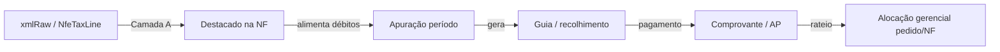

# T01 — Modelo alvo de dados fiscais

**Atualizado:** 2026-07-16  
**Status:** proposta de arquitetura (sem implementação neste prompt)  
**Pré-requisito:** [tax-data-current-state.md](./tax-data-current-state.md)  
**Camadas:** [tax-source-of-truth.md](./tax-source-of-truth.md)

## 1. Princípios

1. **Quatro camadas distintas** — destacado (NF), apurado, recolhido, alocação gerencial — nunca sinônimos.
2. **Não usar** uma coluna genérica única `taxes` como verdade fiscal.
3. **Reutilizar** o que já existe: `NomusNfe` (+ `xmlRaw`), `SalesOrderNfeLink`, `NomusAccountsPayable` (como *hospedeiro* de pagamento), `AccountsPayableCostCenterAllocation` (padrão de rateio).
4. **Não reutilizar** `TaxRule`/`TaxComponent` como apuração SEFAZ — permanecem no domínio de precificação.
5. **Reforma tributária:** modelar códigos de tributo extensíveis (`taxCode`) em vez de só colunas fixas ICMS/IPI.
6. **Compatibilidade histórica:** backfill preferencialmente a partir de `xmlRaw`; manter derivados atuais (`highlightedTaxesValue`) como *legacy display* até as linhas existirem.

## 2. Modelos existentes reutilizáveis

| Existente | Reuso proposto |
|-----------|----------------|
| `NomusNfe` | Âncora documental; opcionalmente enriquecer com resumo (`NfeFiscalSummary` 1:1) |
| `xmlRaw` | Fonte de backfill / reprocessamento |
| `rawPayload` | Fallback quando XML incompleto; nunca única fonte oficial |
| `SalesOrderNfeLink` | Consolidação pedido ↔ NF (já existe) |
| `NomusAccountsPayable` | FK opcional de `FiscalPaymentGuide.accountsPayableId` quando o título Nomus for a guia |
| `AccountsPayableCostCenterAllocation` | Padrão análogo para alocação gerencial pedido/NF |
| `OrderToCashAuditFact` | Continua operacional; pode *referenciar* IDs fiscais depois, sem misturar valores |

**Não criar** apuração em cima de `TaxRule`.

## 3. Arquitetura proposta (entidades lógicas)

```
NomusNfe (existente)
  └── NfeFiscalSummary          1:1  (totais tipados / versão parser)
        └── NfeTaxLine[]        N    (tributo × escopo header|item)
              └── (opcional) nfeItemKey / nItem

FiscalApurationPeriod           período + UF/empresa + regime
  └── FiscalApurationLine[]     débitos/créditos/retenções por taxCode

FiscalPaymentGuide              DARF/GNRE/DAS/DAE/GPS/outros
  └── FiscalPaymentProof[]      anexos / protocolo banco
  └── (opcional) → NomusAccountsPayable

FiscalAllocation                parcela gerencial
  ├── → FiscalPaymentGuide e/ou FiscalApurationLine
  ├── → NomusNfe e/ou SalesOrder
  └── amount + method + audit
```

### 3.1 `NfeFiscalSummary` (persistência fiscal da NF — totais)

Campos sugeridos (não colunas soltas “taxes”):

| Campo | Semântica |
|-------|-----------|
| `nomusNfeId` | FK única |
| `parserVersion` | ex. `nfe-xml-v2` |
| `source` | `XML` \| `NOMUS_JSON` \| `MIXED` |
| `vProd`, `vDesc`, `vFrete`, `vSeg`, `vOutro`, `vII`, `vIPI`, `vIPIDevol`, `vBC`, `vICMS`, `vICMSDeson`, `vBCST`, `vST`, `vFCP`, `vFCPST`, `vFCPSTRet`, `vPIS`, `vCOFINS`, `vISS`, `vTotTrib`, `vNF` | Totais header oficiais quando conhecidos |
| `extensibleTotals Json?` | IBS/CBS/IS e futuros sem migration a cada tag |
| `highlightedResidual` | `max(0, vNF − vProd + vDesc − …componentes conhecidos)` para auditoria de gap |
| `parsedAt`, `xmlHash` | Rastreio de reprocessamento |

Manter `NomusNfe.xmlVProd/VDesc/VNF/valorLiquido` na sync atual até cutover; summary torna-se SoT de breakdown.

### 3.2 `NfeTaxLine` (linhas de tributo)

| Campo | Semântica |
|-------|-----------|
| `nomusNfeId` | FK |
| `scope` | `HEADER` \| `ITEM` |
| `itemIndex` / `nItem` / `productSku` | Quando `ITEM` |
| `taxCode` | Enum/string estável: `ICMS`, `ICMS_ST`, `IPI`, `PIS`, `COFINS`, `FCP`, `II`, `ISS`, `IBS`, `CBS`, `IS`, `OTHER` |
| `cst` / `csosn` / `cfop` | Opcionais |
| `baseAmount`, `rate`, `taxAmount` | Valores |
| `isHighlightedOnInvoice` | Camada A (destacado) |
| `sourcePath` | ex. `ICMSTot/vICMS` ou `det[1]/imposto/...` |
| `confidence` | `PARSED` \| `DERIVED` \| `MISSING` |

### 3.3 `FiscalApurationPeriod` / `FiscalApurationLine` (camada B)

- Período (competência), estabelecimento, tipo (federal/estadual/municipal/reforma).
- Linhas: `taxCode`, natureza (`DEBIT`, `CREDIT`, `RETENTION`, `COMPENSATION`), valor, origem (manual, import, cálculo).
- **Não** exige 1:1 com NF; NFs alimentam débitos, mas o período consolida.

### 3.4 `FiscalPaymentGuide` / `FiscalPaymentProof` (camada C)

| Campo guia | Exemplos |
|------------|----------|
| `guideType` | `DARF`, `GNRE`, `DAS`, `DAE`, `GPS`, `OTHER` |
| `competence`, `dueDate`, `paidAt` | |
| `principalAmount`, `fine`, `interest`, `totalPaid` | |
| `barcode` / `documentNumber` / `revenueCode` | |
| `accountsPayableId` | Link opcional Nomus AP |
| `status` | `DRAFT`, `ISSUED`, `PAID`, `CANCELLED` |

Provas: storage key + filename + uploadedBy + hash (mesmo padrão de anexos já usados no sistema).

### 3.5 `FiscalAllocation` (camada D — gerencial)

| Campo | Semântica |
|-------|-----------|
| `sourceGuideId` ou `sourceApurationLineId` | De onde veio o valor |
| `salesOrderId` / `nomusNfeId` | Destino gerencial |
| `allocatedAmount` | Parcela |
| `allocationMethod` | `PRO_RATA_VNF`, `PRO_RATA_VPROD`, `MANUAL`, `BY_ITEM` |
| `notes`, `createdBy`, `audit` | |

Serve a “quanto deste DARF mensal atribuímos ao pedido X” — **nunca** substitui o valor destacado na NF.

## 4. Consolidação por pedido

Fluxo alvo:

1. `SalesOrder` ← links → `NomusNfe` (já via `SalesOrderNfeLink`).
2. Soma de `NfeTaxLine` (HEADER) das NFs válidas = impostos **destacados** do pedido.
3. Soma de `FiscalAllocation` no pedido = impostos **alocados** (gerencial).
4. Pedido **não** agrega automaticamente “pago” sem alocação explícita.

Exibição no detalhe do pedido: três blocos separados (ver [tax-order-detail-plan.md](./tax-order-detail-plan.md)).

## 5. Apuração × guias × NF



## 6. Compatibilidade histórica e cutover

| Fase | Ação |
|------|------|
| F0 (agora) | Docs + manter derivado destacado |
| F1 | Parser v2 + `NfeFiscalSummary`/`NfeTaxLine`; job reparse `xmlRaw` |
| F2 | UI Auditoria 360º / relatório passam a preferir linhas; derivado só fallback |
| F3 | Guias + vínculo AP + provas |
| F4 | Apuração período + alocação gerencial |
| F5 | Extensões reforma (IBS/CBS/IS) via `taxCode` + `extensibleTotals` |

Backfill F1: para cada `NomusNfe` com `xmlRaw`, parse → upsert summary/lines; marcar `parserVersion`; NFs sem XML ficam `source=NOMUS_JSON` ou `MISSING`.

## 7. Anti-padrões rejeitados

- Coluna única `taxes Decimal` na NF ou no pedido como SoT.
- Sobrescrever `SalesOrder.totalTaxes` com soma da NF.
- Tratar AP description contains “DARF” como tipagem oficial sem `guideType`.
- Misturar TaxRule % com ICMS da NF na mesma coluna de relatório.
- Assumir que residual `vNF − valorLiquido` = IPI sempre (pode incluir frete/outros).

## 8. Decisões pendentes (produto)

Ver lista canônica em [tax-source-of-truth.md](./tax-source-of-truth.md) §6.
