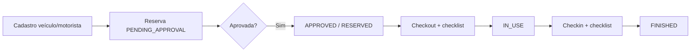

# Gestão de Frota — documentação técnica

Módulo ERP IndusCost para cadastro operacional de veículos, motoristas, reservas, manutenções, documentos, contratos e custos da frota.

**UI:** menu Frota → `/fleet` (desktop) e uso em campo → `/fleet/field` (fluxo web responsivo, não é app nativo).

**Código principal:** `src/lib/fleet*.ts`, `src/components/fleet/`, `src/components/FleetModule.tsx`, registro em `server.ts` via `registerFleetRoutes`.

---

## Visão geral

O módulo cobre o ciclo operacional:

1. Cadastro de veículos e motoristas (com validações de placa, CPF, CNH, documentos e contratos).
2. Reserva com aprovação, disponibilidade por período e conflito de agenda.
3. Retirada (checkout) e devolução (checkin) com checklist e quilometragem.
4. Manutenções com fluxo de status, bloqueio opcional do veículo e geração de custo.
5. Financeiro operacional: custos, abastecimentos, multas e sinistros/ocorrências.
6. Dashboard, motor de alertas e relatórios exportáveis (JSON paginado ou CSV).
7. Importação CSV segura (preview + apply) para carga inicial de veículos e motoristas.
8. Auditoria em `FleetAuditLog` para ações críticas.

Não há integração com GPS, Detran ou ERP financeiro corporativo completo nesta fase — ver [backlog-futuro.md](./backlog-futuro.md).

---

## Entidades principais (Prisma)

| Modelo | Descrição |
|--------|-----------|
| `FleetVehicle` | Veículo (placa, origem, status, km, unidade, centro de custo) |
| `FleetVehicleContract` | Contrato/locação vinculado ao veículo |
| `FleetVehicleDocument` | Documentos com vencimento (seguro, licenciamento, etc.) |
| `FleetDriver` | Motorista (CPF, CNH, status) |
| `FleetReservation` | Reserva de uso (período, motorista, aprovação) |
| `FleetUsage` | Registro de retirada/devolução efetiva |
| `FleetChecklist` / `FleetChecklistItem` | Checklists de retirada, devolução, inspeção, manutenção |
| `FleetMaintenance` | Ordem de manutenção |
| `FleetCost` | Custo operacional vinculado a veículo (e opcionalmente contrato, manutenção, reserva) |
| `FleetFueling` | Abastecimento (pode gerar custo automaticamente) |
| `FleetFine` | Multa |
| `FleetIncident` | Sinistro/ocorrência (pode bloquear veículo e abrir manutenção) |
| `FleetAttachment` | Metadado de anexo (URL externa; sem armazenamento de arquivo no servidor) |
| `FleetSettings` | Parâmetros chave/valor do módulo |
| `FleetAuditLog` | Trilha de auditoria por entidade |

### Status relevantes

- **Veículo:** `AVAILABLE`, `RESERVED`, `IN_USE`, `MAINTENANCE`, `BLOCKED`, `CLAIMED`, `INACTIVE`, `RETURNED`, `SOLD`
- **Motorista:** `AUTHORIZED`, `PENDING`, `BLOCKED`, `INACTIVE`
- **Reserva:** `PENDING_APPROVAL` → `APPROVED` → `IN_USE` → `FINISHED` / `FINISHED_WITH_PENDING` / `CANCELED` / `REJECTED`
- **Manutenção:** `OPEN`, `SCHEDULED`, `PENDING_APPROVAL`, `APPROVED`, `IN_PROGRESS`, `COMPLETED`, `CANCELED`

---

## Permissões

Todas as rotas exigem sessão autenticada. Matriz completa: [../FLEET_PERMISSIONS.md](../FLEET_PERMISSIONS.md).

| Permissão | Uso resumido |
|-----------|----------------|
| `fleet.view` | Leitura geral do módulo |
| `fleet.manage` | Administração ampla + import CSV + ciclo de vida crítico de veículos |
| `fleet.vehicles.edit` | CRUD veículos, contratos, documentos |
| `fleet.reservations.create` | Reservas, checkout/checkin, checklists |
| `fleet.reservations.approve` | Aprovar/rejeitar reservas |
| `fleet.maintenance.manage` | Manutenções |
| `fleet.financial.view` | Ver valores financeiros e lançar custos/multas/abastecimentos |
| `fleet.settings.manage` | Alterar parâmetros (`PUT /api/fleet/settings`) |

Valores monetários em APIs de leitura são **mascarados** se o usuário não tiver `fleet.financial.view` nem `fleet.manage`.

Implementação dos guards: `src/lib/fleetRouteGuards.ts`, `src/lib/fleetAuth.ts`.

---

## Endpoints principais

Prefixo: `/api/fleet`. Listagens suportam paginação: `page`, `limit` (padrão 50, máx. 200), filtros `search`, `status`, `startDate`/`endDate`, `vehicleId`, `driverId`, `unit`, `costCenter`, `origin`.

Resposta paginada: `items`, chave legada (`vehicles`, `drivers`, …), `page`, `limit`, `total`, `totalPages`.

### Operação e cadastro

| Método | Rota | Permissão típica |
|--------|------|------------------|
| GET | `/dashboard` | `fleet.view` |
| GET | `/alerts` | `fleet.view` |
| GET/POST | `/vehicles`, `/vehicles/:id` | view / `vehicles.edit` |
| PATCH | `/vehicles/:id/status`, `/block`, `/unblock`, `/deactivate`, `/sell`, `/return-to-lessor` | `fleet.manage` |
| GET/POST | `/vehicles/:id/contracts`, `/contracts/:id` | view / `vehicles.edit` |
| GET/POST | `/vehicles/:id/documents`, `/documents` (lista global), `/documents/:id` | view / `vehicles.edit` |
| GET/POST/PUT | `/drivers`, `/drivers/:id`, `/drivers/:id/block` | view / `fleet.manage` |

### Reservas e uso

| Método | Rota | Permissão típica |
|--------|------|------------------|
| GET | `/availability?start=&end=` | `fleet.view` |
| GET/POST/PUT | `/reservations`, `/reservations/:id` | view / `reservations.create` |
| PATCH | `/reservations/:id/approve`, `/reject`, `/cancel`, `/replace-vehicle` | approve / create / `manage` |
| POST | `/reservations/:id/checkout`, `/checkin` | `reservations.create` |
| GET | `/reservations/:id/usage`, `/usage-context` | `fleet.view` |
| GET/POST/PUT | `/checklists`, `/checklist-items/:id` | view / `reservations.create` |

### Manutenção e financeiro

| Método | Rota | Permissão típica |
|--------|------|------------------|
| GET/POST/PUT | `/maintenances`, `/maintenances/:id/...` | view / `maintenance.manage` |
| GET | `/financial/dashboard` | `fleet.view` (valores mascarados) |
| GET/POST | `/costs`, `/fuelings`, `/fines`, `/incidents` | view / `financial.view` |
| GET/POST | `/attachments` | view / conforme contexto |

### Relatórios, configuração e importação

| Método | Rota | Notas |
|--------|------|-------|
| GET | `/reports/fleet`, `/usage`, `/costs`, `/maintenance`, `/documents` | `?format=csv` exporta; JSON com paginação |
| GET/PUT | `/settings` | PUT exige `fleet.settings.manage` |
| POST | `/import/vehicles/preview`, `/apply`, `/drivers/preview`, `/apply` | `fleet.manage`; apply exige `confirm: "APLICAR_IMPORTACAO_FROTA"` |

---

## Fluxos operacionais (resumo)



1. **Reserva:** criada em `PENDING_APPROVAL`; aprovador altera para `APPROVED` e veículo pode ir para `RESERVED`.
2. **Retirada:** `POST .../checkout` valida checklist (itens críticos `NOT_OK` bloqueiam), km e motorista/CNH.
3. **Devolução:** `POST .../checkin`; avarias podem deixar reserva `FINISHED_WITH_PENDING`.
4. **Manutenção:** abertura pode bloquear veículo; fluxo `approve` → `start` → `complete`; `generate-cost` cria custo.
5. **Alertas:** recalculados em lote (`buildFleetOperationalAlerts`); dashboard consome cards + alertas filtrados por permissão financeira.

Detalhamento para usuários: [manual-operacional.md](./manual-operacional.md).

---

## Comandos de teste e utilitários

Requer `DATABASE_URL` configurada localmente (não documentar valor da variável).

```bash
# Testes unitários do módulo (validações, alertas, import CSV, permissões, paginação)
npm run test:fleet

# Typecheck e build
npm run lint
npm run build

# Prisma (após alteração de schema)
npx prisma generate
npx prisma migrate deploy

# Scripts operacionais
npm run fleet:seed-demo          # dados de demonstração
npm run fleet:db-validate        # validação estrutural no banco
npm run test:fleet:e2e           # smoke domínio/Prisma (sem HTTP)
npm run test:fleet:smoke         # smoke HTTP do fluxo principal (servidor + DATABASE_URL)
npm run fleet:import -- vehicles preview --file=./arquivo.csv
npm run fleet:import -- vehicles apply --file=./arquivo.csv --confirm="APLICAR_IMPORTACAO_FROTA"
```

**Smoke HTTP (`test:fleet:smoke`):** exige `--confirm="RODAR SMOKE FROTA"`, servidor em execução (`npm run dev`) e dados prefixados `TESTE_FROTA_*` (cleanup automático). Autenticação: `FLEET_SMOKE_EMAIL` + `FLEET_SMOKE_PASSWORD`, ou bootstrap de sessão para usuário com `fleet.manage` / `SUPER_ADMIN`. Opcional: `FLEET_SMOKE_BASE_URL` (padrão `http://127.0.0.1:3000`), `FLEET_SMOKE_SKIP_CLEANUP=1`.

Testes ficam em `src/lib/fleetValidation.test.ts` (runner `tsx --test`).

---

## Deploy e migrations

1. Aplicar migrations Prisma do repositório (inclui módulo frota e índices de listagem):
   - `prisma/migrations/20260603120000_add_fleet_management_module/`
   - `prisma/migrations/20260528180000_fleet_list_query_indexes/`
2. `npx prisma migrate deploy` no ambiente alvo.
3. `npx prisma generate` no build/deploy.
4. Garantir perfis RBAC com permissões `fleet.*` conforme [../FLEET_PERMISSIONS.md](../FLEET_PERMISSIONS.md).
5. Popular `FleetSettings` iniciais (seed demo ou manualmente) antes de operação.

Não commitar credenciais nem arquivos `.env` no repositório.

---

## Parâmetros configuráveis (`FleetSettings`)

Chaves editáveis via UI (permissão `fleet.settings.manage`):

| Chave | Efeito |
|-------|--------|
| `bloquearReservaDocumentoVencido` | Impede reserva com documento vencido |
| `bloquearRetiradaCnhVencida` | Impede retirada com CNH vencida |
| `checklistRetiradaObrigatorio` | Exige checklist na retirada |
| `checklistDevolucaoObrigatorio` | Exige checklist na devolução |
| `diasAlertaDocumento` | Janela de alerta de documentos |
| `diasAlertaCnh` | Janela de alerta de CNH |
| `percentualAlertaFranquiaKm` | Alerta de franquia de km em contratos |

Outras chaves (ex.: limiar de aprovação de manutenção) podem existir no banco; conferir `FLEET_EDITABLE_SETTINGS_KEYS` em `src/lib/fleetManagementOps.ts`.

---

## Limitações conhecidas

| Item | Situação |
|------|----------|
| Anexos | Apenas metadado + **URL**; upload físico para storage não implementado |
| GPS / telemetria | Não implementado |
| Detran / integrações externas | Não implementado |
| App mobile nativo | Uso em campo é **web** em `/fleet/field` |
| Contratos / documentos (UI) | Abas no menu apontam para ficha do veículo; lista global de documentos via API `GET /documents` |
| Relatórios muito grandes | Export CSV carrega conjunto completo em memória; listagens JSON paginadas |
| Integração contábil | Custos são operacionais no módulo; não há lançamento automático em contabilidade geral |
| Alçadas avançadas por valor | Manutenção tem limiar configurável; workflow multi-nível limitado |
| Oficina / estoque de peças | Não implementado |

Pendências planejadas: [backlog-futuro.md](./backlog-futuro.md).

---

## Referências no repositório

- Permissões: `docs/FLEET_PERMISSIONS.md`
- Manual do usuário: `docs/fleet/manual-operacional.md`
- Import CSV: `src/lib/fleetCsvImport.ts`, `scripts/fleetImportCsv.ts`
