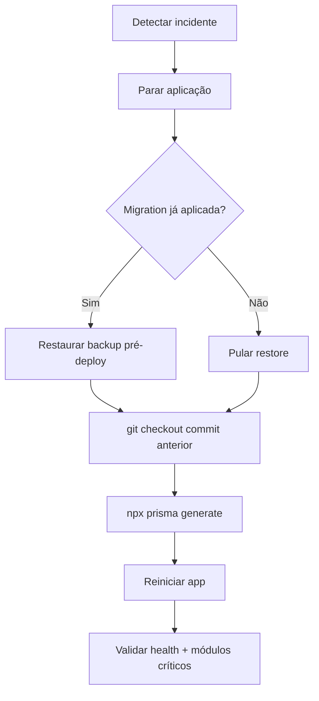

# Gestão de Frota — backup, restore e rollback lógico

Plano de **segurança operacional** para deploy do módulo Gestão de Frota no IndusCost/ERP.

**Não executar restore em produção sem autorização explícita.**  
**Não apagar dados.**  
**Não reverter migration já aplicada com `migrate resolve` / down SQL manual** — o projeto não mantém migrations `down`.

Roteiro complementar de deploy: [deploy-servidor.md](./deploy-servidor.md).

---

## Contexto

| Item | Valor |
|------|--------|
| Banco | PostgreSQL `teste_bi` (servidor típico `/opt/induscost`) |
| App | Node em `/opt/induscost`, porta 3000 |
| Migrations frota | `20260603120000_add_fleet_management_module`, `20260604120000_fix_fleet_schema_alignment` |
| Conexão app | `DATABASE_URL` no `.env` (nunca commitar) |

---

## 1. Pré-deploy (obrigatório antes do primeiro `migrate deploy` da frota)

### 1.1 Checklist rápido

- [ ] Janela de manutenção comunicada (se produção).
- [ ] `git fetch` / commit alvo anotado (`git rev-parse origin/main`).
- [ ] **Backup do banco** gravado e validado (seção 2).
- [ ] Espaço em disco: reservar ~10–20 % do tamanho atual de `teste_bi` para o dump.
- [ ] Confirmar que **não** se usará `prisma db push` nem `migrate dev` no servidor.

### 1.2 Ordem recomendada no deploy

1. Backup (`pg_dump`).
2. `git pull` do commit aprovado.
3. `npx prisma migrate status` → `npx prisma migrate deploy`.
4. `npx prisma validate` + `npx prisma generate`.
5. `npm run test:fleet` + `lint` + `build` (pode ser feito antes no CI; repetir no servidor se política exigir).
6. `npm run fleet:db-validate`.
7. Reiniciar aplicação.
8. Smoke UI + permissões `fleet.*` (ver [deploy-servidor.md](./deploy-servidor.md)).

---

## 2. Backup antes do deploy

### 2.1 Onde salvar

| Ambiente | Pasta sugerida | Observação |
|----------|----------------|------------|
| Servidor Linux | `/var/backups/induscost/` | Preferível; persistente fora de `/tmp` |
| Homologação rápida | `/tmp/induscost-backups/` | OK se copiar dump para storage seguro depois |
| Workstation | Diretório local do operador | Apenas se política permitir cópia do dump |

Crie o diretório com permissão restrita (`chmod 700`).

```bash
sudo mkdir -p /var/backups/induscost
sudo chown "$(whoami):$(whoami)" /var/backups/induscost
chmod 700 /var/backups/induscost
```

### 2.2 Nome do arquivo (timestamp + motivo)

Padrão:

```text
teste_bi_YYYYMMDD_HHMMSS_<motivo>.dump
```

Exemplo: `teste_bi_20260605_143022_pre_deploy_frota.dump`

### 2.3 Comando — usuário `postgres` no host (recomendado no servidor)

Não expõe senha no shell se o peer/trust local estiver configurado.

```bash
TS=$(date +%Y%m%d_%H%M%S)
REASON="pre_deploy_frota"
OUT="/var/backups/induscost/teste_bi_${TS}_${REASON}.dump"

pg_dump -Fc -d teste_bi -f "$OUT"
ls -lh "$OUT"
```

### 2.4 Comando — via `DATABASE_URL` (`.env` do projeto)

Use quando não tiver socket `postgres` direto. **Não imprima** `DATABASE_URL` em logs.

```bash
cd /opt/induscost
set -a
source .env   # apenas no servidor; arquivo não vai para o git
set +a

TS=$(date +%Y%m%d_%H%M%S)
OUT="/var/backups/induscost/teste_bi_${TS}_pre_deploy_frota.dump"

pg_dump "$DATABASE_URL" -Fc --no-owner --no-acl -f "$OUT"
unset DATABASE_URL
ls -lh "$OUT"
```

### 2.5 Script automatizado (opcional)

```bash
cd /opt/induscost
chmod +x scripts/backupDatabaseBeforeDeploy.sh
./scripts/backupDatabaseBeforeDeploy.sh --reason=pre_deploy_frota
# ou: BACKUP_DIR=/var/backups/induscost ./scripts/backupDatabaseBeforeDeploy.sh --reason=...
```

O script exige `--reason=`, usa `DATABASE_URL` do `.env` ou variável já exportada, **não contém senha** no arquivo.

### 2.6 Validar o arquivo de backup (read-only)

```bash
# Tamanho > 0
test -s "$OUT" && echo "OK: arquivo não vazio"

# Integridade do formato custom (-Fc)
pg_restore --list "$OUT" | head -20

# Contagem de objetos (opcional)
pg_restore --list "$OUT" | wc -l
```

Esperado: listagem de tabelas/schemas sem erro fatal. Se `pg_restore --list` falhar, **não prossiga** o deploy.

### 2.7 Registrar evidência

Anote em ticket/runbook:

- Caminho completo do dump.
- Tamanho (`ls -lh`).
- Commit Git previsto para o deploy.
- Operador e data/hora.

---

## 3. Restore (somente homologação ou produção autorizada)

> **Proibido** rodar restore em produção sem aprovação do responsável pelo banco e da aplicação.

### 3.1 Pré-requisitos do restore

1. **Parar a aplicação** (liberar conexões):

   ```bash
   fuser -k 3000/tcp || true
   # ou: systemctl stop induscost / pm2 stop ...
   ```

2. Confirmar que o dump é o correto (`ls -lh`, `pg_restore --list`).

3. Preferir restore em banco **vazio** ou homologação (`teste_bi_hml`). Restaurar por cima de `teste_bi` em produção **substitui** dados — risco alto.

### 3.2 Restore em homologação (exemplo)

```bash
# Criar banco de homologação se não existir
runuser -u postgres -- psql -c "CREATE DATABASE teste_bi_hml OWNER induscost;"

DUMP="/var/backups/induscost/teste_bi_20260605_143022_pre_deploy_frota.dump"

runuser -u postgres -- pg_restore \
  --clean --if-exists --no-owner --no-acl \
  --dbname=teste_bi_hml \
  "$DUMP"
```

Ajuste `--dbname` conforme o ambiente. Valide:

```bash
runuser -u postgres -- psql -d teste_bi_hml -c '\dt Fleet*'
runuser -u postgres -- psql -d teste_bi_hml -c 'SELECT COUNT(*) FROM "FleetSettings";'
```

### 3.3 Restore em produção (apenas com autorização)

Mesmo comando, trocando `teste_bi_hml` por `teste_bi`, **após** parada total da app e janela aprovada. Impacto:

- Dados criados após o backup são **perdidos**.
- Migrations aplicadas após o backup podem divergir do schema esperado pela app antiga — por isso o rollback lógico combina **restore + commit anterior** (seção 4).

---

## 4. Rollback lógico (incidente pós-deploy da frota)

Cenário: migration frota aplicada e/ou versão nova com problema grave.

**Não** usar `prisma migrate reset` em produção.  
**Não** executar `DROP TABLE Fleet*` manualmente sem plano DBA.

### 4.1 Fluxo recomendado



### 4.2 Passos detalhados

1. **Parar aplicação**

   ```bash
   fuser -k 3000/tcp || true
   sleep 2
   ```

2. **Restaurar backup** (se migration frota ou dados corrompidos)

   Use o dump da seção 2. Ver seção 3 — **somente com autorização** em produção.

3. **Voltar código para commit anterior**

   ```bash
   cd /opt/induscost
   PREV=$(git rev-parse HEAD~1)   # ou SHA fixo conhecido estável
   git fetch origin
   git checkout "$PREV"           # ou: git reset --hard <SHA> — cuidado em servidor compartilhado
   git rev-parse HEAD
   ```

   Anote o SHA restaurado no relatório de incidente.

4. **Prisma (sem reverter migration no histórico)**

   ```bash
   npx prisma generate
   ```

   Não rode `migrate dev`. Em produção após restore de backup antigo, o estado de `_prisma_migrations` volta ao do dump — alinhado ao schema daquele momento.

5. **Reiniciar aplicação**

   ```bash
   nohup npm run dev > app.log 2>&1 &
   sleep 5
   tail -n 80 app.log
   ```

6. **Validação mínima pós-rollback**

   - `GET /api/health` ou endpoint equivalente.
   - Login e módulos críticos (CRM, produtos) — não apenas frota.
   - Se frota não existia no backup: menu Gestão de Frota **não** deve aparecer (esperado).

### 4.3 Rollback só de código (sem restore)

Possível se a migration **ainda não foi aplicada** ou se o problema for apenas bug de app e o schema frota for compatível com a versão antiga.

- `git checkout` commit anterior.
- `npx prisma generate` + restart.

**Limitação:** se `migrate deploy` já criou tabelas `Fleet*` e a versão antiga não as conhece, a app antiga pode ignorá-las; se a versão antiga quebrar ao ver enums/tabelas novos, é necessário **restore** do backup.

---

## 5. Reversibilidade conceitual das migrations frota

O projeto **não** versiona SQL `DOWN`. Avaliação **conceitual** apenas.

### 5.1 `20260603120000_add_fleet_management_module`

| Objeto | Reversível sem risco? | Notas |
|--------|------------------------|-------|
| 12 enums `Fleet*` | Não trivial | `DROP TYPE` exige ausência de colunas dependentes |
| 16 tabelas `Fleet*` | Não trivial | `DROP TABLE` apaga dados operacionais |
| FKs (CASCADE em veículo) | N/A | Removidas com as tabelas |
| Seed `FleetSettings` (7 chaves) | Parcial | `DELETE FROM "FleetSettings"` — perde customizações |
| Índices únicos parciais (placa, CPF) | N/A | Vão com as tabelas |

**Conclusão:** rollback de schema = **restore de backup** ou aceitar schema frota e reverter só o código.

### 5.2 `20260604120000_fix_fleet_schema_alignment`

| Objeto | Reversível? | Notas |
|--------|-------------|-------|
| `CREATE INDEX IF NOT EXISTS` | Sim (técnico) | `DROP INDEX` — baixo impacto |
| `INSERT ... ON CONFLICT DO NOTHING` | Parcial | Pode deixar chaves extras; não remove chaves |

Migration **aditiva e idempotente** — risco menor que a primeira.

### 5.3 Registro em `_prisma_migrations`

Após `migrate deploy`, as entradas permanecem. Restaurar backup **anterior** ao deploy remove também esses registros (consistente com o dump).

**Não** marcar migration como rolled back manualmente sem orientação DBA.

---

## 6. Riscos

| Risco | Mitigação |
|-------|-----------|
| Deploy sem backup | Backup obrigatório na seção 1; script com `--reason` |
| Restore em prod sem parar app | Sempre parar app antes do restore |
| Perda de dados pós-backup | Janela + comunicação; backup imediatamente antes do migrate |
| `git reset --hard` errado | Usar SHA documentado; preferir tag/release |
| Credencial em log | Nunca `echo $DATABASE_URL`; script não imprime senha |
| Dump em `/tmp` perdido no reboot | Usar `/var/backups/induscost` |
| Versão app × schema divergente após restore parcial | Restore completo + commit alinhado ao dump |
| Tentar DROP manual das tabelas Fleet | Evitar; usar restore ou suporte DBA |

---

## 7. Checklist pós-deploy

- [ ] Backup pré-deploy arquivado e validado (`pg_restore --list`).
- [ ] `npx prisma migrate status` — migrations frota aplicadas.
- [ ] `npm run fleet:db-validate` — OK.
- [ ] `npm run test:fleet` — OK (no CI ou servidor).
- [ ] App reiniciada sem erro fatal em `app.log`.
- [ ] Menu Gestão de Frota visível para usuário com `fleet.view`.
- [ ] Permissões `fleet.*` concedidas aos perfis operacionais.
- [ ] `npm run fleet:integrity:diagnostic` (opcional) — sem críticos inesperados.
- [ ] Commit deployado: `git rev-parse HEAD` registrado.
- [ ] Caminho do dump anotado no runbook de incidente.

---

## 8. Referências no repositório

| Artefato | Uso |
|----------|-----|
| [deploy-servidor.md](./deploy-servidor.md) | Deploy e validação |
| `scripts/backupDatabaseBeforeDeploy.sh` | Backup com motivo obrigatório |
| `scripts/fleetServerDeployValidate.sh` | Validação pós-pull |
| `npm run fleet:db-validate` | Checagem read-only do schema frota |
| `docs/induscost-engineering-release-checklist.md` | Padrão `pg_dump -Fc` do projeto |

---

## 9. O que este plano **não** faz

- Não executa restore automaticamente.
- Não apaga tabelas nem dados.
- Não gera migration `down`.
- Não altera `_prisma_migrations` manualmente.
- Não substitui política de backup corporativo (replicação, PITR, etc.) — complementa o deploy da frota.
