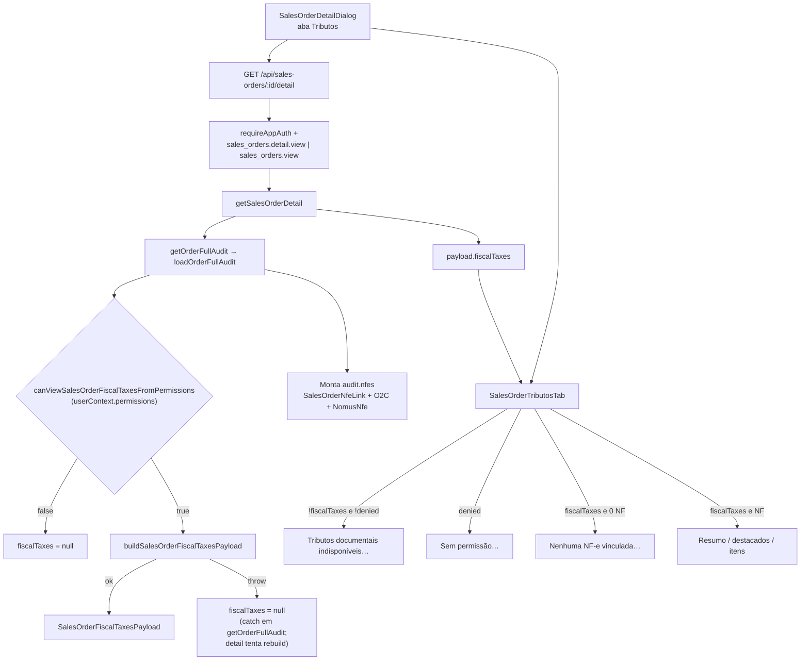

# TRIB-01 — Diagnóstico: aba Tributos vazia (“Tributos documentais indisponíveis”)

**Escopo:** análise somente de código (sem acesso a banco de produção).  
**Sintoma reportado:** Pedido de Venda (ex.: PD 02781) → Detalhe → aba **Tributos** exibe:

> Tributos documentais indisponíveis para este pedido.

A aba em si aparece; este diagnóstico **não** trata layout. Permissionamento entra apenas porque o empty state observado é o ramo `fiscalTaxes == null`, que o backend também usa quando a bag de permissões da sessão não libera tributos.

**Não inventar dados do PD 02781** — hipóteses abaixo são estruturais; validação em dados reais fica para a etapa de servidor.

---

## 1. Fluxo atual



### 1.1 Componente da aba

| Peça | Arquivo |
|------|---------|
| Dialog + abas | `src/components/sales/SalesOrderDetailDialog.tsx` |
| Aba Tributos | `src/components/sales/SalesOrderTributosTab.tsx` |
| Permissão FE | `canViewSalesOrderFiscalTaxes` em `src/lib/sales-orders/salesOrderFiscalTaxesPermissions.ts` via `useAuth().hasPermission` → **`authUser.effectivePermissions`** |

O botão da aba **Tributos** é sempre renderizado quando o detalhe carrega. O conteúdo decide o estado:

```197:208:src/components/sales/SalesOrderTributosTab.tsx
  if (!fiscalTaxes) {
    return (
      ...
        data-testid="sales-order-tributos-empty"
      >
        Tributos documentais indisponíveis para este pedido.
```

`SalesOrderDetailDialog` passa:

- `fiscalTaxes={payload.fiscalTaxes}`
- `denied={!canTributos}` (`canTributos = canViewSalesOrderFiscalTaxes(auth)`)

Ordem de prioridade na aba: `loading` → `denied` → `error` → **`!fiscalTaxes` (empty)** → conteúdo (ou `sales-order-tributos-no-nfe` se payload existe sem NF).

### 1.2 Chamada HTTP

- Hook implícito: `useEffect` + `fetchJsonOk` em `SalesOrderDetailDialog`
- URL: `getSalesOrderDetailUrl(id)` → **`GET /api/sales-orders/:salesOrderId/detail`**
- Cliente: `src/lib/sales-orders/salesOrderDetailClient.ts`
- Rota: `src/lib/salesOrderDetailRoutes.ts`

### 1.3 Service / “repository”

| Camada | Função | Arquivo |
|--------|--------|---------|
| HTTP | `registerSalesOrderDetailRoutes` | `salesOrderDetailRoutes.ts` |
| Detalhe | `getSalesOrderDetail` | `sales-orders/salesOrderDetailService.server.ts` |
| Audit canônico | `getOrderFullAudit` / `loadOrderFullAudit` | `finance/orderFullAuditService.ts` |
| DTO Tributos | `buildSalesOrderFiscalTaxesPayload` | `sales-orders/salesOrderFiscalTaxes.server.ts` |
| Leitura fiscal | `prisma.nomusNfe.findMany` + `fiscalSummary` / `taxLines` | Prisma |
| Settlements B/C/D | `fiscalAllocation` / `fiscalPaymentGuide` | mesmo builder |

Não há repository dedicado separado: a fonte de NF do pedido é o audit; a fonte de impostos documentais é `NomusNfeFiscalSummary` + `NomusNfeTaxLine`.

---

## 2. Condição exata do estado vazio

Mensagem **“Tributos documentais indisponíveis para este pedido.”** ocorre **somente** quando:

1. `loading` é falso;
2. `denied` é falso (`canViewSalesOrderFiscalTaxes(auth) === true` no FE);
3. `error` é ausente;
4. **`fiscalTaxes` é `null` ou `undefined`** no payload do detalhe.

**Não** confundir com:

| `data-testid` | Mensagem | Significado |
|---------------|----------|-------------|
| `sales-order-tributos-denied` | Sem permissão… | FE sem `invoice.view` / `detail.view` |
| `sales-order-tributos-no-nfe` | Nenhuma NF-e vinculada… | **`fiscalTaxes` presente**, `nfes + cancelledNfes === 0` |
| `sales-order-tributos-empty` | Tributos documentais indisponíveis… | **`fiscalTaxes` ausente** |

Portanto, para o sintoma reportado, o JSON de `GET .../detail` chegou com **`fiscalTaxes: null`** enquanto o FE acredita ter permissão de ver tributos.

---

## 3. Quando o backend seta `fiscalTaxes: null`

### 3.1 Gate de permissão (caminho principal no código)

`getSalesOrderDetail` / `getOrderFullAudit`:

```ts
const allowFiscal = canViewSalesOrderFiscalTaxesFromPermissions(
  input.userContext?.permissions ?? null
);
// allowFiscal === false → fiscalTaxes = null
```

Regras de `canViewSalesOrderFiscalTaxesFromPermissions`:

| Bag `permissions` | Resultado |
|-------------------|-----------|
| `null` / `[]` | **libera** (legado / teste) |
| sem nenhuma chave `sales_orders.*` | **libera** |
| tem `sales_orders.*` mas **sem** `sales_orders.detail.view` e **sem** `sales_orders.invoice.view` | **nega** → `null` |
| inclui `detail.view` ou `invoice.view` | libera |

A rota do detalhe aceita **`sales_orders.view` OU `sales_orders.detail.view`**.  
Ou seja: o usuário pode abrir o detalhe só com `sales_orders.view`, e ainda assim o bloco fiscal sai `null`.

### 3.2 Mismatch FE × BE (causa mais provável)

| Lado | Fonte da permissão |
|------|--------------------|
| FE `canViewSalesOrderFiscalTaxes` | `authUser.effectivePermissions` |
| BE gate fiscal | `req.appAuth.permissions` (**bag crua**, não `effectivePermissions`) |

Em `toSafeAppUser` / `getEffectivePermissions`:

- **SUPER_ADMIN:** `effectivePermissions` = **todas** as chaves do catálogo; `permissions` = bag persistida no usuário (pode ser parcial).
- Demais papéis: ambas derivam da bag, mas o detalhe **ainda passa só `permissions`** para o service.

Cenário que reproduz exatamente o empty state:

1. Sessão com `role === SUPER_ADMIN` (ou bag efetiva no FE contendo `detail.view` / `invoice.view`).
2. `appAuth.permissions` (DB) contém alguma chave `sales_orders.*` (ex.: só `sales_orders.view`) **sem** `detail.view` / `invoice.view`.
3. FE: `denied = false` → não mostra “sem permissão”.
4. BE: `allowFiscal = false` → `fiscalTaxes: null`.
5. UI: **empty**.

Teste já existente confirma a regra BE:  
`canViewSalesOrderFiscalTaxesFromPermissions(["sales_orders.view"]) === false`  
(`src/lib/sales-orders/salesOrderFiscalTaxes.test.ts`).

### 3.3 Exceção no builder

`getOrderFullAudit` captura erro em `buildSalesOrderFiscalTaxesPayload` e devolve `fiscalTaxes: null`.  
`getSalesOrderDetail` tenta de novo (`audit.fiscalTaxes ?? build...`). Se o rebuild falhar, a rota tende a **500** no detalhe inteiro — menos compatível com “Geral ok + Tributos empty”, mas possível se o catch engolir só no primeiro passo e o segundo retornar por `allowFiscal` false (improvável). Priorizar o gate 3.1/3.2.

**Nota:** `buildSalesOrderFiscalTaxesPayload` **sempre retorna um objeto** (mesmo com zero NF). Empty UI **não** significa “sem NF”; sem NF o estado seria `sales-order-tributos-no-nfe`.

---

## 4. Fontes de dados utilizadas

### 4.1 Resolução do pedido

`loadOrderFullAudit({ salesOrderId })` carrega `SalesOrder` (+ itens, `nfeLinks`, etc.) e fatos O2C.

### 4.2 NF-es no audit (`audit.nfes`)

| Origem | Como entra em `nfeMap` | Aceito para Tributos? |
|--------|------------------------|------------------------|
| **`SalesOrderNfeLink`** | Seed direto por `nfeExternalId` (`linkOrigin: SALES_ORDER_NFE_LINK`) | **Sim** — caminho oficial completo |
| **`OrderToCashAuditFact`** | Agrega por **`nfeNumber`** já existente; se número novo, cria **surrogate id negativo** | **Parcial** — surrogate **não** entra em `NomusNfe.findMany` (`externalId > 0`); `fact.nfeExternalId` **não** seeda `nfeMap` |
| **Documento de Saída (`NomusStockDocument.idNfe`)** | Preenche `stockDocument.idNfe`; serve join de itens **se** a NF já está no mapa | **Não seeda** `nfeMap` sozinho — Pedido→DS→NF **sem** link/O2C por número **não** lista a NF em Tributos |

Enriquecimento oficial: `prisma.nomusNfe.findMany` para ids **positivos**; status cancelado via `applyNormalizedNfeStatus` / flags `isCanceled` / `isValidForBilling`.

### 4.3 Impostos documentais (camada A)

Para cada `audit.nfes[]`:

1. Lookup `NomusNfe` por `externalId`
2. Include `fiscalSummary` (`NomusNfeFiscalSummary`) + `taxLines` (`NomusNfeTaxLine`)
3. Sem summary: fallback `HEADER_DIFF` / `MISSING` a partir de valores do audit (não inventa ICMS/IPI tipados)

### 4.4 Totais / canceladas

- **Válidas para totais:** `!isCancelled && isValidForBilling !== false`
- Canceladas: vão para `cancelledNfes`; **não** entram na soma de destacados válidos
- UI: não somar HEADER + ITEM (`technical.doNotSumHeaderAndItem`)

### 4.5 O que **não** alimenta a aba Tributos

- Precificação / markup do pedido
- Apuração gerencial sem NF no audit (guides só enriquecem se houver `nomusNfeId` / `salesOrderId` em allocations)
- Output Document comercial futuro (DS-01) — não é fonte desta aba

---

## 5. Campos tributários esperados

Parser / labels (`nfeFiscalXmlParser`, `salesOrderFiscalTaxesClient`):

| `taxType` | Uso típico |
|-----------|------------|
| `ICMS` | ICMS destacado |
| `ICMS_ST` | ICMS-ST (`vST`) |
| `ICMS_DESON` | ICMS desonerado |
| `IPI` / `IPI_DEVOL` | IPI |
| `PIS` / `COFINS` | PIS / COFINS |
| `FCP`, `FCP_ST`, … | Fundos |
| `OTHER` | residual / agregado sem composição |

Models:

- `NomusNfeFiscalSummary`: `vICMS`, `vST`, `vIPI`, `vPIS`, `vCOFINS`, `vNF`, …
- `NomusNfeTaxLine`: `taxType`, `scope` (`HEADER`|`ITEM`), `amount`, `baseAmount`, `rate`, `cst`/`csosn`, `cfop`, `ncm`

---

## 6. Causa mais provável (código)

**Gate fiscal no backend usando `appAuth.permissions` (bag crua) enquanto o FE decide `denied` com `effectivePermissions`, combinado com a regra “qualquer `sales_orders.*` exige `detail.view` ou `invoice.view`”.**

Isso produz `fiscalTaxes: null` com a aba liberada e a mensagem empty — exatamente o sintoma — **sem** precisar de ausência de NF ou de XML.

Hipóteses secundárias (validar com dados do PD 02781 no servidor):

1. Pedido sem `SalesOrderNfeLink` e só vínculo via DS/`idNfe` ou O2C com `nfeExternalId` sem número casável → com gate ok, UI seria **no-nfe** ou NF surrogate sem summary (não empty).
2. NF linkada sem `NomusNfeFiscalSummary` → ainda haveria payload com composição incompleta / OTHER — **não** empty.
3. Falha transitória no builder — menos provável se o detalhe Geral carrega.

---

## 7. Logs / consultas read-only (executar depois no servidor)

Substituir `:orderCode` / ids após localizar o pedido (ex. PD 02781). **Somente SELECT.**

### 7.1 Resposta da API (com a sessão do usuário afetado)

```http
GET /api/sales-orders/{salesOrderId}/detail
```

Inspecionar:

- `fiscalTaxes` é `null`?
- Se objeto: `nfes.length`, `cancelledNfes.length`, `highlightedTaxes`
- Comparar com headers de sessão / bag do usuário

### 7.2 Pedido + links

```sql
SELECT id, "orderCode", status
FROM "SalesOrder"
WHERE "orderCode" ILIKE '%02781%';

SELECT l.*
FROM "SalesOrderNfeLink" l
JOIN "SalesOrder" o ON o.id = l."salesOrderId"
WHERE o."orderCode" ILIKE '%02781%';
```

### 7.3 O2C / documentos

```sql
SELECT f."nfeExternalId", f."nfeNumber", f."stockDocumentExternalId", f."salesOrderItemId"
FROM "OrderToCashAuditFact" f
WHERE f."salesOrderId" = :salesOrderId
LIMIT 200;

SELECT d."externalId", d."idNfe", d."tipoDocumentoEstoque"
FROM "NomusStockDocument" d
WHERE d."externalId" = ANY(:stockExternalIds);
```

### 7.4 Summary fiscal

```sql
SELECT n."externalId", n.numero, n.status, s.id AS summary_id, s.source, s."parsedAt",
       s."vICMS", s."vST", s."vIPI", s."vPIS", s."vCOFINS", s."vNF"
FROM "NomusNfe" n
LEFT JOIN "NomusNfeFiscalSummary" s ON s."nomusNfeId" = n.id
WHERE n."externalId" = ANY(:nfeExternalIds);

SELECT tl."taxType", tl.scope, tl.amount
FROM "NomusNfeTaxLine" tl
JOIN "NomusNfeFiscalSummary" s ON s.id = tl."fiscalSummaryId"
WHERE s."nomusNfeId" IN (:nomusNfeIds);
```

### 7.5 Permissões do usuário da sessão

```sql
SELECT u.id, u.email, u.role, u.permissions, u."permissionsVersion"
FROM "AppUser" u
WHERE u.email = :email;
```

Comparar: `permissions` vs o que o FE mostra em `/api/auth/me` (`effectivePermissions`).

### 7.6 Log de aplicação

Procurar:

- `getOrderFullAudit fiscalTaxes`
- `buildSalesOrderFiscalSettlementsBlock`
- `GET /api/sales-orders/:salesOrderId/detail`

---

## 8. Correção mínima recomendada (não implementar nesta etapa)

1. **Alinhar o gate fiscal ao mesmo critério do FE / sessão efetiva**
   - Em `salesOrderDetailRoutes` (e audit), passar `appAuth.effectivePermissions` (ou `hasPermission(appAuth, …)` / SUPER_ADMIN) para `canViewSalesOrderFiscalTaxesFromPermissions`; **ou**
   - Incluir `sales_orders.view` na allowlist fiscal se a política de produto for “quem vê o pedido vê tributos documentais”.
2. **UX:** se BE negar fiscal, preferir `denied` explícito (ou campo `fiscalTaxesDenied`) em vez de empty genérico.
3. **Vínculos (etapa seguinte, se dados confirmarem gap):** seedar `nfeMap` com `fact.nfeExternalId` e/ou `NomusStockDocument.idNfe` quando positivos — para aceitar Pedido→O2C→NF e Pedido→DS→NF de forma simétrica ao link direto.

Ordem sugerida: (1) permissões/empty; só então (3) se, com `fiscalTaxes` não-null, ainda faltar NF para o pedido.

---

## 9. Arquivos-chave

| Arquivo | Papel |
|---------|--------|
| `src/components/sales/SalesOrderTributosTab.tsx` | Empty / no-nfe / denied |
| `src/components/sales/SalesOrderDetailDialog.tsx` | Fetch detalhe + tab |
| `src/lib/salesOrderDetailRoutes.ts` | Endpoint + guard + `userContext.permissions` |
| `src/lib/sales-orders/salesOrderDetailService.server.ts` | Monta payload + `fiscalTaxes` |
| `src/lib/sales-orders/salesOrderFiscalTaxes.server.ts` | Builder DTO |
| `src/lib/sales-orders/salesOrderFiscalTaxesPermissions.ts` | FE/BE gates |
| `src/lib/finance/orderFullAuditService.ts` | Pedido, links, O2C, NF map |
| `src/lib/appAuth.ts` | `permissions` vs `effectivePermissions` |
| `prisma/schema.prisma` | `SalesOrderNfeLink`, `NomusNfeFiscalSummary`, `NomusNfeTaxLine` |

---

## 10. Testes desta etapa

- Já existentes: regra BE `sales_orders.view` → nega fiscal (`salesOrderFiscalTaxes.test.ts`).
- Acrescentado: contrato do empty state + mismatch `permissions` vs `effectivePermissions` documentado em teste direcionado (sem alterar regra de produção).
