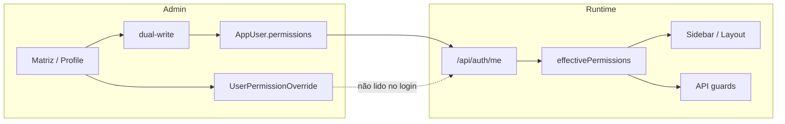

# Trilha — usuária Visualizador “somente Contas a Pagar”

**Cenário:** role `VIEWER` (label **Visualizador**); intenção = apenas Contas a Pagar; sintoma = Pessoas/RH e outros módulos visíveis/acessíveis.  
**Nota:** o Cursor **não** acessa o servidor. Passos “banco/sessão real” são o que o código **espera**; o conteúdo exato da bag da Leticia é **dependente de dado**.

---

## 1. Configuração salva (esperado pelo código)

Caminhos possíveis na UI admin:

### A) Matriz de permissões do usuário

1. Role = `VIEWER`.
2. Checkbox Contas a Pagar (`financeiro.contas_pagar`) → view = true (diff vs baseline NONE → override allow).
3. Outros recursos finance/ops/admin deixados no baseline VIEWER (NONE) **sem** override, **exceto** comercial/pedidos que no seed VIEWER já são **V**.
4. Save → `saveUserPermissionOverrides`:
   - `UserPermissionOverride`: pelo menos `{ resourceKey: "financeiro.contas_pagar", canView: true, … }`.
   - Para “tirar” comercial seria necessário override `canView: false` em `comercial` / filhos (desmarcar gerando diff).
   - `AppUser.permissions[]` materializado via dual-write.

### B) AccessProfile “Visualizador” aplicado

1. `applyAccessProfileToUserFields` → `role = VIEWER`, `permissions = VIEWER_LIGHT` (inclui **`products.view`**, crm, customers, proposals, …).
2. **Substitui** a bag (não une com a anterior naquele passo).
3. Matriz posterior com dual-write **deveria remover** `products.view` (mapeado a `operations.performance` = NONE no VIEWER). Se Engenharia continua aberta após save, a bag ainda não foi rematerializada **ou** há fallback FE (bag vazia) / outras keys.

### C) Bag antiga nunca limpa

Usuária criada antes da matriz / com templates amplos (`costs.view`, `materials.view`, …). Matriz parcial pode deixar unmapped; mapped como `costs.view` **deveria** cair no dual-write se ops/suprimentos efetivos = NONE.

---

## 2. Banco esperado (após save matriz “só AP” bem-sucedido)

| Tabela / campo | Conteúdo esperado |
|----------------|-------------------|
| `AppUser.role` | `VIEWER` |
| `AppUser.accessProfileId` | opcional; se perfil Visualizador, nome “Visualizador” |
| `UserPermissionOverride` | allow em `financeiro.contas_pagar`; denies só onde UI diferiu do baseline |
| `AppUser.permissions[]` | **no mínimo** `finance.accountsPayable.view` + chaves do baseline comercial VIEWER (`sales_orders.view` / `crm.view` / `dashboard.view` …) |
| | Possível **acúmulo** de keys sem alias no seed (ex.: `pricing.view`) |
| | `costs.view` / `products.view`: **não** deveriam restar se dual-write rodou (mapeadas e recursos NONE) |

**Dependente de servidor:** inspecionar `AppUser.permissions` e overrides da Leticia.

---

## 3. Sessão

```
GET /api/auth/me
→ toSafeAppUser
→ effectivePermissions = filterKnownPermissions(permissions)   // VIEWER: sem ampliação
→ AuthContext (React state)
```

- Footer/header: **Visualizador** = `formatRoleLabel(role)`, não o texto do AccessProfile (embora possam coincidir).
- Após alterar permissões: a usuária precisa **novo `me`/login**; o admin que salvou não atualiza a sessão dela.

---

## 4. Permissões efetivas (resolução)

```
effectivePermissions ⊆ AppUser.permissions[]
```

**Não** inclui leitura live de overrides.

Reprodução em código (testes diagnósticos):

| Bag de teste | Contas a Pagar (efeito) | Pessoas/RH | Máquinas | Engenharia | Conciliação |
|--------------|-------------------------|------------|----------|------------|-------------|
| `["finance.accountsPayable.view"]` | parent Financeiro **sim** | não | não | não | **sim (bleed)** |
| + `costs.view` | + | **sim** | **sim** | não* | sim |
| + `products.view` | + | não | não | **sim** | sim |
| `[]` + role VIEWER | via ROLE_MATRIX FE | não (RH) | não | **sim (FE)** | não |

\*Engenharia via `products.view` / materials / simulations, não via AP alone.

---

## 5. Sidebar

```
buildResourceAwareSidebarNavigation
  → canViewResource(resourceKey)  // se mapeado
  → senão canAccessModule
```

Trilha para sintomas do print:

1. **Financeiro + Conciliação** ← só `finance.accountsPayable.view` (aliases compartilhados) — **confirmado sem dado servidor**.
2. **Comercial / pedidos** ← baseline VIEWER no dual-write — **confirmado no materialize**.
3. **Engenharia / Simulador / Simulações** ← `products.view` e/ou `simulations.view` e/ou `costs.view` e/ou bag vazia ROLE_MATRIX — **provável dado**.
4. **Suprimentos / Custos Indiretos / Máquinas / Pessoas** ← sobretudo `costs.view` (mega-key) — **provável dado**; opex sem resourceKey usa só legado.

---

## 6. Rota Pessoas/RH

```
URL /employees
→ Layout → evaluatePathViewAccess
→ moduleId employees → resourceKey admin.employees
→ canAccessResourceClient(..., "admin.employees", "view")
→ legacyAliasKeys: employees.view, costs.view, employees.edit
```

- Com bag só AP: **denied** (teste).
- Com `costs.view`: **allowed** (teste).
- Não é “só menu escondido”: Layout bloqueia path quando o resolvedor nega.

---

## 7. API

```
GET /api/employees
→ requireAppAuth
→ requireAnyPermission(EMPLOYEES_VIEW_PERMISSIONS)
→ inclui "costs.view"
```

- Menu oculto **não** protege se a chave ampla estiver na bag.
- Usuário sem `costs.view`/`employees.*` recebe 403 na API mesmo se forjar URL (Layout já redireciona).

---

## 8. Separação de problemas (Leticia)

| Tipo | Status no código | Status no caso Leticia |
|------|------------------|------------------------|
| Persistência (matriz vs bag) | Baseline VIEWER + preserve + aliases | Depende se save/dual-write/perfil |
| Sessão/cache | Precisa me/login | Depende se testou após save |
| Resolução (aliases) | Bleed AP→Finance/Conciliação **confirmado** | Explica itens financeiros extras |
| Sidebar | Espelha resolução | Sim |
| Rota | Espelha resolução | Pessoas abre **se** bag tem mega-key |
| API | `costs.view` = view RH | Alinhado ao bleed de costs |

---

## 9. Diagrama resumido



---

## 10. O que validar no servidor (fora do escopo Cursor)

1. `SELECT permissions, role, "accessProfileId" FROM "AppUser" WHERE email = …`
2. Overrides do usuário.
3. Resposta real de `/api/auth/me` logada como Leticia.
4. Confirmar presença de `finance.accountsPayable.view`, `costs.view`, `products.view`, `materials.view`, `employees.view`.
