# Prompt 00 — Plano de implementação: Central de Tesouraria

**Projeto:** IndusCost  
**Data:** 2026-07-27  
**Base:** `01-DISCOVERY.md` + `02-REQUIREMENTS-MAPPING.md`  
**Escopo:** plano ordenado em entregas pequenas — **sem código funcional neste prompt**

---

## 1. Objetivo do plano

Entregar a Central de Tesouraria de ponta a ponta, em prompts sequenciais, sem:

- duplicar títulos oficiais Nomus;
- alterar o significado do Fluxo de Caixa / Faturamento / Conciliação de Carteira;
- concentrar lógica no `server.ts`;
- usar Float em dinheiro;
- deployar produção pelo Cursor.

Cada prompt: implementar só o escopo → validar/testar → atualizar `IMPLEMENTATION_STATUS.md` → **um commit coeso** → parar.

---

## 2. Ordem canônica dos prompts

A sequência abaixo **é a ordem oficial**. Entregas são pequenas, mas a ordem não deve ser invertida sem registrar exceção no status.

| Prompt | Entrega | Tipo | Resultado verificável |
|--------|---------|------|------------------------|
| **00** | Discovery + mapping + plano | Docs | `01`/`02`/`03` + status |
| **01** | Foundation: pasta `src/lib/treasury`, money Decimal/string, civil date adapters, feature flag fail-closed, skeleton `registerTreasuryRoutes`, health stub | BE foundation | Flag off → rotas 404/403; tests money/flag; checks FE imports OK |
| **02** | Permissões contrato `finance.treasury*` + seed + nav stub + isolation tests | ACL | Resource no contrato; `requireResource` wired; nav oculta sem grant |
| **03** | Contratos client-safe: enums, DTOs, schemas/parse, paginação, sort, money/date/timestamp | Shared | Pacote `src/lib/treasury/contracts/**` sem Prisma; testes de validação |
| **04** | Schema Prisma: `TreasuryFinancialAccount` + migration versionada | DB | Migration criada (não `db push`); generate OK |
| **05** | CRUD contas financeiras (service/repo/routes/UI mínima) | Feature | `/finance/treasury/accounts` + API |
| **06** | Schema + API saldos manuais/históricos versionados | Feature | Snapshots imutáveis + audit |
| **07** | Ledger mínimo + lançamentos manuais + reversão | Feature | Extrato; sem delete físico |
| **08** | Transferências internas (2 pernas, invariante consolidado) | Feature | Teste soma consolidada |
| **09** | Balance engine: observado / calculado / conciliado + divergência explícita | Feature | Endpoint position; UI cards |
| **10** | Facade read-only CR/CP (reuso `NomusAccounts*`) + DTO string — **sem cópia** | Integration | Join overlays vazios; não grava título |
| **11** | Overlays: data esperada (não toca `dueDate`) | Feature | Test dueDate imutável |
| **12** | Promessas de pagamento | Feature | Status machine + audit |
| **13** | Ações de cobrança | Feature | Timeline append-only |
| **14** | Contestações | Feature | Não zera balance oficial |
| **15** | Programação de pagamentos (AP) | Feature | Parcial ≤ saldo aberto |
| **16** | Previsto vs realizado (Tesouraria) | Feature | Não soma camadas do mesmo título |
| **17** | Projeções CONTRACTUAL / PROBABLE / CONFIRMED | Feature | Matriz de classificação testada |
| **18** | Agenda financeira | Feature | Agenda por conta/dia civil |
| **19** | Exceções + alertas | Feature | Sem auto-hide de divergência |
| **20** | Schema OFX + import idempotente | Feature | Reimport safe |
| **21** | Workspace conciliação bancária (match/unmatch) | Feature | Não muta Nomus |
| **22** | Fechamento diário imutável | Feature | Hash/payload frozen |
| **23** | Reabertura versionada | Feature | Supersession + manage-only |
| **24** | Relatórios Tesouraria | Feature | Totais = engine |
| **25** | Exportações CSV/XLSX (`export` action) | Feature | Decimal string nas colunas |
| **26** | Auditoria completa + correlação | Hardening | Toda ação crítica auditada |
| **27** | Observabilidade (health detalhado, logs mascarados) | Hardening | `/api/finance/treasury/health` |
| **28** | Suíte `test:treasury` + regressão anti-duplicação financeiro oficial | QA | Scripts npm; gates CI locais |
| **29** | Docs finais + runbook deploy/validação (usuário aplica em prod) | Docs/Ops | Runbook sem credenciais |
| **30** | Soft-launch: flag, checklist homolog, smoke scripts | Release | Flag documentada; Cursor não deploya |

> Prompts 01–30 correspondem à sequência operacional. Requisitos do programa (contas, saldos, CR/CP, overlays, OFX, etc.) estão cobertos sem pular dependências (contratos/ACL/flag/schema antes de UI pesada).

---

## 3. Dependências entre blocos

```mermaid
flowchart TD
  P00[00 Docs] --> P01[01 Foundation flag money]
  P01 --> P02[02 Permissions]
  P02 --> P03[03 Contracts DTO schema]
  P03 --> P04[04 Schema accounts]
  P04 --> P05[05 CRUD accounts]
  P05 --> P06[06 Balances]
  P06 --> P07[07 Ledger manual]
  P07 --> P08[08 Transfers]
  P08 --> P09[09 Balance engine]
  P09 --> P10[10 AR AP read facade]
  P10 --> P11[11 Expected dates]
  P11 --> P12[12 Promises]
  P12 --> P13[13 Collection]
  P13 --> P14[14 Disputes]
  P14 --> P15[15 Payment schedule]
  P15 --> P16[16 Forecast vs actual]
  P16 --> P17[17 Projections]
  P17 --> P18[18 Agenda]
  P18 --> P19[19 Exceptions alerts]
  P19 --> P20[20 OFX]
  P20 --> P21[21 Bank reconcile]
  P21 --> P22[22 Daily close]
  P22 --> P23[23 Reopen]
  P23 --> P24[24 Reports]
  P24 --> P25[25 Exports]
  P25 --> P26[26 Audit sweep]
  P26 --> P27[27 Observability]
  P27 --> P28[28 Test suite]
  P28 --> P29[29 Runbook docs]
  P29 --> P30[30 Soft launch]
```

---

## 4. O que cada fase pode / não pode tocar

### Pode

- `src/lib/treasury/**` (novo)
- `src/components/finance/treasury/**` (novo)
- `prisma/schema.prisma` + **nova** pasta em `prisma/migrations/`
- `src/lib/financeModulesAccess.ts` / navigation / permission contract (**somente entradas Tesouraria**)
- `server.ts` — **apenas** import + `registerTreasuryRoutes(...)`
- `package.json` scripts `test:treasury*`
- `docs/treasury/**`

### Não pode

- Reescrever engines oficiais de cash-flow / billing / portfolio para “virarem tesouraria”
- `UPDATE NomusAccountsReceivable/Payable` com campos de overlay (usar tabela lateral)
- `prisma db push` / `migrate dev` em produção
- Alterar `.env` / segredos
- Misturar WIP Lucro×Caixa (`finance.profit_cash`) sem coordenação
- Commitar arquivos não relacionados do working tree

---

## 5. Validação contínua anti-duplicação

Em todo prompt de feature, incluir pelo menos um teste ou assert documental:

| Gate | Verificação |
|------|-------------|
| G1 | Nenhuma tabela `Treasury*` copia `amountReceivable`/`amountPayable` como fonte |
| G2 | Writes Tesouraria não chamam update nos models Nomus AR/AP |
| G3 | Transferência: Δ consolidado = 0 |
| G4 | Expected/promise não alteram `dueDate` |
| G5 | UI labels distinguem Fluxo de Caixa × Saldo bancário × Conciliação carteira × Conciliação bancária |
| G6 | `check:frontend-server-imports` OK |
| G7 | DTOs money = string decimal |

Checklist de regressão oficial (Prompt 27):

- `npm run test:finance:cash-flow` (smoke)
- `npm run test:finance:accounts-receivable` (smoke subset se necessário)
- `npm run test:finance:accounts-payable` (smoke subset)
- Testes novos `test:treasury` cobrindo G1–G5

---

## 6. Estratégia de schema (visão)

Ordem física das migrations (alinhada aos prompts):

1. **P04:** `TreasuryFinancialAccount`
2. **P06:** `TreasuryBalanceSnapshot` + `TreasuryAuditLog` (audit cedo)
3. **P07:** `TreasuryLedgerEntry`
4. **P08:** `TreasuryTransfer` (ou só groupId no ledger)
5. **P11–P15:** overlays (`TreasuryTitleOverlay` / promises / collection / dispute / payment schedule) — preferir migration coesa por prompt
6. **P20:** OFX import + transactions
7. **P21:** reconciliation matches
8. **P22:** daily closing (+ reopen fields/version)

Tipos money: `@db.Decimal(20, 2)`.  
Datas de negócio: civil date (`Date` / `@db.Date` ou DateTime UTC midnight + `financeCivilDate`).  
Timestamps de auditoria: `@db.Timestamptz(6)` preferível (padrão recente do schema).

---

## 7. Estratégia de API

Prefixo único: `/api/finance/treasury/...`

| Área | Prefixo |
|------|---------|
| Contas / saldos / position | `/accounts` |
| Ledger / transfers | `/ledger-entries`, `/transfers` |
| Overlays CR/CP | `/overlays`, `/promises`, `/collection-actions`, `/disputes` |
| Schedule / agenda / projections | `/payment-schedule`, `/agenda`, `/projections`, `/forecast-vs-actual` |
| OFX / reconcile | `/ofx`, `/reconcile` |
| Closings | `/closings` |
| Reports / export / audit / health | `/reports`, `.../export.xlsx`, `/audit`, `/health` |

Auth: `requireAppAuth` + `requireResource('finance.treasury', action)` (+ flag).  
Leitura de títulos oficiais: exigir também `finance.accounts_receivable` / `finance.accounts_payable` quando a facade devolver dados de título.

---

## 8. Estratégia de UI

- Entrada: tab/seção em `FinanceModule` → `/finance/treasury/*`
- Shell: `FinanceBiDashboardShell` + Overlay canônico
- Não criar design system paralelo
- Deep-links para CR/CP oficiais quando a ação for “gestão de título Nomus”
- Copy explícita de fronteira nas páginas (evita duplicação cognitiva)

---

## 9. Critérios de pronto por prompt (DoD)

1. Escopo só do prompt  
2. Testes novos/relevantess verdes  
3. `check:frontend-server-imports` se tocou FE/lib compartilhada  
4. `IMPLEMENTATION_STATUS.md` atualizado  
5. Commit Conventional Commit `feat|fix|refactor|test|docs|chore(treasury):`  
6. Sem avanço automático  
7. Riscos/bloqueios registrados com honestidade  

---

## 10. Fora de escopo explícito

- Substituir Nomus como origem de títulos  
- Transformar Fluxo de Caixa em extrato bancário  
- Unificar Conciliação de Carteira com conciliação bancária  
- Open Banking / PIX automático (futuro)  
- Deploy em `/opt/induscost` pelo agente  

---

## 11. Riscos de plano e mitigações

| Risco | Mitigação |
|-------|-----------|
| Escopo gigante | Prompts pequenos + DoD rígido |
| WIP Lucro×Caixa no working tree | Commits só `docs/treasury` / paths Tesouraria |
| Decimal→number herdado | Money kit próprio desde P01 |
| Confusão de nomes “conciliação” | Glossário na UI + docs |
| Migration em prod | Runbook: backup → pull → `migrate deploy` → build → restart (usuário) |
| OFX heterogeneidade | Quarantine + idempotência; não adivinhar match |

---

## 12. Estado após este documento

| Item | Status |
|------|--------|
| Discovery | DONE |
| Requirements mapping | DONE (este pacote) |
| Implementation plan | DONE (este arquivo) |
| Código funcional Tesouraria | NOT_STARTED |
| Próximo prompt a aguardar | **01 — Foundation** |

**Confirmação:** este prompt não implementa foundation nem schema; apenas documentação de desenho e plano.
