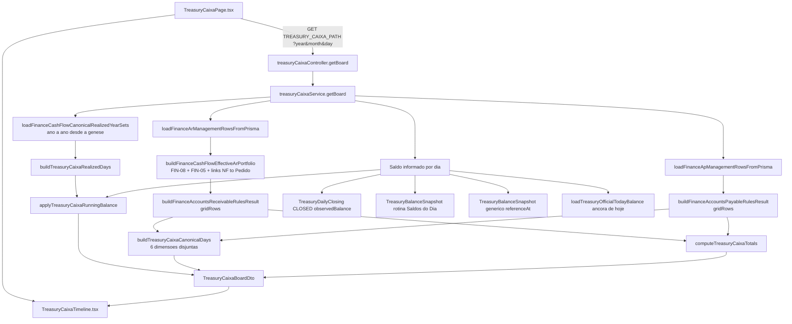
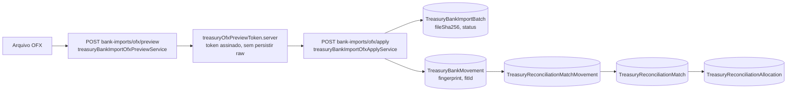
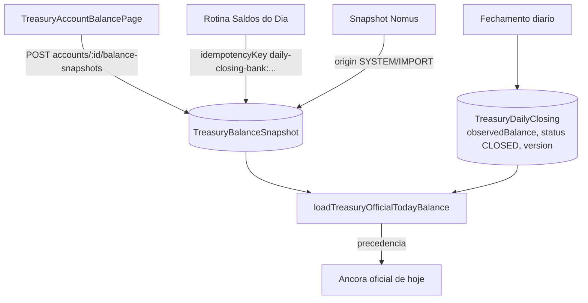

# Apoio ao Caixa — Auditoria do estado atual (Etapa 1)

Somente leitura. Nenhum código funcional alterado.

---

## 1. Diagrama — Linha do tempo do Caixa

### Regras já aplicadas pela fonte (comprovadas em código)

| Regra exigida | Situação | Evidência |
|---|---|---|
| Prioridade previsão x título real | **Sim** | FIN-08 suprime previsão coberta por CR real (`suppressPreNfReplacedByRealCrOnSameOrder`, `nomusCrCoverageByOrder`) |
| Substituição do previsto pelo realizado | **Sim** | dimensões disjuntas `receivableDue` (aberto) x `receivableReceived` (baixado) — `treasuryCaixaCanonicalDay.ts:404-426` |
| Cobertura PV / DS / NF-e / CR | **Sim** | `lineKind`: `CR_REAL`, `DOCUMENT_AWAITING_CR`, `ORDER_RESIDUAL_FORECAST`, `ORDER_PLAN_FORECAST` |
| Saldo remanescente | **Sim** | `balanceReceivable` / `balancePayable` por título |
| Cancelamentos | **Parcial** | CP: `isFinanceApCancelledTitle` no realizado. CR: sem flag equivalente no board |
| Exclusões / suspensões | **Sim** | `suspendCollection` / `suspendPayment` excluídos do fluxo, mantidos na listagem |
| Regras especiais de CP | **Sim** | realizado por `resolveFinanceApEffectivePaymentDate` (vencimento, Nomus raramente informa pagamento); a-pagar por `operationalDueDate ?? dueDate` |
| Datas operacionais | **Sim** | `operationalDueDate` (CP), política de conciliação N dias (`TreasuryScenarioPolicy`) |
| Filtro de período | **Sim** | `resolveTreasuryCaixaDueDateRange` |
| Filtro de empresa | **NÃO** | board não recebe `companyId`; usa `companyAccounts[0].companyCode` (`treasuryCaixaService.server.ts:496-501`) |
| Filtro de conta | **NÃO** | nenhum recorte por conta; consolidado implícito |

---

## 2. Diagrama — OFX

### Distinção de estados (como o Apoio ao Caixa deve ler)

| Estado | Como distinguir |
|---|---|
| Preview | Não persistido — vive só no token assinado; nada em `TreasuryBankMovement` |
| Importação confirmada | Existe `TreasuryBankImportBatch` com `status = PROCESSED` |
| Movimento ativo | Linha em `TreasuryBankMovement` (não há soft-delete no model) |
| Possível duplicidade | `duplicateReason` no resultado do apply (`EXISTING_FILE` / `EXISTING_MOVEMENT`) |
| Duplicidade confirmada | Bloqueada por `@@unique([accountId, fingerprint])` e `@@unique([accountId, fitId])` — nunca chega a existir |
| Movimento inválido | `status = INVALID` no preview; **não é persistido** |
| Movimento corrigido / substituído | **Não existe** — sem campos de correção, estorno ou supersede |

Idempotência de reimport: `@@unique([accountId, fileSha256])` no batch.

---

## 3. Diagrama — Saldo manual

Precedência (força): `DAILY_CLOSING` (STRONG) > rotina/genérico manual (MEDIUM) > Nomus (WEAK) —
`treasuryCaixaService.server.ts:757-763`.

### Campos para comparação

| Campo necessário | Existe? | Onde |
|---|---|---|
| Empresa | Indireto | via `account.companyCode` |
| Conta | **Sim** | `accountId` |
| Valor | **Sim** | `availableBalance` Decimal(20,2) |
| Moeda | **Parcial** | só na conta (`TreasuryFinancialAccount.currency`), enum com valor único `BRL` |
| Tipo de saldo | **Sim** | `availableBalance` / `blockedBalance` / `investmentsBalance` / `usedLimit` |
| Data-hora de referência | **Sim** | `referenceAt` Timestamptz |
| Histórico / versionamento | **Sim** | `previousSnapshotId` + `cancelledAt` (sem delete físico) |
| Origem | **Sim** | `origin` (MANUAL/OFX/CLOSING/SYSTEM/IMPORT) |

**Ausente:** não há campo distinguindo saldo de *fim de dia* x *instantâneo* — `referenceAt` na rotina
"Saldos do Dia" é o instante do registro, não o dia civil fechado (por isso o dia civil é lido da
`idempotencyKey`, `treasuryCaixaService.server.ts:298-307`).

---

## 4. Contratos encontrados

| Contrato | Arquivo |
|---|---|
| `TreasuryCaixaBoardDto` | `domain/treasuryCaixaRules.ts` |
| `TreasuryCaixaCanonicalDay` (+ títulos por dimensão) | `domain/treasuryCaixaCanonicalDay.ts:101-158` |
| `FinanceAccountsReceivableGridRow` | `financeAccountsReceivableRulesEngine.types.ts:145-163` |
| `FinanceArEffectiveTitleListItem` (FIN-08, mais rico) | `finance/financeAccountsReceivableEffectiveTitles.ts:63-91` |
| `TreasuryReconciliationAllocationDraft` | `domain/treasuryReconciliationMatchRules.ts:41-53` |
| `TreasuryMoneyString` (+ cents bigint) | `treasuryMoney.ts` |

---

## 5. Chaves e identificadores

| Chave exigida (Prompt 0 §5) | Disponível no resultado canônico? |
|---|---|
| `economicEventKey` | **Não** |
| `canonicalRepresentationKey` | **Não** |
| `coverageGroupKey` | **Não** no board (`orderCode` existe no FIN-08 e é descartado na projeção) |
| Identificador da parcela | **Não** no board (`installmentNumber` só dentro do FIN-08) |
| `revision` | **Não** (`syncedAt` existe na row bruta, ausente na grid row) |
| `updatedAt` confiável | **Não** |
| `fingerprint` | **Não** |
| `ruleVersion` | **Parcial** — `engineVersion` existe em `FinanceAccountsReceivableRulesResult`, não é devolvido pelo board |

Identificador de fato disponível: `externalId: number`.
- `CR_REAL` / CP: id Nomus positivo — **estável**.
- Previsões e documentos: id **sintético negativo** = FNV-1a de
  `forecast:{orderCode}:{installment}:{dueDate}` / `doc-sched:{orderCode}:{documentKey}:{installment}` /
  `doc-await:{orderCode}:{documentKey}` (`financeAccountsReceivableEffectiveTitles.ts:142-149`, `518/543/591`).

---

## 6. Regras existentes reaproveitáveis

- Conciliação completa já implementada: match + alocações (`TITLE`, `FEE`, `INTEREST`, `DISCOUNT`,
  `ABATEMENT`, `DIFFERENCE`, `TRANSFER`, `MANUAL_LEDGER`, `UNIDENTIFIED`), covering net,
  capacidade do movimento, saldo aberto do título, versão otimista, soft-unmatch com frase forte de
  confirmação, `TREASURY_RECONCILIATION_DOES_NOT_REALIZE_OFFICIAL = true`.
- Dinheiro como string + `bigint` de centavos (`treasuryMoney.ts`) — sem `parseFloat` como verdade.
- Auditoria append-only (`TreasuryAuditLog`) com `beforeJson`/`afterJson`/`justification`/`requestId`.
- RBAC por recurso + ACL por conta (`TreasuryFinancialAccountAccess`) + feature flags
  (`treasury.reconciliation.enabled`, OFX import) + rate limiting por rota.
- Motor de sugestões separado do aceite (`treasuryReconciliationSuggestionEngine.ts`).

---

## 7. Limitações

1. **Sem empresa no board.** A Linha do tempo é efetivamente monoempresa (`companyAccounts[0]`).
2. **Sem conta no evento canônico.** Só `bankAccountName: string | null` — não casa com `accountId` do OFX.
3. **Sem moeda no evento canônico.** `TreasuryCurrencyCode` tem apenas `BRL`; comparação multimoeda é impossível hoje.
4. **`otherMovements` não carregados** para dias arbitrários (`otherMovementsLoadStatus: "not_loaded"`) — ledger e transferências ficam fora da Linha do tempo fora de "hoje".
5. **Datas em `number` e `Math.round`** no motor de dia (`roundMoney`), não em Decimal — a fonte canônica trabalha em `number`.
6. **CP realizado usa vencimento**, não a data bancária real — divergência estrutural contra o extrato.
7. **Sem correção/estorno de movimento OFX**; sem `analysisAsOfDateTime` em qualquer contrato atual.

---

## 8. Riscos

| Risco | Severidade | Nota |
|---|---|---|
| Dupla contagem evento x OFX | Alta | CP realizado entra por vencimento; o mesmo pagamento chega ao banco em outra data |
| Colisão de id sintético | Média | FNV-1a 32 bits em espaço negativo, sem verificação de colisão |
| Divergência de população | Média | `realizedDays` recorta baixa por ano; `canonicalDays` não |
| Perda de precisão | Média | fonte canônica em `number`/`Math.round`; Apoio ao Caixa exige Decimal |
| Ambiguidade de conta | Alta | evento canônico sem `accountId`; movimento bancário com `accountId` obrigatório |

---

## 9. Bloqueios

### BLOQUEIO CRÍTICO — identidade econômica

O Prompt 0 §5 exige `economicEventKey` e `canonicalRepresentationKey` nativos ou deriváveis
**exclusivamente** do resultado canônico, sobrevivendo a PV → DS → NF-e → CR → recebimento.

Estado real:

1. O board devolve apenas `externalId`. `lineKind`, `orderCode`, `salesOrderId` e `origin` são
   calculados pelo FIN-08 e **descartados** na projeção para `FinanceAccountsReceivableGridRow`.
2. O id sintético da previsão embute `dueDate`. Reagendar a parcela **muda o id** — viola
   estabilidade da `economicEventKey`.
3. Na transição previsão → CR real o id sintético negativo desaparece e surge o `externalId` Nomus.
   Nenhum vínculo entre os dois sobrevive no contrato do board.
4. Mesmo propagando `orderCode`, o `CR_REAL` **não carrega número de parcela** — a identidade só
   fecharia no nível do pedido (`coverageGroupKey`), nunca da parcela.

Conclusão: não existe hoje chave estável de evento econômico no resultado canônico, e construir uma
exigiria consultar fontes brutas e reconstruir regras — expressamente proibido.

### Bloqueios secundários
- Comparabilidade de saldo (§4.22) impossível por conta/moeda: o evento canônico não tem nenhuma das duas.

---

## 10. Matriz de arquivos e responsabilidades

| Arquivo | Responsabilidade | Apoio ao Caixa |
|---|---|---|
| `services/treasuryCaixaService.server.ts` | Fonte canônica da timeline | **Ler via adapter. Não alterar** |
| `domain/treasuryCaixaCanonicalDay.ts` | 6 dimensões por dia | Consumir |
| `domain/treasuryCaixaRules.ts` | Running balance, totais, atrasados | Consumir |
| `finance/financeAccountsReceivableEffectiveTitles.ts` | FIN-08, `lineKind`/`orderCode` | Origem da identidade (hoje não exposta) |
| `services/treasuryBankImportOfxApplyService.server.ts` | Grava batch/movimentos | **Escrita proibida** |
| `services/treasuryBankImportOfxPreviewService.server.ts` | Parser/preview | **Não alterar** |
| `repositories/treasuryBankMovementRepository.server.ts` | Leitura de movimentos | Reusar leitura |
| `domain/treasuryReconciliationMatchRules.ts` | Regras puras de match | **Reusar — não duplicar** |
| `services/treasuryReconciliationMatchService.server.ts` | Aceite/unmatch/reverse | **Reusar** |
| `treasuryMoney.ts` | Decimal como string | **Reusar** |
| `TreasuryBalanceSnapshot` (Prisma) | Saldo manual | **Escrita proibida** |
| `TreasuryDailyClosing` (Prisma) | Fechamento | **Escrita proibida** |

### Caminhos de escrita proibidos (mapeados)

| Alvo | Função/rota que escreve |
|---|---|
| Movimentos OFX | `treasuryBankImportOfxApplyService.apply` (`prisma.treasuryBankMovement.createMany`) |
| Importações OFX | mesmo serviço (`treasuryBankImportBatch.create/update`) |
| Saldo manual | `POST accounts/:id/balance-snapshots`, `.../cancel` |
| Fechamento / Caixa atual | `treasuryDailyClosingController`, `treasuryDailyClosingRepository.server.ts` |
| CR / CP | sincronização Nomus (`scripts/nomus*`, `nomusRestClient`) — fora do módulo |
| Linha do tempo | não há escrita: é derivada em tempo de requisição |

---

## 11. Recomendação

**BLOQUEADO** — para o escopo definido no Prompt 0 §5 (conciliação ancorada em `economicEventKey`
estável ao longo de PV → DS → NF-e → CR).

Escopo alternativo, se o usuário decidir reduzir: **APTO COM LIMITAÇÕES** para conciliação restrita a
títulos reais (`externalId` Nomus positivo, estável) — que é exatamente a população que gera movimento
bancário. Previsões (`lineKind` de forecast) entrariam somente como contexto informativo, nunca como
alvo de conciliação. Nesse recorte, o módulo `TreasuryReconciliationMatch` existente já atende à maior
parte dos requisitos, e a limitação de empresa/conta/moeda seria registrada explicitamente.
