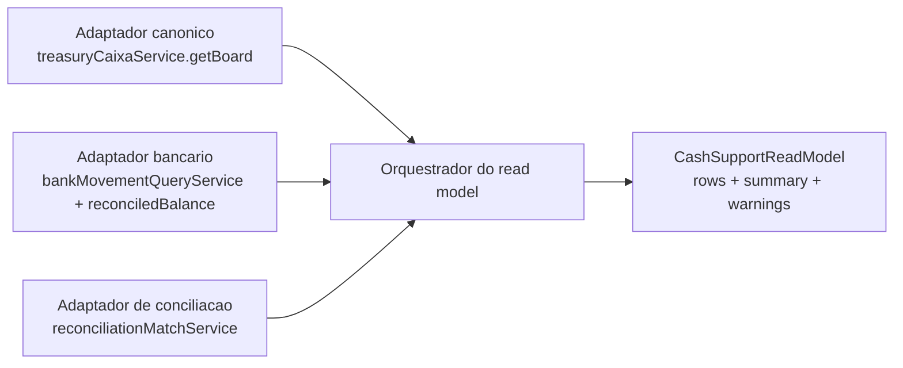

# Read model proposto — Apoio ao Caixa

Somente leitura. Nenhuma autoridade nova: agrega três adaptadores sobre fontes existentes.

---

## 1. Linha unificada

| Campo | Tipo | Origem | Regra |
|---|---|---|---|
| `displayId` | string | derivado | `{resourceType}:{chave natural}` — só apresentação |
| `resourceType` | enum | derivado | `FORECAST` \| `OFFICIAL_RECEIVABLE` \| `OFFICIAL_PAYABLE` \| `BANK_MOVEMENT` \| `INTERNAL_TRANSFER` \| `ADJUSTMENT` \| `UNIDENTIFIED` |
| `officialTitleKey` | key \| null | canônico | Só `externalId > 0` |
| `bankMovementKey` | uuid \| null | bancário | `TreasuryBankMovement.id` |
| `forecastContextKey` | key \| null | canônico | Nunca em escrita |
| `reconcilable` | boolean | derivado | `true` só com `officialTitleKey` ou `bankMovementKey` |
| `direction` | `IN` \| `OUT` | fonte | Preservado |
| `expectedDate` | civil \| null | canônico | Data que a previsão espera |
| `dueDate` | civil \| null | canônico | Vencimento oficial |
| `bankDate` | civil \| null | bancário | `postedCivilDate` — **única data de realizado** |
| `expectedAmount` | cents \| null | canônico | Previsão |
| `officialAmount` | cents \| null | canônico | Valor do título |
| `bankAmount` | cents \| null | bancário | Absoluto; sinal em `direction` |
| `allocatedAmount` | cents | conciliação | `reconciledAmount` ativo |
| `adjustmentAmount` | cents | conciliação | Σ `FEE`+`INTEREST`−`DISCOUNT`−`ABATEMENT` |
| `residualAmount` | cents | conciliação | Capacidade restante — **calculada pelo motor** |
| `reconciliationState` | enum | conciliação | Espelha estado oficial; nunca persistido aqui |
| `sourceState` | enum | fonte | Estado na origem (`calculatedStatus`, batch status) |
| `companyContext` | ctx \| null | fonte | `null` = ausente, com warning |
| `accountContext` | ctx \| null | bancário | `null` para título (não casa) |
| `currencyContext` | ctx | fonte | `BRL` |
| `sourceReferences` | lista | todas | Tabela + id + rótulo |
| `warnings` | lista | derivado | Estruturado (código + mensagem) |
| `availableActions` | lista | derivado | Após RBAC + ACL + estado |

### Invariantes
1. `resourceType = FORECAST` ⇒ `reconcilable = false`, `officialTitleKey = null`, `availableActions` sem ação de conciliação.
2. `officialTitleKey ≠ null` ⇒ `externalId > 0`.
3. `bankDate` só é preenchida por movimento bancário — título nunca inventa data bancária.
4. Nenhum campo monetário é `number`; tudo em centavos (`bigint`/string).
5. `residualAmount` e `allocatedAmount` **nunca** são calculados no frontend.

---

## 2. Resumo (`CashSupportSummary`)

Duas famílias **separadas por uma ponte explícita**, nunca somadas em um número só:

**Posição bancária** (dinheiro real): saldo, entradas, saídas, conciliado, parcialmente
conciliado, não conciliado, unidentified.

**Posição canônica** (compromissos): títulos esperados, títulos evidenciados por banco,
previsões futuras, atrasados.

**Ponte**: divergência = bancário não explicado por título + título sem evidência bancária.
Transferências internas entram com efeito consolidado zero.

---

## 3. Filtros

Período, empresa, conta, moeda, direção, `resourceType`, `reconciliationState`, origem,
texto livre, somente pendências, somente warnings. Paginação e ordenação no backend.

---

## 4. Plano de testes (a executar nas etapas de implementação)

| # | Cenário | Asserção |
|---|---|---|
| 1 | Movimento sem match | Aparece; entra na posição bancária; `reconciliationState = PENDING` |
| 2 | Classificação (`FEE`/`DIFFERENCE`) | Posição bancária **inalterada**; só explica |
| 3 | Título + movimento conciliado | Contado **uma vez**; sem dupla contagem |
| 4 | Previsão | `reconcilable = false`; sem ação de conciliar; allocation rejeitada |
| 5 | Título real | `reconcilable = true` conforme RBAC/ACL |
| 6 | Qualquer comando | `dueDate`, `status` e baixa Nomus **inalterados** |
| 7 | Parcial | `residualAmount` = valor − alocado; estado `PARTIAL` |
| 8 | Tarifa | Título 10.000, movimento 10.050, `TITLE` 10.000 + `FEE` 50 → saída bancária 10.050 |
| 9 | Desconto | Título 10.000, movimento 9.950, `DISCOUNT` 50 → banco 9.950, cobertura 10.000, Nomus intacto |
| 10 | Transferência | Efeito individual nas contas; consolidado **zero** |
| 11 | Reversão | Residual recomposto; auditoria preservada; Nomus intacto |
| 12 | Concorrência | Dois aceites simultâneos **não** excedem a capacidade do movimento (cobre lacuna #30) |
| 13 | Mudança de fonte | Conciliação não apagada; marcada para revisão |
| 14 | `bankDate` | Realizado usa `postedCivilDate`, nunca `dueDate` |
| 15 | Fechamento diário/mensal | Totais fecham no centavo com a Linha do tempo |
| 16 | Centavos | Nenhum `float`/`parseFloat` no caminho monetário |
| 17 | RBAC / ACL | Sem permissão nega; conta não autorizada nega (anti-IDOR) |

---

## 5. Limitações assumidas

- Sem empresa e sem conta no lado canônico (matriz #41, #42) → `companyContext`/`accountContext`
  podem vir `null` **com warning**; nunca inventados.
- Sem saldo *available* e sem cobertura de extrato (#6, #8) → warning, sem tabela nova.
- Correção de movimento OFX não representável (#4) → warning.
