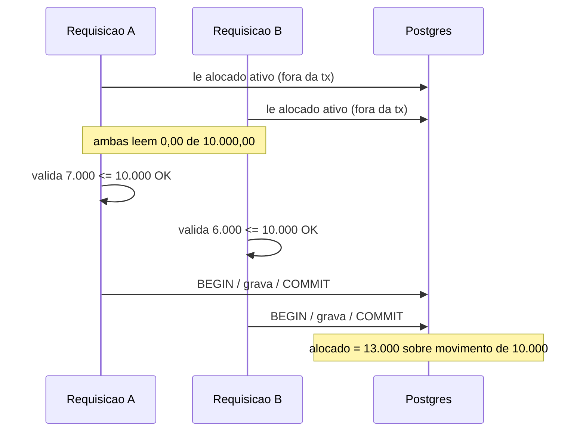

# CASH-SUPPORT-P0-CONCURRENCY-001

- **Severidade:** P0 — integridade financeira
- **Estado:** BLOQUEADOR PARA OPERAÇÕES DE ESCRITA
- **Origem:** defeito **pré-existente** do motor oficial; anterior ao Apoio ao Caixa
- **Correção:** no serviço oficial. Proibido motor paralelo ou contorno na UI.

---

## 1. Resumo executivo

No aceite de conciliação, a capacidade disponível do movimento bancário é lida **antes** da
abertura da transação e reaproveitada **dentro** dela. Dois aceites concorrentes sobre o mesmo
movimento observam a mesma capacidade antiga; cada um se valida isoladamente e ambos gravam.
A soma das alocações pode exceder o valor real do movimento — dinheiro que não existe passa a
"cobrir" títulos.

## 2. Arquivo e funções

`src/lib/treasury/services/treasuryReconciliationMatchService.server.ts` → `accept()`

| Elemento | Papel |
|---|---|
| `matchRepo.sumActiveAllocatedByMovementIds` (~369) | Lê o já alocado **fora** da transação |
| `assertTreasuryReconciliationMovementCapacity` (~417) | Valida capacidade com esse valor, ainda fora |
| `runInTransaction` (~425) | Abre a transação **depois** da validação |
| `already.get(id)` (~465) | **Reusa o valor pré-transação** para gravar `reconciledAmount` |

## 3. Fluxo atual

## 4. Cenário de corrida e exemplo numérico

Movimento com capacidade de **R$ 10.000,00**.

| Passo | A | B | Alocado real |
|---|---|---|---|
| 1 | lê 10.000 livre | | 0,00 |
| 2 | | lê 10.000 livre | 0,00 |
| 3 | valida 7.000 → OK | | 0,00 |
| 4 | | valida 6.000 → OK | 0,00 |
| 5 | grava 7.000 | | 7.000,00 |
| 6 | | grava 6.000 | **13.000,00** |

Cada requisição individualmente acredita estar dentro do limite; o agregado chega a
**R$ 13.000,00 sobre um movimento de R$ 10.000,00**.

## 5. Impacto

**Financeiro:** cobertura falsa de títulos; posição bancária divergente do extrato; residual
inconsistente; risco de dar por explicado dinheiro que não entrou.

**Módulos afetados:** conciliação bancária (produção), movimentos bancários, projeção
(`requestTreasuryProjectionRecalc` roda sobre estado corrompido), fechamento diário,
relatórios, e — quando existir — o Apoio ao Caixa.

## 6. Por que o optimistic locking atual não basta

`assertTreasuryReconciliationMatchVersion` protege **um match existente** contra edição
concorrente (`unmatch`/`reverse`). O `accept` **cria** um match novo: não há versão anterior a
comparar, e o recurso realmente disputado é o **movimento bancário** — cuja capacidade é
agregada sobre N matches. Versionar o match não protege o agregado do movimento.

## 7. Riscos

Over-allocation · residual negativo · divergência movimento↔allocations · auditoria registrando
operações que violam invariante · retrabalho operacional de destravar manualmente.

## 8. Solução recomendada (a implementar em etapa própria)

**Precedente institucional já existe no projeto** — não é preciso inventar mecanismo:

- Advisory lock: `pg_try_advisory_lock` em
  [treasuryDailyClosingRepository.server.ts:319](src/lib/treasury/repositories/treasuryDailyClosingRepository.server.ts:319),
  com builder de chaves em `domain/treasuryDailyClosingLock.ts`.
- Lock de projeção: `domain/treasuryProjectionLock.ts`.
- `idempotencyKey` como campo institucional (limite 128 em
  `contracts/treasuryConstants.ts:177`), já com unicidade em `TreasuryBalanceSnapshot`.

**Direção recomendada:** mover a leitura de capacidade e a asserção para **dentro** da mesma
transação da gravação, protegendo o(s) movimento(s) por lock em ordem determinística (por
`bankMovementId` ordenado, evitando deadlock), com invariante final antes do commit.

### Opções a avaliar na etapa de correção
1. `SELECT ... FOR UPDATE` nas linhas de `TreasuryBankMovement` envolvidas.
2. Advisory lock por movimento (segue o padrão do fechamento diário).
3. Releitura + reasserção da capacidade dentro da transação (**obrigatório em qualquer opção**).
4. Ordem determinística de locks por id ordenado.
5. Invariante final: `Σ allocations ativas ≤ amount` verificado antes do commit.
6. Constraint/índice parcial no banco, se viável.
7. `Idempotency-Key` no `accept` (reusar padrão existente).
8. Retry controlado apenas para deadlock/serialization failure.

**Decisão da estratégia fica para a etapa de correção**, após auditar repositories e o padrão de
transação — não é decidida aqui.

## 9. Critérios de aceite

1. Capacidade verificada **dentro** da mesma transação da gravação.
2. Recurso correto (o movimento) protegido por lock ou mecanismo atômico equivalente.
3. Duas requisições concorrentes não excedem capacidade do movimento **nem** residual do título.
4. Residual nunca negativo.
5. Allocations agregadas nunca excedem o movimento.
6. Allocations + ajustes nunca excedem a cobertura permitida do título.
7. `Idempotency-Key` impede repetição.
8. Conflito retorna erro controlado.
9. Deadlock/serialization failure com retry controlado quando aplicável.
10. Auditoria registra **apenas** o resultado confirmado.
11. Nomus permanece inalterado.
12. Testes concorrentes repetidos passam de forma determinística.

## 10. Testes concorrentes obrigatórios

| # | Teste |
|---|---|
| 1 | N aceites paralelos no mesmo movimento → soma nunca excede a capacidade |
| 2 | N aceites paralelos no mesmo título → soma nunca excede o saldo aberto |
| 3 | Aceite + unmatch concorrentes → estado final consistente |
| 4 | Mesmo `Idempotency-Key` repetido → um único match |
| 5 | Deadlock forçado → retry converge, sem duplicar |
| 6 | Regressão: cenários 1:1, 1:N, N:1, parcial mantêm comportamento |

## 11. Rollback

A correção é comportamental, sem migration destrutiva. Rollback = reverter o commit do serviço.
Se qualquer opção exigir coluna nova (ex.: `idempotencyKey` no match), a migration deve ser
**aditiva e nullable**, permitindo rollback do código sem rollback do banco.
